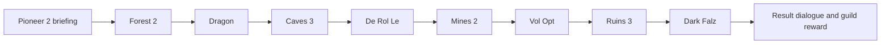

# Building a PSOBB quest, explained through your Towards the Future files

Prepared 10 September 2026. This guide is based on the supplied English quest, its shared map file, both Qedit executables, Qedit's configuration archive, and selected parts of your modded client. The Japanese script was also decoded. No supplied files were changed.

## What has actually been established

The English script has been disassembled and reassembled. Its **71,436-byte decompressed result is byte-for-byte identical to the original**. The map has been decoded into 277 object records, 216 enemy/NPC records, and 69 wave events. All event-to-event destinations in its action streams resolve on their respective floors.

Qedit's opcode, enemy and object parameter definitions have been recovered from `config.ppk`. Selected native instructions in Qedit and `psobb.exe` have been examined, and the client's online map-selection table has been decoded.

This is a verified static analysis of the quest-building architecture, not a complete decompilation of either executable. The quest has not been played or edited through Qedit during this analysis, and no server-side reward behavior or multiplayer behavior has been tested in-game. Uncertain areas are identified below.

## 1. What a quest consists of

| Component | What it supplies | What you edit |
|---|---|---|
| Client assets and engine | Existing areas, collision, models, textures, enemy behavior, script execution | Normally choose compatible assets rather than alter the client |
| Quest `.bin` | Header, title/descriptions, script bytecode, labels and dialogue | Quest properties and script |
| Quest `.dat` | Per-floor object placements, enemy/NPC placements and wave events | Map, objects, monsters and events |
| `.qst` | A container carrying quest files | A convenient format for exchanging/opening a complete quest |
| Server | Offers and transfers the quest; handles relevant game and reward operations | Install the quest using the server's conventions |

Your `q118-bb-e.bin` and `q118-bb-j.bin` contain language-specific scripts. `q118-bb.dat` is the shared map file. These three files are PRS-compressed. Their contents, not the extension alone, determine their encoding.

The quest does not contain all of Forest's scenery or implement a new Dragon AI. It selects existing areas and arranges encounters within them. Most custom quest work is arranging placements, events and script state so that these existing systems cooperate.

The terms below must stay separate:

| Term | Meaning |
|---|---|
| Floor | A quest's numbered map slot |
| Area | The kind of map loaded into that slot |
| Layout variation | Which geometry/layout variant to use |
| Room / section | A coordinate and encounter subdivision within a map |
| Wave | The enemy grouping selected by a wave event |
| Event ID | The identifier used to trigger an event on a floor |
| Object group | A collection that can be constructed together, including after an encounter |
| Script label | An entry in the script's label table; used by calls, handlers and objects |
| Switch flag | Map state controlling such things as a door or teleporter |
| Register | Script state or a temporary value; shared only when explicitly synchronized where necessary |

An event ID of 411 is not automatically wave 411 or script function 411. TTF uses all three numbering systems.

## 2. Your quest's actual areas

Function 0 begins by selecting Episode 1, registering floor handlers, registering success/failure callbacks, reading difficulty and local player ID, and executing ten map-designation instructions.

| Floor decimal / hex | Area | Layout / entities variation | Objects | Enemy/NPC records | Events |
|---|---|---|---:|---:|---:|
| 0 / 00 | Pioneer 2 | 0 / 0 | 26 | 19 | 0 |
| 2 / 02 | Forest 2 | 0 / 0 | 29 | 33 | 8 |
| 5 / 05 | Caves 3 | 4 / 0 | 42 | 52 | 18 |
| 7 / 07 | Mines 2 | 4 / 0 | 37 | 62 | 28 |
| 8 / 08 | Ruins 1 | 4 / 0 | 0 | 0 | 0 |
| 10 / 0A | Ruins 3 | 4 / 0 | 39 | 45 | 12 |
| 11 / 0B | Dragon arena | 0 / 0 | 23 | 1 | 1 |
| 12 / 0C | De Rol Le arena | 0 / 0 | 16 | 1 | 1 |
| 13 / 0D | Vol Opt arena | 0 / 0 | 30 | 2 | 0 |
| 14 / 0E | Dark Falz arena | 0 / 0 | 35 | 1 | 1 |
| **Total** | | | **277** | **216** | **69** |

These are file record counts, **not a count of kills available to a player**. Town NPCs occupy enemy records, enemy constructors may produce children, bosses have special behavior, and some encounters are alternatives. Ruins 1 is designated and has script handling even though this DAT has no placement section for it; its handler contains player-position and coordinate-trigger logic. Do not remove a floor merely because its DAT count is zero.

The client table confirms, for example, that Caves 3 layout 4 uses setup `map_cave03_04`, Mines 2 layout 4 uses `map_machine02_04`, and Ruins 3 layout 4 uses `map_ancient03_04`. The matching client scene assets are present.

The main combat route can be understood as:



This is an overview, not an exhaustive diagram of optional routes, revisits or the designated Ruins 1 handler.

## 3. A complete encounter you can follow in Qedit

Use Forest 2, room 4, and display event IDs in decimal. The first chain is:

| Event ID decimal / hex | Enemy room | Enemy wave | Delay in frames | Records | On completion |
|---|---:|---:|---:|---:|---|
| 41 / 29 | 4 | 1 | 1 | 6 | Trigger event 411 |
| 411 / 19B | 4 | 2 | 1 | 3 | Trigger event 412 |
| 412 / 19C | 4 | 3 | 1 | 4 | Set switch 90 |
| 42 / 2A | 4 | 4 | 300 | 1 | Set switch 90 |

The first three events form a chain. The fourth is a separate route to the same switch; it is not the next event after wave 3.

The six first-wave records have base type `0x44`, the Booma family; one has variant parameter `p6=2`. Wave 2 contains three wolf records (`0x43`). Wave 3 contains a Rappy record (`0x41`) and three Hildebear-family records (`0x40`). The display name can vary with parameters and difficulty.

Here is the complete data connection:

1. A Set Event Activation object, type 8, is placed in **room 12** at approximately `(94.345, 57.179, -370.375)`. Its radius is 41 and its Event Number is 41.
2. Entering that collision starts event 41 on **floor 2**. The event targets enemies in **room 4**, wave 1. The trigger object's room does not have to be the enemy room.
3. When that wave is defeated, its small DAT action stream triggers event 411. This selects room 4, wave 2.
4. Wave 2 finishes and triggers event 412. This selects room 4, wave 3.
5. Wave 3 finishes and sets switch flag 90 (`0x5A`).
6. The Boss Teleporter, type 25 (`0x19`), in room 4 has `p5=90`. This is the switch it requires before activation. The destination is determined by the area's boss-teleporter behavior; do not assume its `p4=11` alone controls that behavior.

The separate activation object for event 42 is nearby in room 12 at approximately `(11.626, 57.179, -501.930)`. Event 42 creates one room-4, wave-4 enemy after its 300-frame delay. Its completion also sets switch 90.

**This is how TTF can offer more than one route to opening an exit.** A rigid assumption that every placed enemy must die would misread its design.

The other Forest room gives a second example:

```text
Event 121 -> Event 1211 -> Event 1212 -> switch 10
Event 122 --------------------------> switch 10
```

The first path has three waves of six Booma-family records. The alternative event has one Hildebear-family record. The Forest Door in room 12 has `p4=0x090A`: its low byte selects switch 10 and its next byte supplies the displayed door number. This is why a raw field can look unlike the switch number shown elsewhere.

For all other encounters, `extracted/wave-chains.csv` provides the floor, event ID, room, wave, delay, record count and completion actions.

## 4. How a boss connects back to the script

The Dragon arena's event 1 targets room 1, wave 1. Its completion action **constructs object group 1 in room 1**. That group includes a Function Touch Plate / Script Collision object of type 18 (`0x12`), whose script label is `0x190` (decimal 400).

Function 400 sets and synchronizes `r15`, with a guard against repeating the operation. The Dragon floor handler has already started a monitoring thread. That thread waits for `r15`, then executes the post-boss sequence. Thus the dependency passes through both files:

```text
Boss wave cleared
  -> DAT constructs an object group
  -> group's script collision invokes a BIN label
  -> label sets/synchronizes a register
  -> waiting BIN thread continues
```

Dark Falz follows the same broad design: event 1 constructs group 1 in rooms 0, 1 and 2. Script collisions in rooms 1 and 2 reference label `0x193` (decimal 403), which synchronizes `r18=1`.

The completion-monitor labels `0x1AE` and `0x1B0` wait for `r18`, run result-related logic and set `r254`. Later, result-dialogue paths converge on `0x68` (decimal 104), which sets `r255`. The success callback registered at startup is `0xFA` (decimal 250).

This separation matters: **the boss being dead, the objective being complete, and the quest being officially successful are distinct steps.**

Vol Opt does not have a DAT event section in this copy. Its two enemy records and script/object logic require separate treatment; do not force every boss into the Dragon event pattern.

## 5. The script's working state

These meanings are derived from the actual reads, writes and callbacks in TTF, not rules for every quest:

| Register | Observed use |
|---|---|
| r250 | Local client/player slot, read at startup |
| r252 | Difficulty, read at startup |
| r15 / r16 / r17 / r18 | Progress flags associated with Dragon / De Rol Le / Vol Opt / Dark Falz |
| r54 / r55 | Elapsed seconds / starting clock value |
| r110 | Shared death counter, incremented on transition into player state 9 |
| r52 | Per-client death-state latch, avoiding repeated counts every frame |
| r112 | Enemy-destruction counter returned by `chk_ene_num` |
| r88 / r97 | High-kill / low-kill route flags |
| r190 | Accumulated score, then rank index |
| r254 | Completion state used by result dialogue |
| r255 | Quest success flag |

The script uses `sync` in polling loops so they yield instead of spinning continuously. It uses explicit register synchronization for shared progress. Reusing a register simply because it appears idle in one function can damage unrelated dialogue, a background thread or an optional feature.

### Scoring directly visible in the script

Label `0x262` clears `r190`, calls the death/time/kill scoring functions and turns the sum into rank indices 0–3: sums up to 5, up to 14, up to 21, and above 21. Result dialogue maps those ordinary indices to C, B, A and S.

| Contribution | 10 points | 5 points | 2 points | 0 points |
|---|---|---|---|---|
| Deaths | 0 | 1–4 | 5–8 | 9 or more |
| Elapsed seconds, ordinary path | below 2700 | 2700–3599 | 3600–4499 | 4500 or more |
| Kills, ordinary path | 120 or more | 100–119 | 80–99 | below 80 |

There are deliberate exceptions: the high-kill flag forces the time contribution to 2, and the low-kill flag forces the kill contribution to 2. Label `0x3D5` sets low-kill for at most 18 and high-kill for more than 195. Particular result-dialogue branches promote an eligible high/low-kill S result to SS and set the special-item entitlement state.

Treat these as the rules in **this supplied revision**. Do not substitute a server wiki's rank thresholds without comparing its quest files. The special-item selection and persistent flags have not all been individually traced here.

The success callback separately grants 5,000 / 10,000 / 15,000 / 20,000 Meseta by difficulty. Item rewards additionally involve the BB header's item masks and server-supported operations; merely changing dialogue does not change what is granted.

## 6. What the Qedit reverse engineering explains

Your main `Qedit1.exe` contains the title string **Quest Editor v2.0c Public**. Both editor files are 32-bit Windows executables, but they are different builds. The nested `qedit/Qedit.exe` has a `.MKW` section, an entry point there, and very few readable strings, consistent with packing. It was not unpacked or executed.

The main editor contains readable native code that references `config.ppk`, `asm.txt`, `itemsname.ini`, and `npcname.ini`. Static tracing of that code supplied the information necessary to extract the archive successfully. The recovered files explain the editor's data model:

| Recovered file | Purpose |
|---|---|
| Asm.txt | Opcode numbers, editor mnemonics and operand types |
| itemsname.ini | Object names and labels for their parameter fields |
| npcname.ini | Enemy/NPC names and parameter fields |
| monsters.txt / Objs.txt | Placement presets/default values |
| FloorSet.ini | Area-specific availability definitions |
| Eng.txt and other languages | Interface wording |

The external `Qedit/FloorSet.ini` also exists and differs from the archived copy. External configuration can override bundled defaults. The extracted archive is a baseline, not a guarantee that every visible menu uses that exact definition at runtime.

### A particularly important naming/argument mismatch

The archive defines opcode `0xF951` as `BB_Map_Designate` with operands **BYTE, WORD, BYTE, BYTE**. The newer reference exposes the identical bytes as **floor, area, type, layout, entities**: five BYTE operands.

The old WORD packs `area + (type << 8)`. For TTF's Caves 3 designation:

```text
Stored bytes:                 F9 51 05 05 00 04 00
Modern descriptive operands:  floor=5, area=5, type=0, layout=4, entities=0
Bundled Qedit operands:        5, 5, 4, 0
```

The archive also names opcode `0xF8BC` `set_epiII`, despite the opcode accepting an episode value; TTF supplies zero for Episode 1. Names can be historical and misleading. Compare opcode number and bytes when names differ.

The extracted `ttf-qedit.txt` uses newserv's Qedit naming option, **but is still newserv assembly syntax**. Its directives, explicit label annotations and `...` argument-stack annotations are not promised to import directly into Qedit. Open the original quest through Qedit for editing; use the text extracts for reading and cross-references. The roundtrip check used newserv, not Qedit.

## 7. What was checked in the actual client

In your `psobb.exe`, the native routine beginning at virtual address `0x006B9A54` branches on a language value and passes `_j.bin`, `_e.bin`, `_g.bin`, `_f.bin` or `_s.bin` to a string-building routine. It also selects `_j.dat` for that filename path. This is evidence of language-specific script naming in the client, not a claim that every server's transfer filenames must follow that exact pattern.

The file also contains map setup names and native references to `enemyentry.dat` and `setentry.dat`. Its decoded `SetDataTableOn.rel` links area/variation choices to concrete map assets. Together with the quest bytecode, this explains why correct area and variation selection is required before placements line up with the scenery.

The complete VM dispatch table, all object constructors and the modded client's changes from stock PSOBB have **not** been reconstructed. Recorded addresses belong to this file hash and must not be assumed valid in another client build.

## 8. A practical path to your first quest

Your supplied **EP1 - Barebones.qst** is a much smaller example: its compressed script is 911 bytes and its compressed map is 1,649 bytes. I decoded the QST itself and confirmed its opening script and Caves console wiring.

Work on a copy. A sensible first objective is: **speak to the quest giver, enter Caves, activate a console, return for success and reward.** The template already provides this structure:

| Template label decimal / hex | Role |
|---|---|
| 0 / 0000 | Selects Pioneer 2 and Caves 1; reads difficulty |
| 100 / 0064 | Pioneer 2 floor handler |
| 1000 / 03E8 | Chooses the appropriate quest-giver dialogue by state |
| 1001 / 03E9 | Opening dialogue; selects main warp to floor 3; sets r25 |
| 50 / 0032 | Winning console interaction; sets r50 |
| 1003 / 03EB | Completion dialogue; sets r255; registers the reward handler |
| 250 / 00FA | Chooses the difficulty-specific Meseta reward |

The Caves map section contains a computer of type `0x8B`, in room 50, with `p4=50`, linking the map object to script function 50. Nearby switch and fence objects both use switch 10. Keep those links intact while learning.

**First editing pass:**

1. Copy the complete template to a working directory and open that copy in Qedit.
2. Set the title, short description, long description and an appropriate unique quest number for your test server. Keep Blue Burst and Episode 1 selected.
3. Replace the opening, reminder, console and completion dialogue in the functions above. Preserve their state-setting and return instructions.
4. Inspect the Caves computer's function parameter and the nearby fence/switch pair. Confirm the target label exists.
5. Save as a new quest, reopen it, and run Qedit's compatibility check. Verify that the script and map remain paired.
6. Load it through a test server you control. Confirm the entire sequence works before adding encounters. Installing files into the client folder alone is not a substitute for serving the quest.

**Second pass: add one encounter.** Choose an area-supported enemy preset and a walkable room location. Assign a room and wave number. Add an event targeting that same room/wave and an activation object whose Event Number points to the event ID. Start with one enemy and one event; inspect the resulting DAT before expanding it.

**Third pass: add an encounter chain.** Use the TTF pattern: event A creates wave 1, completion triggers event B, and event B's completion sets a switch. A door/fence must reference that exact switch. Alternatively, construct a group containing a script collision after the last wave, and have its label update the quest objective state. An event action does not become a script call merely by giving it the same number as a label.

**Fourth pass: join the encounter to the objective.** Preserve the template's NPC completion path. In that template the console uses `r50`; in TTF the final objective uses `r18` and then `r254`. These conventions are different. Design and document your own state table rather than copy both without reconciling them.

**Then test the cases that can change the result:** two players entering a trigger together; death and revival; revisiting an area; a player staying in another area; all intended difficulties; and attempting the reward dialogue twice. Check that objective state is synchronized and that reward grants cannot repeat unintentionally.

Useful failure diagnoses:

| Symptom | First checks |
|---|---|
| Enemies never spawn | Floor, room/wave match, event activation, area-supported enemy type |
| Wave appears but progression stops | Completion action's event ID and target floor |
| Door stays locked | Switch number, packed parameter bytes, alternate state conditions |
| NPC or console does nothing | Correct object/NPC function parameter and defined label |
| Scenery/placements do not align | Layout variation, room assignment, coordinate transform |
| Works alone but fails with two players | Local versus shared registers, duplicate triggers, thread guards |
| Victory text appears but quest stays active | Objective flag versus actual r255 success path |
| Item text appears but no item is granted | Actual item operation, BB header masks, server support |

## Evidence and next boundaries

Start with `extracted/ttf-script.txt` for readable instructions with byte offsets and map references, `extracted/ttf-map.txt` for every placement and action, and `extracted/wave-chains.csv` for a compact encounter table. `inventory.json` records original hashes, and `validation.json` records the structural and roundtrip checks.

This provides a sound basis for constructing and reasoning about ordinary quests. The remaining specialist work is runtime verification, complete optional-feature/reward tracing, and any desired modifications to the client itself. None is silently treated as completed here.

The public [newserv project](https://github.com/fuzziqersoftware/newserv) supplied the decoding tools. Its [quest opcode implementation](https://github.com/fuzziqersoftware/newserv/blob/master/src/QuestScript.cc), [BB header definitions](https://github.com/fuzziqersoftware/newserv/blob/master/src/QuestScript.hh), [map structures](https://github.com/fuzziqersoftware/newserv/blob/master/src/Map.hh), and [object/monster definitions](https://github.com/fuzziqersoftware/newserv/blob/master/src/Map.cc) were used to interpret the actual bytes. Local snapshots are in `reference/`. Tool build: `newserv-1f7faff9+`, built 4 September 2026, distributed under release tag `v2026-09-02`.
