# NPC appearance gallery

Actual preview pictures extracted from the supplied Qedit `images.ppk`. NPC preview filenames are mapped to hexadecimal DAT types by `GenerateMonsterName(..., -1)` in Qedit Unit1.pas. These are reference previews, not proof of every client appearance combination.

[Special characters and IDs](special-characters.md) · [Class, hair, face, head, skin and costume IDs](../qedit/native-builder/appearance-ids.json) · [NPC parameters and placements](../npcs.md) · [Machine-readable gallery](npcs.json)

Player class IDs, DAT NPC types, instance/character IDs, script labels and special appearance selectors are separate namespaces. Select a DAT entry below for positions, facing, interaction and source documentation.

Coverage: 57 previews across 62 NPC definitions. Missing previews are listed explicitly. Hair/face/costume combination renders and special-model pictures remain incomplete.

## Gallery

### 0x0001 (1) — Woman with red hair and purple outfit

[Full ID, parameters, areas and observed placements](../npcs/0001-TObjNpcFemaleBase.md)

Qedit label: Unknown 1. Constructor: `TObjNpcFemaleBase`. Observed placements: 6.

### 0x0002 (2) — Shorter version of the above

[Full ID, parameters, areas and observed placements](../npcs/0002-TObjNpcFemaleChild.md)

Qedit label: Unknown 2. Constructor: `TObjNpcFemaleChild`. Observed placements: 22.

### 0x0003 (3) — Woman wearing green outfit

[Full ID, parameters, areas and observed placements](../npcs/0003-TObjNpcFemaleDwarf.md)

Qedit label: Unknown 3. Constructor: `TObjNpcFemaleDwarf`. Observed placements: 85.

### 0x0004 (4) — Woman outside Hunter's Guild

[Full ID, parameters, areas and observed placements](../npcs/0004-TObjNpcFemaleFat.md)

Qedit label: Unknown 4. Constructor: `TObjNpcFemaleFat`. Observed placements: 172.

### 0x0005 (5) — Tool shop woman

[Full ID, parameters, areas and observed placements](../npcs/0005-TObjNpcFemaleMacho.md)

Qedit label: Unknown 5. Constructor: `TObjNpcFemaleMacho`. Observed placements: 567.

### 0x0006 (6) — Older woman with yellow/red outfit

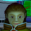

[Full ID, parameters, areas and observed placements](../npcs/0006-TObjNpcFemaleOld.md)

Qedit label: Unknown 6. Constructor: `TObjNpcFemaleOld`. Observed placements: 57.

### 0x0007 (7) — Woman walking around inside shop area

[Full ID, parameters, areas and observed placements](../npcs/0007-TObjNpcFemaleTall.md)

Qedit label: Unknown 7. Constructor: `TObjNpcFemaleTall`. Observed placements: 212.

### 0x0008 (8) — Similar appearance to weapon shop man

[Full ID, parameters, areas and observed placements](../npcs/0008-TObjNpcMaleBase.md)

Qedit label: Unknown 8. Constructor: `TObjNpcMaleBase`. Observed placements: 24.

### 0x0009 (9) — Kid wearing purple

[Full ID, parameters, areas and observed placements](../npcs/0009-TObjNpcMaleChild.md)

Qedit label: Unknown 9. Constructor: `TObjNpcMaleChild`. Observed placements: 166.

### 0x000A (10) — Man outside Medical Center

[Full ID, parameters, areas and observed placements](../npcs/000A-TObjNpcMaleDwarf.md)

Qedit label: Uknown 10. Constructor: `TObjNpcMaleDwarf`. Observed placements: 187.

### 0x000B (11) — Armor shop man

[Full ID, parameters, areas and observed placements](../npcs/000B-TObjNpcMaleFat.md)

Qedit label: Armor shop. Constructor: `TObjNpcMaleFat`. Observed placements: 443.

### 0x000C (12) — Weapon shop man

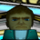

[Full ID, parameters, areas and observed placements](../npcs/000C-TObjNpcMaleMacho.md)

Qedit label: Weapon Shop. Constructor: `TObjNpcMaleMacho`. Observed placements: 298.

### 0x000D (13) — Man near telepipe locations

[Full ID, parameters, areas and observed placements](../npcs/000D-TObjNpcMaleOld.md)

Qedit label: Zidd. Constructor: `TObjNpcMaleOld`. Observed placements: 271.

### 0x000E (14) — Man wearing turquoise

[Full ID, parameters, areas and observed placements](../npcs/000E-TObjNpcMaleTall.md)

Qedit label: Unknown 14. Constructor: `TObjNpcMaleTall`. Observed placements: 17.

### 0x0019 (25) — Man right of the Ragol warp door

[Full ID, parameters, areas and observed placements](../npcs/0019-TObjNpcSoldierBase.md)

Qedit label: Blue Soldier. Constructor: `TObjNpcSoldierBase`. Observed placements: 469.

### 0x001A (26) — Man left of the Ragol warp door

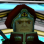

[Full ID, parameters, areas and observed placements](../npcs/001A-TObjNpcSoldierMacho.md)

Qedit label: Red Soldier. Constructor: `TObjNpcSoldierMacho`. Observed placements: 367.

### 0x001B (27) — Principal Tyrell

[Full ID, parameters, areas and observed placements](../npcs/001B-TObjNpcGovernorBase.md)

Qedit label: Principle. Constructor: `TObjNpcGovernorBase`. Observed placements: 159.

### 0x001C (28) — Tekker

[Full ID, parameters, areas and observed placements](../npcs/001C-TObjNpcConnoisseur.md)

Qedit label: Tekker. Constructor: `TObjNpcConnoisseur`. Observed placements: 512.

### 0x001D (29) — Bank woman

[Full ID, parameters, areas and observed placements](../npcs/001D-TObjNpcCloakroomBase.md)

Qedit label: Guild Lady. Constructor: `TObjNpcCloakroomBase`. Observed placements: 630.

### 0x001E (30) — Man in front of bank

[Full ID, parameters, areas and observed placements](../npcs/001E-TObjNpcExpertBase.md)

Qedit label: Scientist. Constructor: `TObjNpcExpertBase`. Observed placements: 534.

### 0x001F (31) — Nurses in Medical Center

[Full ID, parameters, areas and observed placements](../npcs/001F-TObjNpcNurseBase.md)

Qedit label: Nurse. Constructor: `TObjNpcNurseBase`. Observed placements: 797.

### 0x0020 (32) — Irene

[Full ID, parameters, areas and observed placements](../npcs/0020-TObjNpcSecretaryBase.md)

Qedit label: Irene. Constructor: `TObjNpcSecretaryBase`. Observed placements: 209.

### 0x0021 (33) — TODO

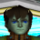

[Full ID, parameters, areas and observed placements](../npcs/0021-TObjNpcHHM00.md)

Qedit label: Default Humar (Ash). Constructor: `TObjNpcHHM00`. Observed placements: 37.

### 0x0022 (34) — TODO

[Full ID, parameters, areas and observed placements](../npcs/0022-TObjNpcNHW00.md)

Qedit label: Default Hunewearl (Sue). Constructor: `TObjNpcNHW00`. Observed placements: 15.

### 0x0024 (36) — TODO

[Full ID, parameters, areas and observed placements](../npcs/0024-TObjNpcHRM00.md)

Qedit label: Default Ramar (Bernie). Constructor: `TObjNpcHRM00`. Observed placements: 16.

### 0x0025 (37) — TODO

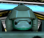

[Full ID, parameters, areas and observed placements](../npcs/0025-TObjNpcARM00.md)

Qedit label: Default Racast (Gilingham). Constructor: `TObjNpcARM00`. Observed placements: 33.

### 0x0026 (38) — TODO

[Full ID, parameters, areas and observed placements](../npcs/0026-TObjNpcARW00.md)

Qedit label: Default Racaseal (Elenor). Constructor: `TObjNpcARW00`. Observed placements: 29.

### 0x0027 (39) — TODO

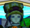

[Full ID, parameters, areas and observed placements](../npcs/0027-TObjNpcHFW00.md)

Qedit label: Default Fomarl (Alisha). Constructor: `TObjNpcHFW00`. Observed placements: 41.

### 0x0028 (40) — TODO

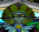

[Full ID, parameters, areas and observed placements](../npcs/0028-TObjNpcNFM00.md)

Qedit label: Default Fomewm (Montaque). Constructor: `TObjNpcNFM00`. Observed placements: 30.

### 0x0029 (41) — TODO

[Full ID, parameters, areas and observed placements](../npcs/0029-TObjNpcNFW00.md)

Qedit label: Default Fomewearl (Rupika). Constructor: `TObjNpcNFW00`. Observed placements: 28.

### 0x002B (43) — TODO

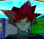

[Full ID, parameters, areas and observed placements](../npcs/002B-TObjNpcNHW01.md)

Qedit label: Unknown 43. Constructor: `TObjNpcNHW01`. Observed placements: 48.

### 0x002C (44) — TODO

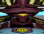

[Full ID, parameters, areas and observed placements](../npcs/002C-TObjNpcAHM01.md)

Qedit label: Unknown 44. Constructor: `TObjNpcAHM01`. Observed placements: 24.

### 0x002D (45) — TODO

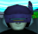

[Full ID, parameters, areas and observed placements](../npcs/002D-TObjNpcHRM01.md)

Qedit label: Dacci. Constructor: `TObjNpcHRM01`. Observed placements: 50.

### 0x0030 (48) — TODO

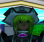

[Full ID, parameters, areas and observed placements](../npcs/0030-TObjNpcHFW01.md)

Qedit label: None. Constructor: `TObjNpcHFW01`. Observed placements: 30.

### 0x0031 (49) — TODO

[Full ID, parameters, areas and observed placements](../npcs/0031-TObjNpcNFM01.md)

Qedit label: None. Constructor: `TObjNpcNFM01`. Observed placements: 106.

### 0x0032 (50) — TODO

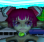

[Full ID, parameters, areas and observed placements](../npcs/0032-TObjNpcNFW01.md)

Qedit label: None. Constructor: `TObjNpcNFW01`. Observed placements: 26.

### 0x0045 (69) — Rappy NPC

Preview unavailable in the supplied Qedit archive.

[Full ID, parameters, areas and observed placements](../npcs/0045-TObjNpcLappy.md)

Qedit label: Rappy NPC. Constructor: `TObjNpcLappy`. Observed placements: 862.

### 0x0046 (70) — Small Hildebear NPC

Preview unavailable in the supplied Qedit archive.

[Full ID, parameters, areas and observed placements](../npcs/0046-TObjNpcMoja.md)

Qedit label: Small hildebear NPC. Constructor: `TObjNpcMoja`. Observed placements: 16.

### 0x00A9 (169) — Dark Bringer NPC

Preview unavailable in the supplied Qedit archive.

[Full ID, parameters, areas and observed placements](../npcs/00A9-TObjNpcBringer.md)

Qedit label: None. Constructor: `TObjNpcBringer`. Observed placements: 0.

### 0x00D0 (208) — Ep2 armor shop man

[Full ID, parameters, areas and observed placements](../npcs/00D0-TObjNpcKenkyu.md)

Qedit label: Unknown 208. Constructor: `TObjNpcKenkyu`. Observed placements: 319.

### 0x00D1 (209) — Natasha Milarose

[Full ID, parameters, areas and observed placements](../npcs/00D1-TObjNpcSoutokufu.md)

Qedit label: Natasha. Constructor: `TObjNpcSoutokufu`. Observed placements: 167.

### 0x00D2 (210) — Dan

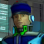

[Full ID, parameters, areas and observed placements](../npcs/00D2-TObjNpcHosa.md)

Qedit label: Dan. Constructor: `TObjNpcHosa`. Observed placements: 133.

### 0x00D3 (211) — Ep2 tool shop woman

[Full ID, parameters, areas and observed placements](../npcs/00D3-TObjNpcKenkyuW.md)

Qedit label: Unknown 211. Constructor: `TObjNpcKenkyuW`. Observed placements: 324.

### 0x00F0 (240) — Man next to room with warp to Lab

[Full ID, parameters, areas and observed placements](../npcs/00F0-TObjNpcHosa2.md)

Qedit label: Armor shop. Constructor: `TObjNpcHosa2`. Observed placements: 149.

### 0x00F1 (241) — Ep2 weapon shop man

[Full ID, parameters, areas and observed placements](../npcs/00F1-TObjNpcKenkyu2.md)

Qedit label: Item Shop. Constructor: `TObjNpcKenkyu2`. Observed placements: 178.

### 0x00F2 (242) — TODO

[Full ID, parameters, areas and observed placements](../npcs/00F2-TObjNpcNgcBase_0x00F2_.md)

Qedit label: Default Fomar. Constructor: `TObjNpcNgcBase(0x00F2)`. Observed placements: 31.

### 0x00F3 (243) — TODO

[Full ID, parameters, areas and observed placements](../npcs/00F3-TObjNpcNgcBase_0x00F3_.md)

Qedit label: Default Ramarl (Karen). Constructor: `TObjNpcNgcBase(0x00F3)`. Observed placements: 48.

### 0x00F4 (244) — TODO

[Full ID, parameters, areas and observed placements](../npcs/00F4-TObjNpcNgcBase_0x00F4_.md)

Qedit label: Leo. Constructor: `TObjNpcNgcBase(0x00F4)`. Observed placements: 41.

### 0x00F5 (245) — TODO

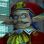

[Full ID, parameters, areas and observed placements](../npcs/00F5-TObjNpcNgcBase_0x00F5_.md)

Qedit label: Pagini. Constructor: `TObjNpcNgcBase(0x00F5)`. Observed placements: 36.

### 0x00F6 (246) — TODO

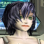

[Full ID, parameters, areas and observed placements](../npcs/00F6-TObjNpcNgcBase_0x00F6_.md)

Qedit label: Unknown 246. Constructor: `TObjNpcNgcBase(0x00F6)`. Observed placements: 8.

### 0x00F7 (247) — Nol

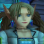

[Full ID, parameters, areas and observed placements](../npcs/00F7-TObjNpcNgcBase_0x00F7_.md)

Qedit label: Nol. Constructor: `TObjNpcNgcBase(0x00F7)`. Observed placements: 73.

### 0x00F8 (248) — Elly

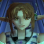

[Full ID, parameters, areas and observed placements](../npcs/00F8-TObjNpcNgcBase_0x00F8_.md)

Qedit label: Elly. Constructor: `TObjNpcNgcBase(0x00F8)`. Observed placements: 98.

### 0x00F9 (249) — Woman with cyan hair

[Full ID, parameters, areas and observed placements](../npcs/00F9-TObjNpcNgcBase_0x00F9_.md)

Qedit label: Unknown 249. Constructor: `TObjNpcNgcBase(0x00F9)`. Observed placements: 154.

### 0x00FA (250) — Woman with bright red hair

[Full ID, parameters, areas and observed placements](../npcs/00FA-TObjNpcNgcBase_0x00FA_.md)

Qedit label: Ep 2 Item Shop. Constructor: `TObjNpcNgcBase(0x00FA)`. Observed placements: 139.

### 0x00FB (251) — Man with blue hair near the Ep2 Medical Center

[Full ID, parameters, areas and observed placements](../npcs/00FB-TObjNpcNgcBase_0x00FB_.md)

Qedit label: Ep 2 Weapon Shop. Constructor: `TObjNpcNgcBase(0x00FB)`. Observed placements: 146.

### 0x00FC (252) — Man in room next to Ep2 Hunter's Guild

[Full ID, parameters, areas and observed placements](../npcs/00FC-TObjNpcNgcBase_0x00FC_.md)

Qedit label: Security Guard. Constructor: `TObjNpcNgcBase(0x00FC)`. Observed placements: 125.

### 0x00FD (253) — TODO

[Full ID, parameters, areas and observed placements](../npcs/00FD-TObjNpcNgcBase_0x00FD_.md)

Qedit label: Ep 2 Hunters Guild. Constructor: `TObjNpcNgcBase(0x00FD)`. Observed placements: 73.

### 0x00FE (254) — Episode 2 Hunter's Guild woman

[Full ID, parameters, areas and observed placements](../npcs/00FE-TObjNpcNgcBase_0x00FE_.md)

Qedit label: Ep 2 Nurse. Constructor: `TObjNpcNgcBase(0x00FE)`. Observed placements: 386.

### 0x00FF (255) — Woman near room with teleporter to VR areas

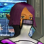

[Full ID, parameters, areas and observed placements](../npcs/00FF-TObjNpcNgcBase_0x00FF_.md)

Qedit label: Unknown 255. Constructor: `TObjNpcNgcBase(0x00FF)`. Observed placements: 133.

### 0x0100 (256) — Momoka

[Full ID, parameters, areas and observed placements](../npcs/0100-__MOMOKA__.md)

Qedit label: Momoka. Constructor: `__MOMOKA__`. Observed placements: 86.

### 0x0118 (280) — Rupika

Preview unavailable in the supplied Qedit archive.

Qedit label: Rupika. Constructor: `__QUEST_NPC__`. Observed placements: 161.

### 0x0033 (51) — Stage NPC's

Preview unavailable in the supplied Qedit archive.

[Full ID, parameters, areas and observed placements](../npcs/0033-TObjNpcEnemy.md)

Qedit label: Stage NPC's. Constructor: `TObjNpcEnemy`. Observed placements: 598.

## Coverage notes

This gallery includes `0x0118 / 280` (`__QUEST_NPC__`, 161 observed placements), which the older entity index incorrectly grouped as a monster because its classifier checked mixed-case `Npc`. The gallery recognizes it as an NPC; its parameters are included in `npcs.json`. The older index and SQLite classification have not yet been rebuilt.

## Evidence

[Qedit preview lookup](https://github.com/schthack/qedit/blob/2af5d144485b58ba28b57d98d2daa1a6b141ff4f/Unit1.pas) and [image archive loading](https://github.com/schthack/qedit/blob/2af5d144485b58ba28b57d98d2daa1a6b141ff4f/main.pas). Original preview rights remain with their owners. Archive entry hashes are retained in `npcs.json`.
