# HUmar appearance selectors

Visual class ID **0**. [Scope, baseline and limitations](README.md). Each heading identifies the only changed selector.

## baseline 0

## skin 0

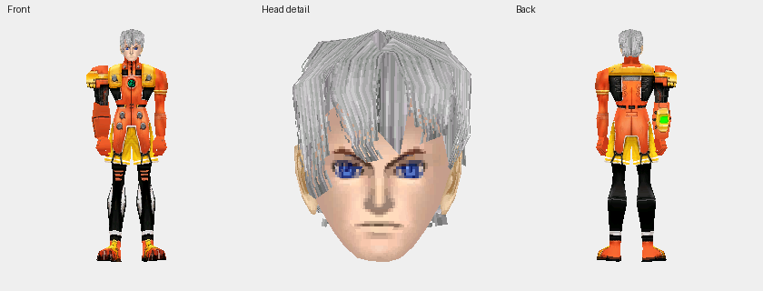

## skin 1

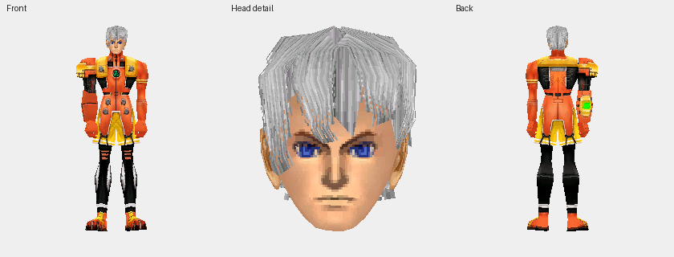

## skin 2

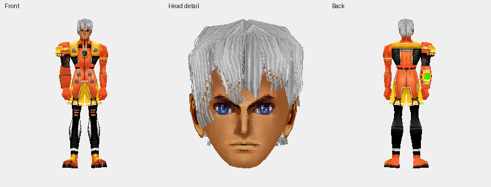

## skin 3

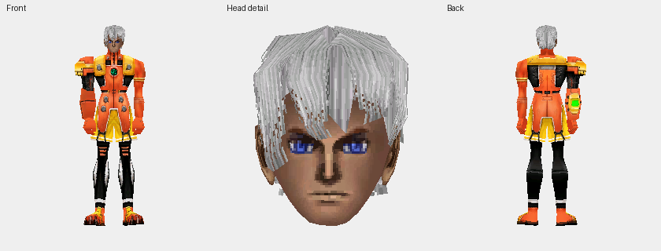

## face 0

## face 1

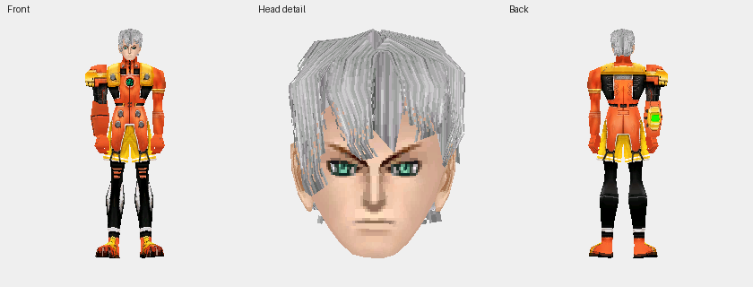

## face 2

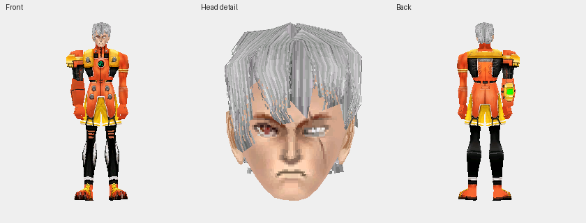

## face 3

## face 4

## costume 0

## costume 1

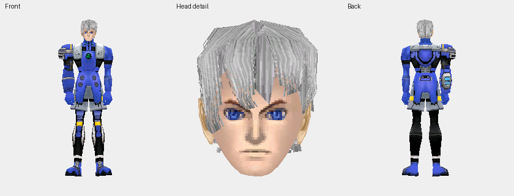

## costume 2

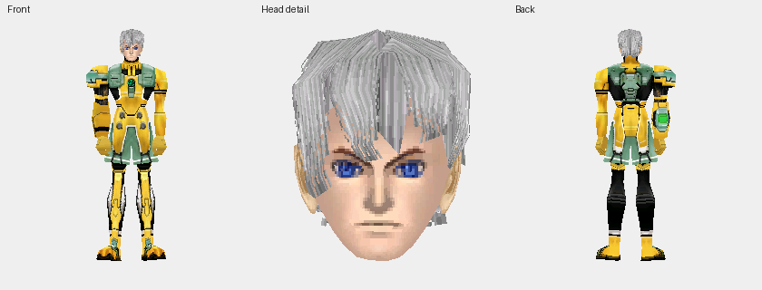

## costume 3

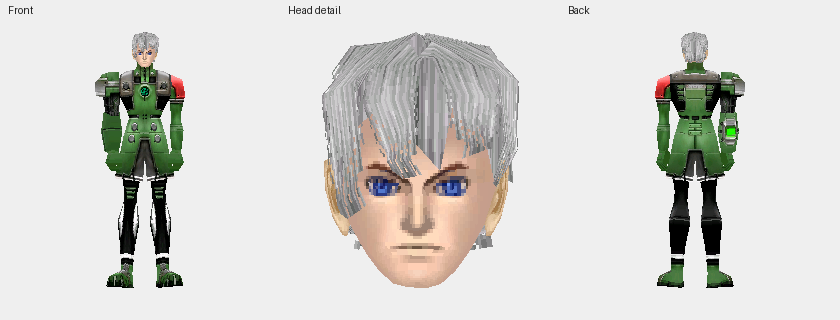

## costume 4

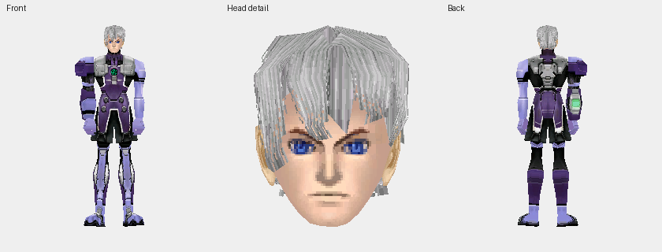

## costume 5

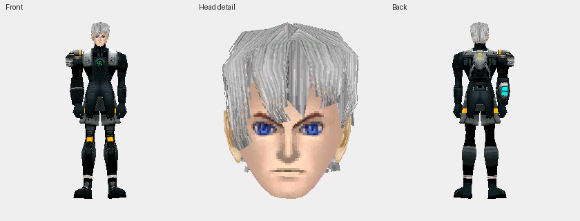

## costume 6

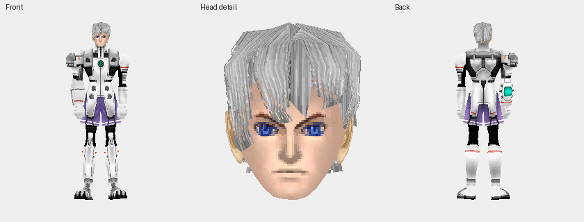

## costume 7

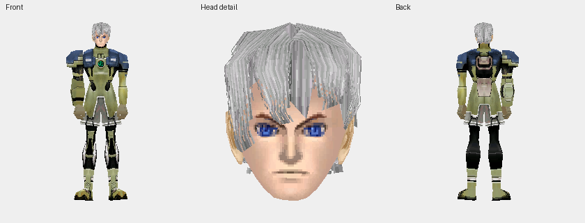

## costume 8

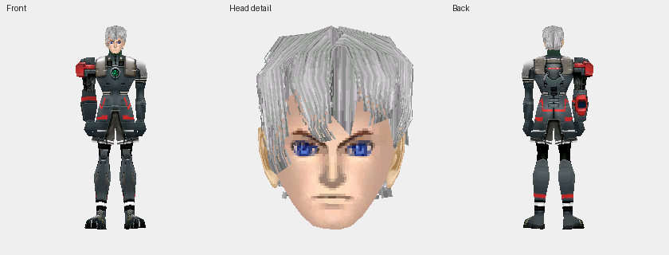

## costume 9

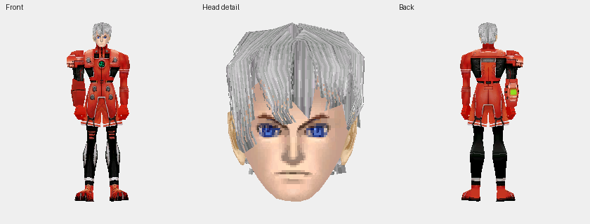

## costume 10

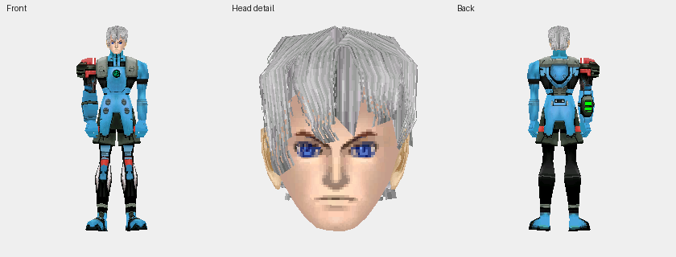

## costume 11

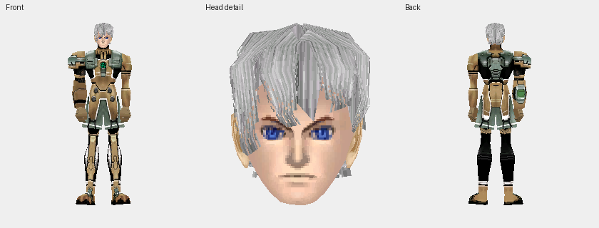

## costume 12

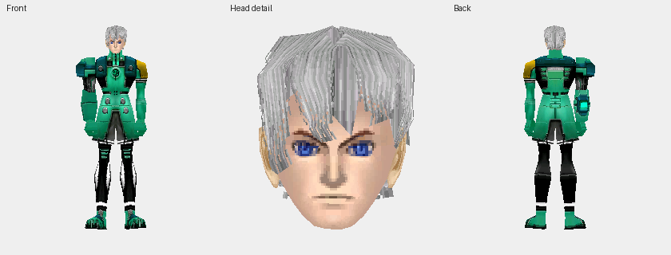

## costume 13

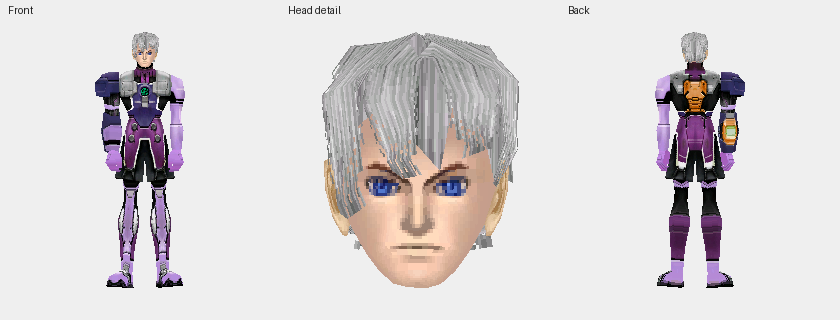

## costume 14

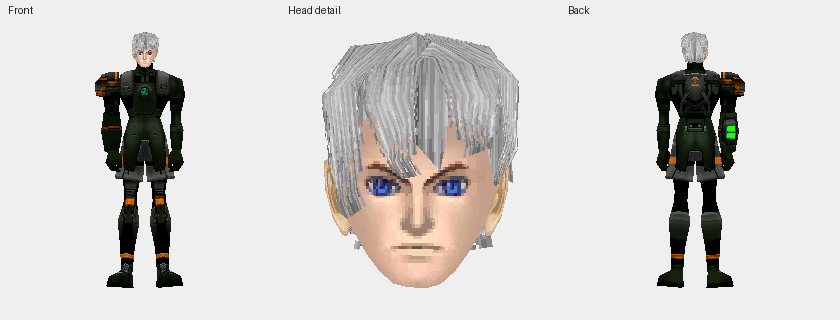

## costume 15

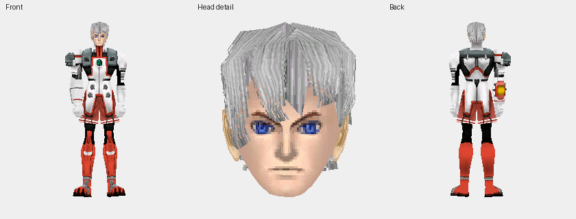

## costume 16

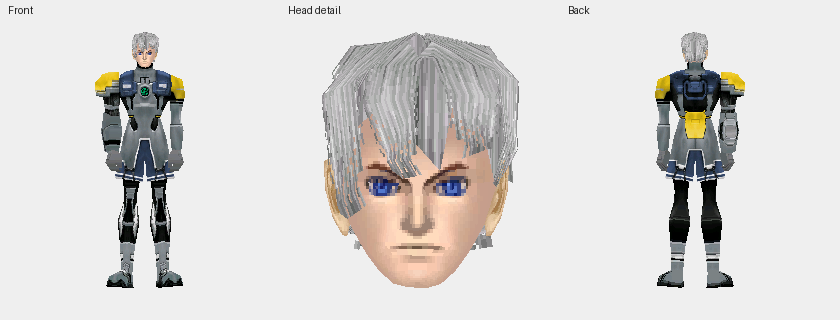

## costume 17

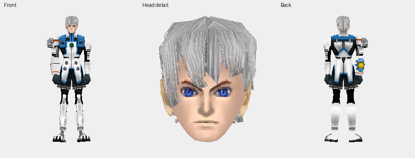

## hair 0

## hair 1

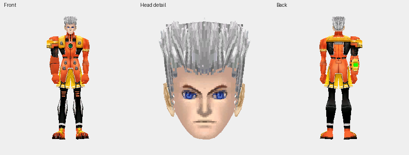

## hair 2

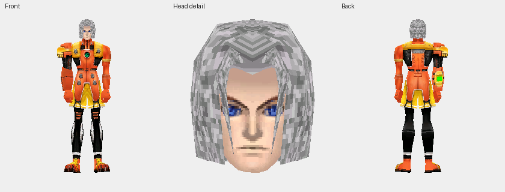

## hair 3

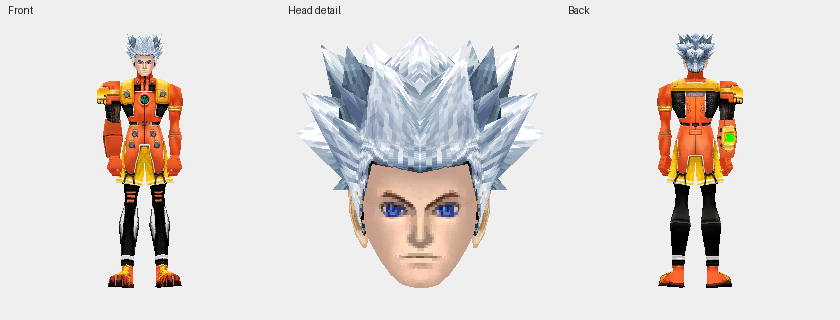

## hair 4

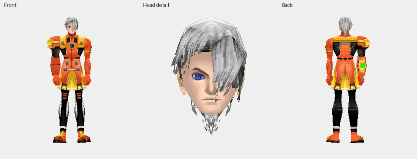

## hair 5

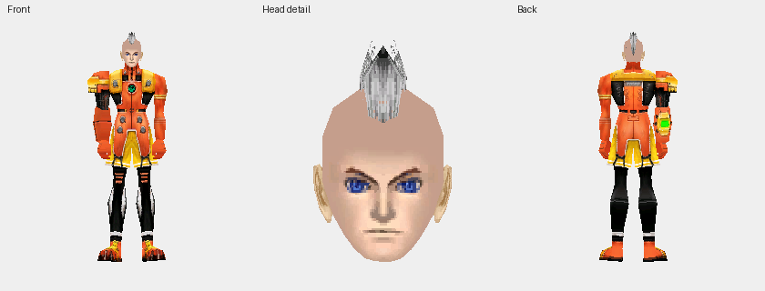

## hair 6

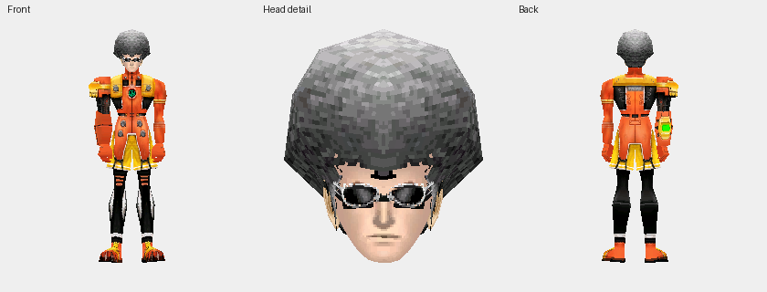

## hair 7

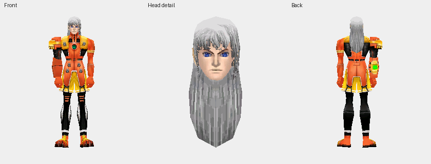

## hair 8

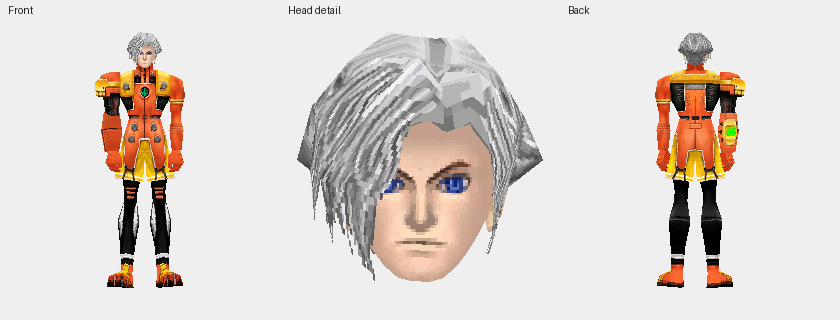

## hair 9

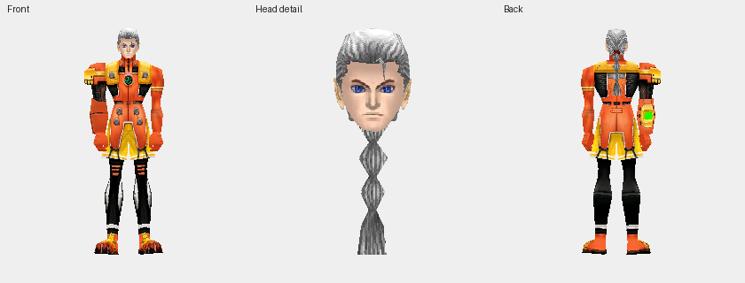

## head 0

