# HUcast appearance selectors

Visual class ID **2**. [Scope, baseline and limitations](README.md). Each heading identifies the only changed selector.

## baseline 0

## skin 0

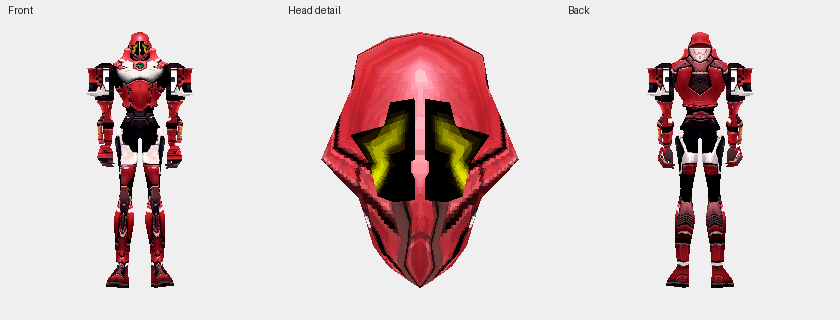

## skin 1

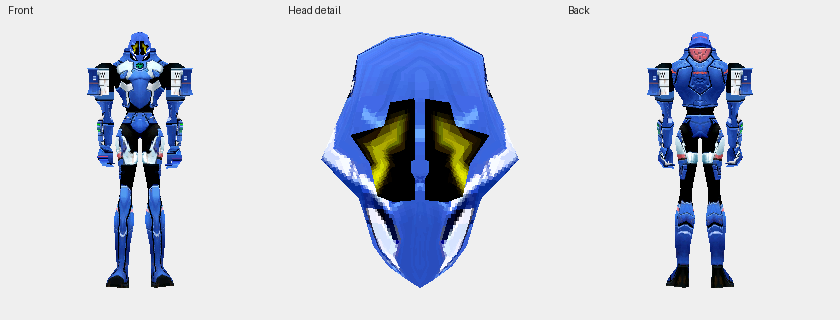

## skin 2

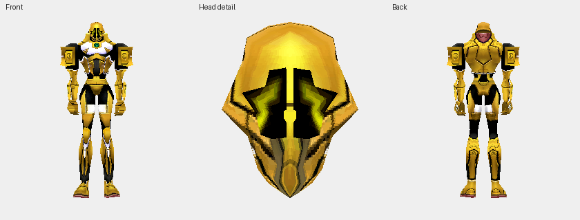

## skin 3

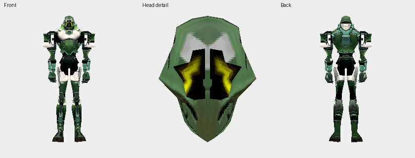

## skin 4

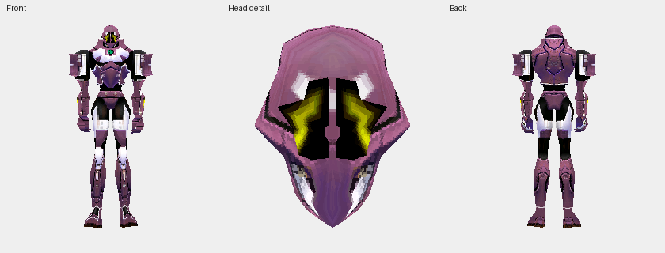

## skin 5

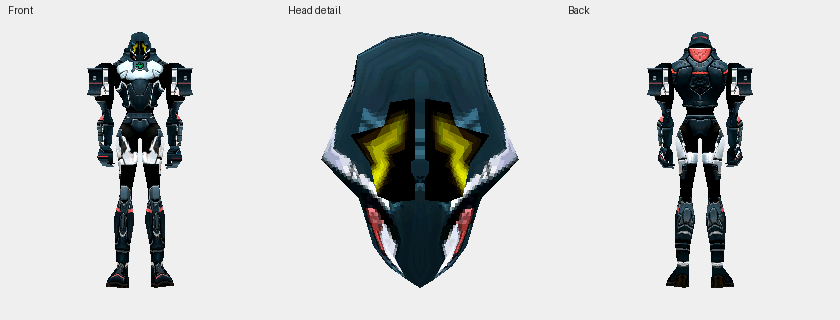

## skin 6

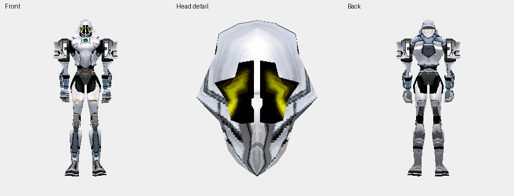

## skin 7

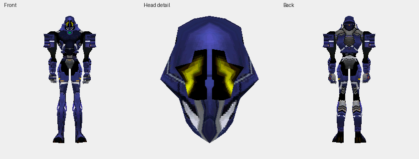

## skin 8

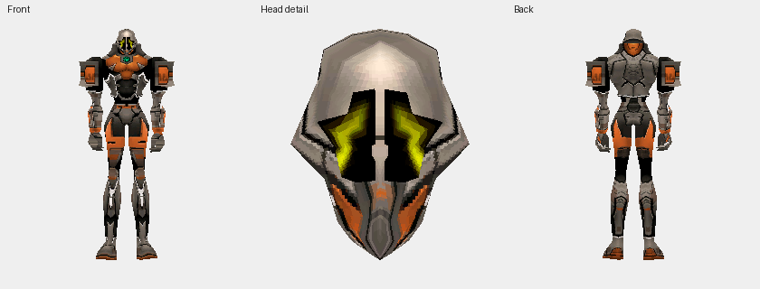

## skin 9

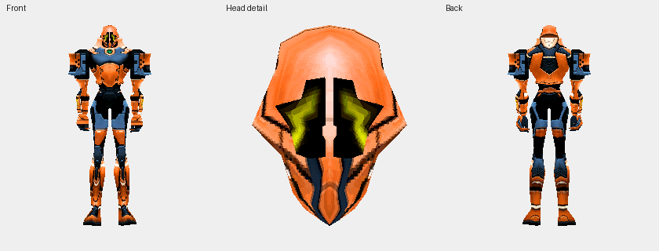

## skin 10

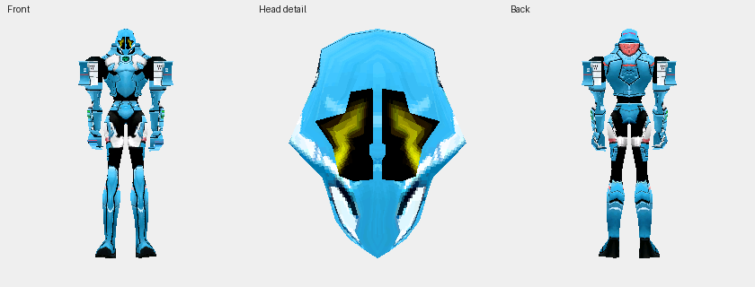

## skin 11

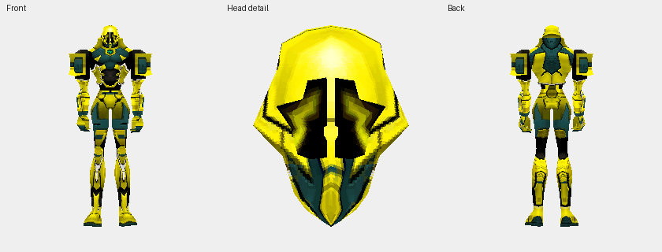

## skin 12

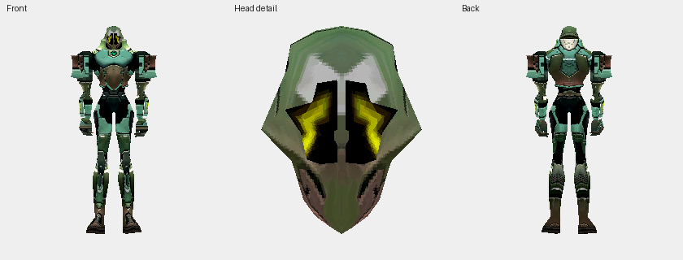

## skin 13

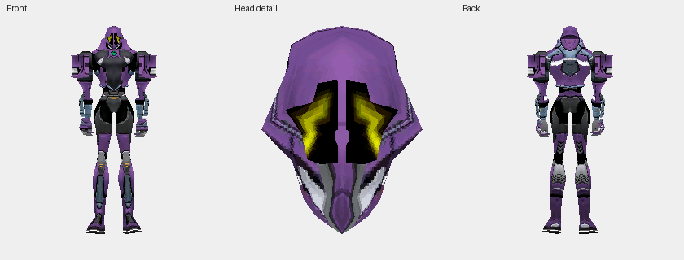

## skin 14

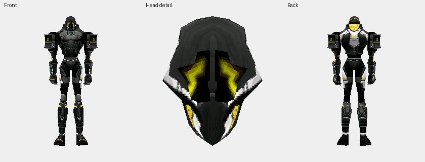

## skin 15

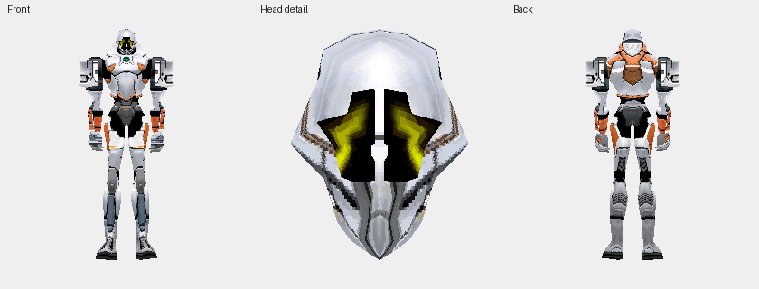

## skin 16

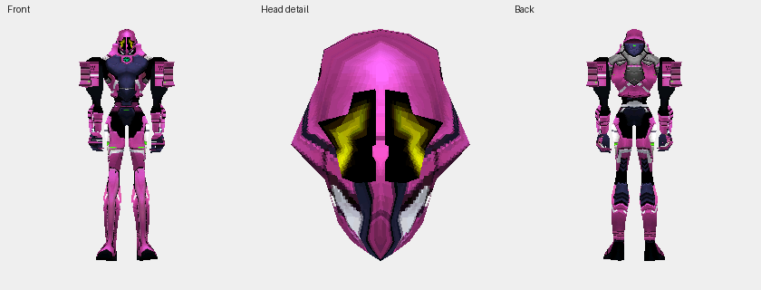

## skin 17

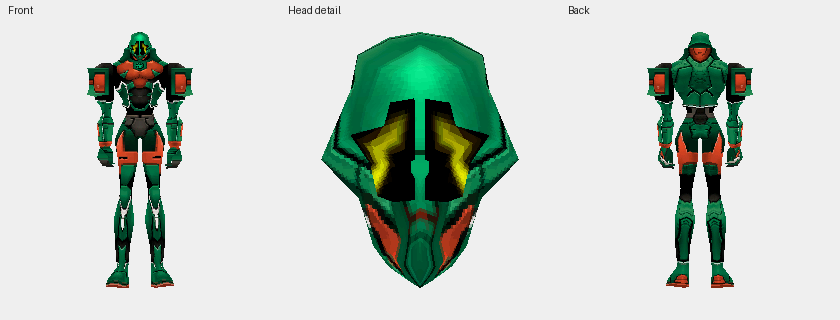

## skin 18

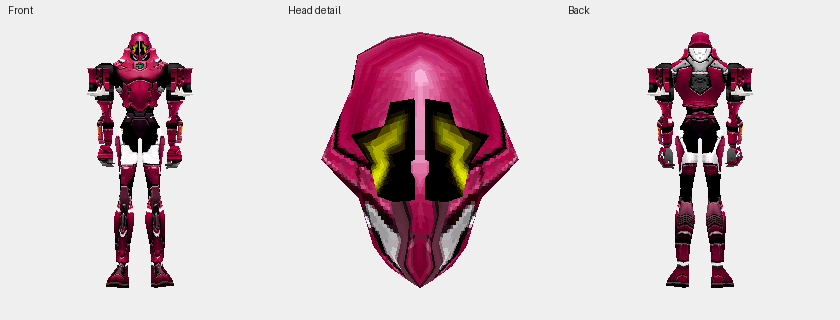

## skin 19

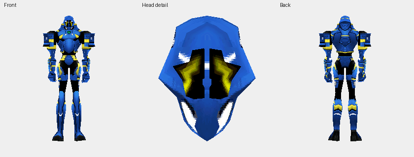

## skin 20

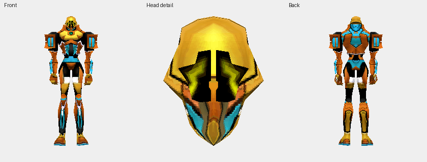

## skin 21

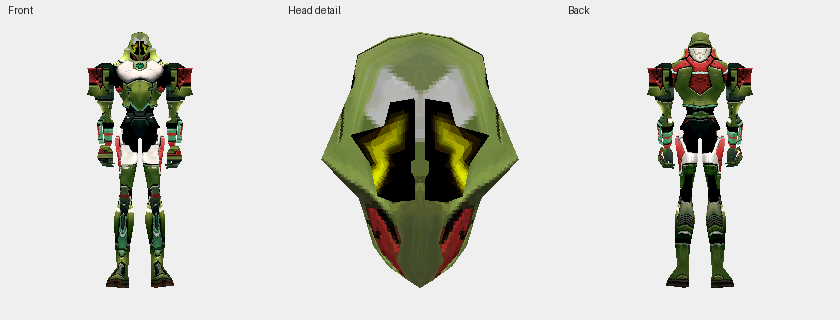

## skin 22

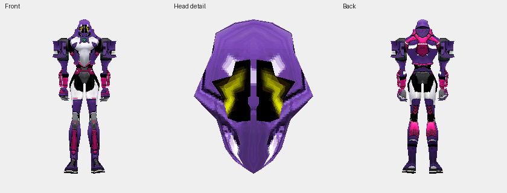

## skin 23

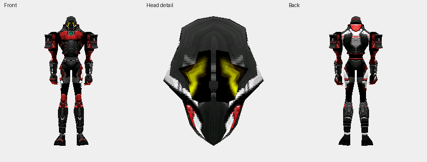

## skin 24

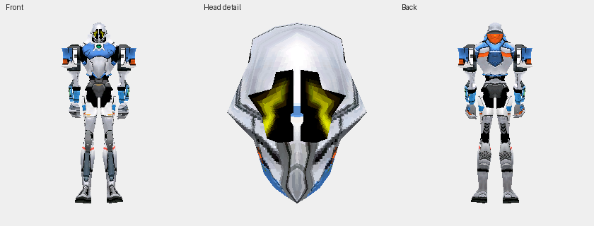

## head 0

## head 1

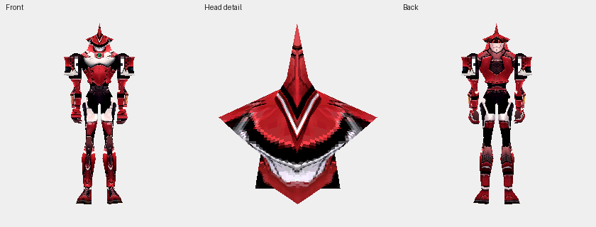

## head 2

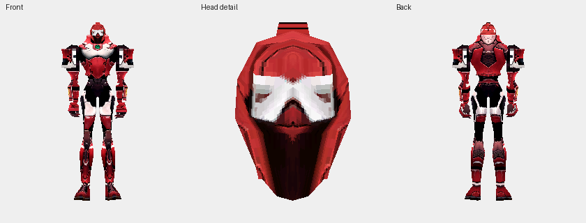

## head 3

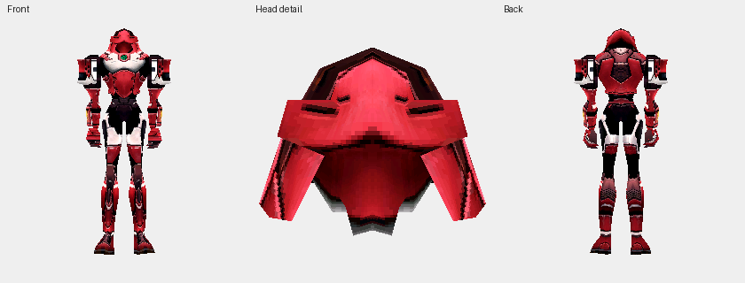

## head 4

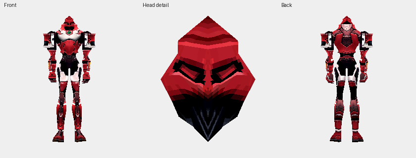
