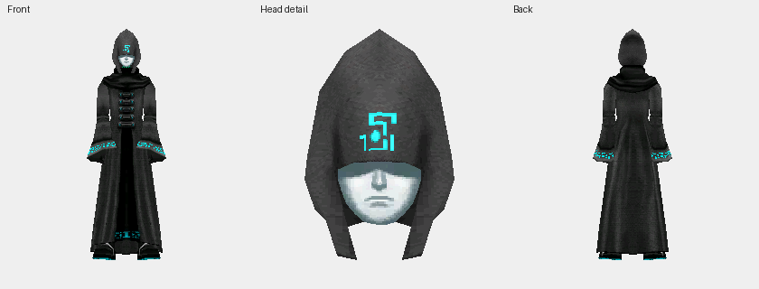
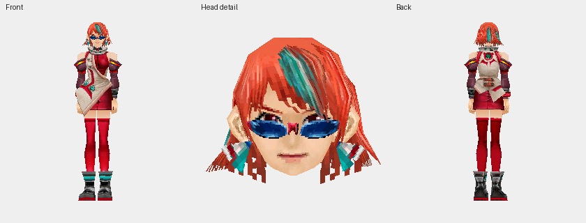
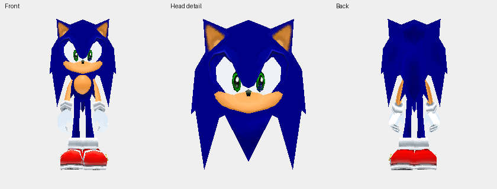
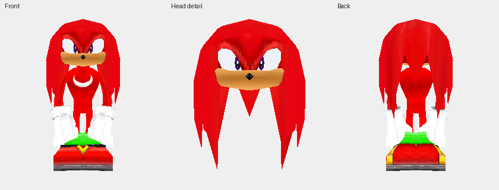
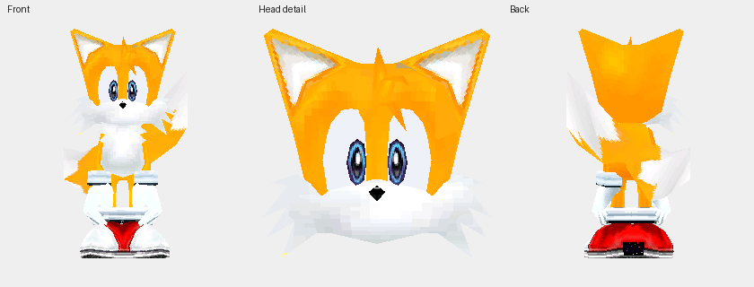
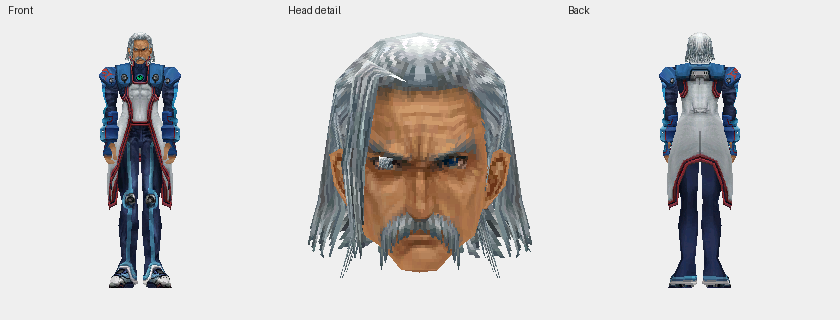
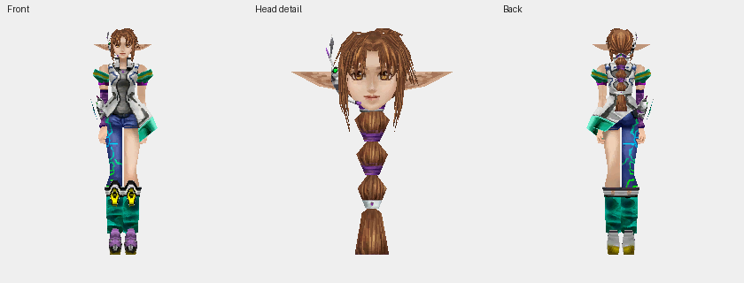

# Special-model appearance sheets

[Scope and limitations](README.md). These are extra_model selector IDs, not DAT types.

## GM — extra_model 0

## Rico — extra_model 1

## Sonic — extra_model 2

## Knuckles — extra_model 3

## Tails — extra_model 4

## Flowen — extra_model 5

## Elly — extra_model 6

