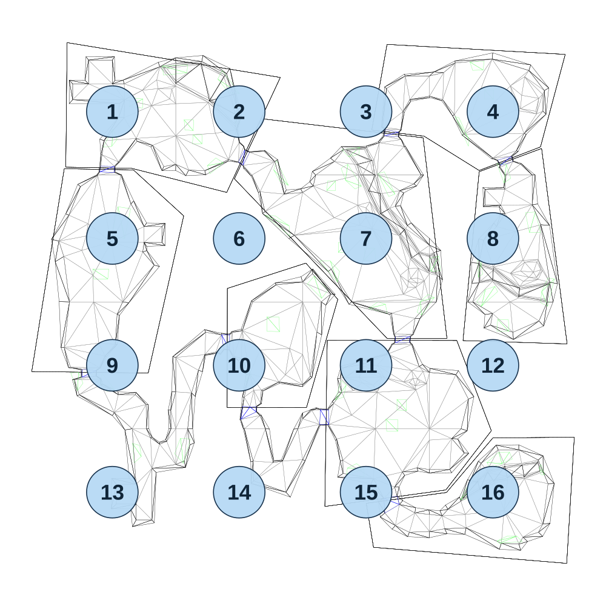
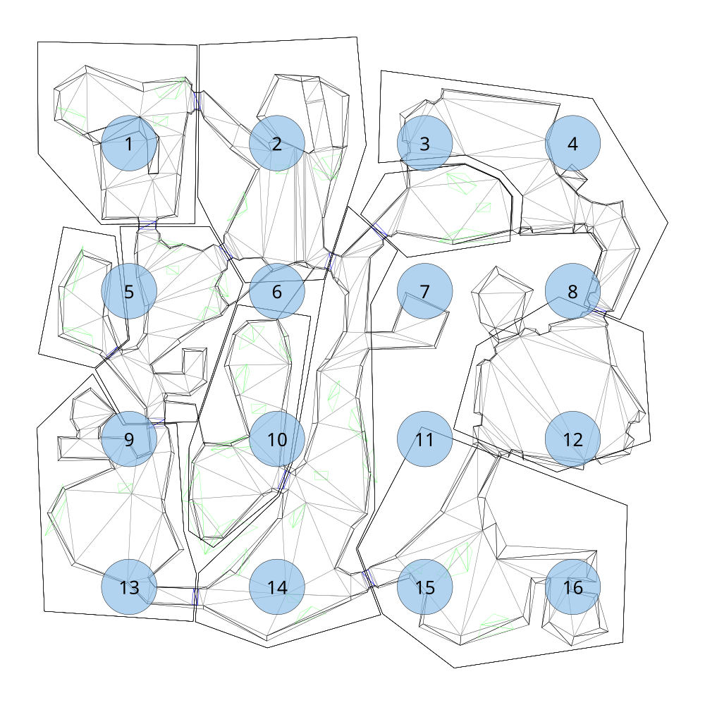

# Extracted Forest wireframes and section markers

These wireframes were generated directly from the supplied Qedit map files, not traced from screenshots. The parser follows [Qedit's DrawBBRELFile implementation](https://github.com/schthack/qedit/blob/master/main.pas): collision vertices/triangles come from `c.rel`; section IDs and marker positions come from `n.rel`. The resulting outlines and marker positions were visually compared with the owner's Forest 1/2 screenshots and match their layout.

| Map | Numbered sections | Vertices | Collision triangles | Downloads |
|---|---|---:|---:|---|
| Forest 1 | 1–16 | 1,372 | 1,455 | [SVG wireframe](map_forest01.svg) · [JSON geometry](map_forest01.json) |
| Forest 2 | 1–16 | 1,464 | 1,475 | [SVG wireframe](map_forest02.svg) · [JSON geometry](map_forest02.json) |

## Forest 1

## Forest 2

The JSON contains original file hashes, section positions, raw rotation values, collision blocks, vertices, triangle indices and flags. Unknown bytes are preserved. Forest 2 also contains a section record with ID 0xFFFFFFFF; it is retained in JSON but excluded from the numbered marker overlay, consistent with Qedit's ID filter.

**The blue circles identify section reference positions; they are not room boundaries or safe spawn zones.** Some markers lie in empty space. Collision blocks are not automatically associated with a room ID. Region assignment, local-to-world coordinate transforms and client spawn validation remain separate work. Do not assign a triangle to its nearest marker or treat a marker position as a player spawn point.

The colors follow Qedit's drawing priority: flag 0x40 blue, 0x10 green, 0x01 gray, otherwise black. This reproduces rendering; it does not fully interpret collision behavior. These results apply to the supplied Forest map files, not automatically every area in the game.

[Extractor](../../tools/extract_forest_geometry.py) · [General floor database](../README.md)
