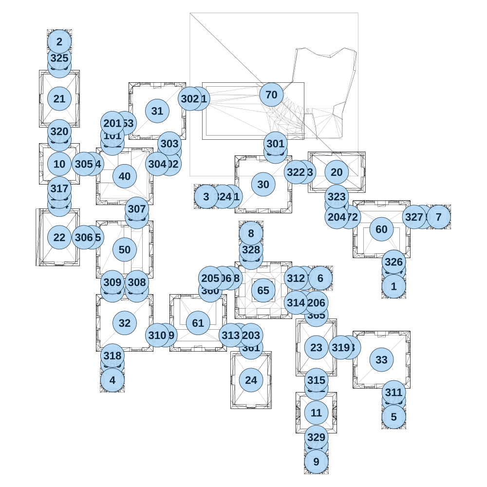

# map_ancient01_00

[All map wireframes](README.md)

[SVG](map_ancient01_00.svg) · [PNG](map_ancient01_00.png) · [Geometry JSON](map_ancient01_00.json)

## Section reference positions

These are markers, not room boundaries or safe spawn points. Positions use the file’s XYZ axes; the wireframe projects X/Z. Rotation is retained raw, not interpreted here.

| Section ID | X | Y | Z | Raw rotation |
|---:|---:|---:|---:|---:|
| 68 | 1300 | 0 | 575 | 16383 |
| 350 | 850 | 0 | -625 | 0 |
| 351 | 375 | 0 | -950 | 16383 |
| 352 | -150 | 0 | -675 | 0 |
| 353 | -75 | 0 | -800 | 16383 |
| 354 | -275 | 0 | -550 | 16383 |
| 355 | -275 | 0 | -100 | 16383 |
| 356 | -150 | 0 | 225 | 0 |
| 357 | 0 | 0 | 225 | 0 |
| 358 | 575 | 0 | 150 | 16383 |
| 359 | 175 | 0 | 500 | 16383 |
| 360 | 450 | 0 | 225 | 0 |
| 361 | 700 | 0 | 575 | 0 |
| 362 | 1100 | 0 | 825 | 0 |
| 363 | 0 | 0 | -225 | 0 |
| 364 | -475 | 0 | -300 | 0 |
| 365 | 1100 | 0 | 375 | 0 |
| 366 | -150 | 0 | 675 | 0 |
| 367 | 1025 | 0 | 150 | 16383 |
| 369 | 1575 | 0 | 100 | 0 |
| 370 | -475 | 0 | -1150 | 0 |
| 371 | 575 | 0 | -350 | 16383 |
| 372 | 1300 | 0 | -225 | 16383 |
| 373 | 1025 | 0 | -500 | 16383 |
| 374 | 1575 | 0 | 100 | 0 |
| 375 | -475 | 0 | -700 | 0 |
| 376 | 1575 | 0 | 900 | 0 |
| 377 | 1100 | 0 | 1175 | 0 |
| 378 | 700 | 0 | 25 | 0 |
| 379 | 1750 | 0 | -225 | 16383 |
| 101 | -150 | 0 | -725 | 0 |
| 102 | 200 | 0 | -625 | 0 |
| 103 | -475 | 0 | -350 | 0 |
| 104 | 1025 | 0 | 300 | 16383 |
| 105 | 1225 | 0 | -300 | 0 |
| 106 | 525 | 0 | 150 | 16383 |
| 107 | 625 | 0 | 500 | 16383 |
| 201 | -150 | 0 | -800 | 0 |
| 202 | 200 | 0 | -550 | 32768 |
| 203 | 700 | 0 | 500 | 49152 |
| 204 | 1225 | 0 | -225 | 16383 |
| 205 | 450 | 0 | 150 | 0 |
| 206 | 1100 | 0 | 300.647 | 49152 |
| 301 | 850 | 0 | -675 | 0 |
| 302 | 325 | 0 | -950 | 16383 |
| 303 | 200 | 0 | -675 | 0 |
| 304 | 125 | 0 | -550 | 16383 |
| 305 | -325 | 0 | -550 | 16383 |
| 306 | -325 | 0 | -100 | 16383 |
| 307 | 0 | 0 | -275 | 0 |
| 308 | 0 | 0 | 175 | 0 |
| 309 | -150 | 0 | 175 | 0 |
| 310 | 125 | 0 | 500 | 16383 |
| 311 | 1575 | 0 | 850 | 0 |
| 312 | 975 | 0 | 150 | 16383 |
| 313 | 575 | 0 | 500 | 16383 |
| 314 | 975 | 0 | 300 | 16383 |
| 315 | 1100 | 0 | 775 | 0 |
| 317 | -475 | 0 | -400 | 0 |
| 318 | -150 | 0 | 625 | 0 |
| 319 | 1250 | 0 | 575 | 16383 |
| 320 | -475 | 0 | -750 | 0 |
| 321 | 1575 | 0 | 50 | 0 |
| 322 | 975 | 0 | -500 | 16383 |
| 323 | 1225 | 0 | -350 | 0 |
| 324 | 525 | 0 | -350 | 16383 |
| 325 | -475 | 0 | -1200 | 0 |
| 326 | 1575 | 0 | 50 | 0 |
| 327 | 1700 | 0 | -225 | 16383 |
| 328 | 700 | 0 | -25 | 0 |
| 329 | 1100 | 0 | 1125 | 0 |
| 1 | 1575 | 0 | 200 | 0 |
| 2 | -475 | 0 | -1300 | 0 |
| 3 | 425 | 0 | -350 | 0 |
| 4 | -150 | 0 | 775 | 0 |
| 5 | 1575 | 0 | 1000 | 0 |
| 6 | 1125 | 0 | 150 | 0 |
| 7 | 1850 | 0 | -225 | 0 |
| 8 | 700 | 0 | -125 | 0 |
| 9 | 1100 | 0 | 1275 | 0 |
| 10 | -475 | 0 | -550 | 0 |
| 11 | 1100 | 0 | 975 | 0 |
| 20 | 1225 | 0 | -500 | 16383 |
| 21 | -475 | 0 | -950 | 0 |
| 22 | -475 | 0 | -100 | 0 |
| 23 | 1100 | 0 | 575 | 0 |
| 24 | 700 | 0 | 775 | 0 |
| 30 | 775 | 0 | -425 | 0 |
| 31 | 125 | 0 | -875 | 0 |
| 32 | -75 | 0 | 425 | 0 |
| 33 | 1500 | 0 | 650 | 0 |
| 70 | 825 | 0 | -975 | 16383 |
| 40 | -75 | 0 | -475 | 0 |
| 50 | -75 | 0 | -25 | 0 |
| 60 | 1500 | 0 | -150 | 0 |
| 61 | 375 | 0 | 425 | 32768 |
| 65 | 775 | 0 | 225 | 0 |

Collision triangles: 9026. Sentinel/unlabelled records remain in JSON. Overlapping marker positions are preserved, not moved to invent room locations.
