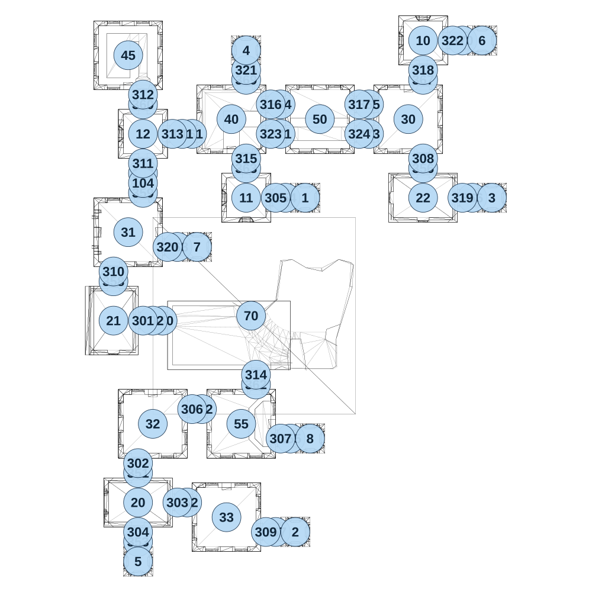

# map_ancient01_01

[All map wireframes](README.md)

[SVG](map_ancient01_01.svg) · [PNG](map_ancient01_01.png) · [Geometry JSON](map_ancient01_01.json)

## Section reference positions

These are markers, not room boundaries or safe spawn points. Positions use the file’s XYZ axes; the wireframe projects X/Z. Rotation is retained raw, not interpreted here.

| Section ID | X | Y | Z | Raw rotation |
|---:|---:|---:|---:|---:|
| 350 | -250 | 0 | -200 | 16383 |
| 351 | -375 | 0 | 575 | 0 |
| 352 | -125 | 0 | 725 | 16383 |
| 353 | -375 | 0 | 925 | 0 |
| 354 | 375 | 0 | -825 | 16383 |
| 355 | 400 | 0 | 400 | 16383 |
| 356 | 1075 | 0 | -975 | 0 |
| 357 | 325 | 0 | 875 | 16383 |
| 358 | -500 | 0 | -400 | 0 |
| 359 | -350 | 0 | -850 | 0 |
| 360 | -350 | 0 | -1300 | 0 |
| 361 | -100 | 0 | -1150 | 16383 |
| 362 | 225 | 0 | 125 | 0 |
| 363 | 175 | 0 | -975 | 0 |
| 364 | 350 | 0 | -1300 | 16383 |
| 365 | 800 | 0 | -1300 | 16383 |
| 366 | 1325 | 0 | -825 | 16383 |
| 367 | 1075 | 0 | -1425 | 0 |
| 368 | -175 | 0 | -575 | 16383 |
| 369 | 175 | 0 | -1425 | 0 |
| 370 | 1275 | 0 | -1625 | 16383 |
| 371 | 350 | 0 | -1150 | 16383 |
| 372 | -50 | 0 | 250 | 16383 |
| 373 | 800 | 0 | -1150 | 16383 |
| 101 | -150 | 0 | -1150 | 16383 |
| 102 | -300 | 0 | -200 | 16383 |
| 103 | -350 | 0 | -950 | 0 |
| 104 | -350 | 0 | -900 | 0 |
| 301 | -350 | 0 | -200 | 16383 |
| 302 | -375 | 0 | 525 | 0 |
| 303 | -175 | 0 | 725 | 16383 |
| 304 | -375 | 0 | 875 | 0 |
| 305 | 325 | 0 | -825 | 16383 |
| 306 | -100 | 0 | 250 | 16383 |
| 307 | 350 | 0 | 400 | 16383 |
| 308 | 1075 | 0 | -1025 | 0 |
| 309 | 275 | 0 | 875 | 16383 |
| 310 | -500 | 0 | -450 | 0 |
| 311 | -350 | 0 | -1000 | 0 |
| 312 | -350 | 0 | -1350 | 0 |
| 313 | -200 | 0 | -1150 | 16383 |
| 314 | 225 | 0 | 75 | 0 |
| 315 | 175 | 0 | -1025 | 0 |
| 316 | 300 | 0 | -1300 | 16383 |
| 317 | 750 | 0 | -1300 | 16383 |
| 318 | 1075 | 0 | -1475 | 0 |
| 319 | 1275 | 0 | -825 | 16383 |
| 320 | -225 | 0 | -575 | 16383 |
| 321 | 175 | 0 | -1475 | 0 |
| 322 | 1225 | 0 | -1625 | 16383 |
| 323 | 300 | 0 | -1150 | 16383 |
| 324 | 750 | 0 | -1150 | 16383 |
| 1 | 475 | 0 | -825 | 0 |
| 2 | 425 | 0 | 875 | 0 |
| 3 | 1425 | 0 | -825 | 0 |
| 4 | 175 | 0 | -1575 | 0 |
| 5 | -375 | 0 | 1025 | 0 |
| 6 | 1375 | 0 | -1625 | 0 |
| 7 | -75 | 0 | -575 | 0 |
| 8 | 500 | 0 | 400 | 0 |
| 10 | 1075 | 0 | -1625 | 0 |
| 11 | 175 | 0 | -825 | 0 |
| 12 | -350 | 0 | -1150 | 0 |
| 20 | -375 | 0 | 725 | 16383 |
| 21 | -500 | 0 | -200 | 0 |
| 22 | 1075 | 0 | -825 | 16383 |
| 30 | 1000 | 0 | -1225 | 0 |
| 31 | -425 | 0 | -650 | 0 |
| 32 | -300 | 0 | 325 | 0 |
| 33 | 75 | 0 | 800 | 0 |
| 70 | 200 | 0 | -225 | 16383 |
| 40 | 100 | 0 | -1225 | 32768 |
| 50 | 550 | 0 | -1225 | 49152 |
| 55 | 150 | 0 | 325 | 49152 |
| 45 | -425 | 0 | -1550 | 32768 |

Collision triangles: 7506. Sentinel/unlabelled records remain in JSON. Overlapping marker positions are preserved, not moved to invent room locations.
