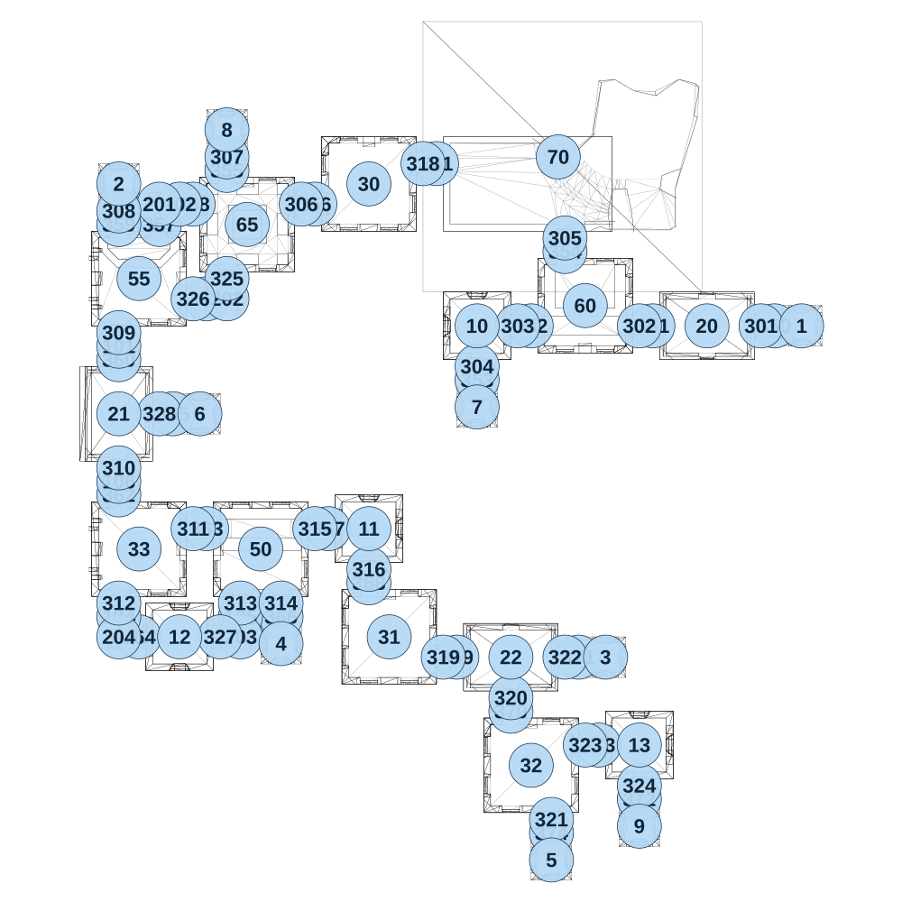

# map_ancient01_02

[All map wireframes](README.md)

[SVG](map_ancient01_02.svg) · [PNG](map_ancient01_02.png) · [Geometry JSON](map_ancient01_02.json)

## Section reference positions

These are markers, not room boundaries or safe spawn points. Positions use the file’s XYZ axes; the wireframe projects X/Z. Rotation is retained raw, not interpreted here.

| Section ID | X | Y | Z | Raw rotation |
|---:|---:|---:|---:|---:|
| 350 | 2000 | 0 | -350 | 16383 |
| 351 | 1550 | 0 | -350 | 16383 |
| 352 | 1100 | 0 | -350 | 16383 |
| 353 | 900 | 0 | -150 | 0 |
| 354 | 1225 | 0 | -625 | 0 |
| 355 | -25 | 0 | -925 | 0 |
| 356 | 300 | 0 | -800 | 16383 |
| 357 | -275 | 0 | -725 | 0 |
| 358 | -150 | 0 | -800 | 16383 |
| 359 | -425 | 0 | -725 | 0 |
| 360 | -425 | 0 | -225 | 0 |
| 361 | 750 | 0 | -950 | 16383 |
| 362 | -425 | 0 | 275 | 0 |
| 363 | -100 | 0 | 400 | 16383 |
| 364 | -350 | 0 | 800 | 16383 |
| 365 | -225 | 0 | -25 | 16383 |
| 366 | 175 | 0 | 725 | 0 |
| 367 | 350 | 0 | 400 | 16383 |
| 368 | 500 | 0 | 600 | 0 |
| 369 | 825 | 0 | 875 | 16383 |
| 370 | 1025 | 0 | 1075 | 0 |
| 371 | 1275 | 0 | 875 | 16383 |
| 372 | 1500 | 0 | 1400 | 0 |
| 373 | 1350 | 0 | 1200 | 16383 |
| 374 | 1175 | 0 | 1525 | 0 |
| 101 | -425 | 0 | -275 | 0 |
| 102 | -200 | 0 | -800 | 16383 |
| 103 | -100 | 0 | -450 | 16383 |
| 104 | -425 | 0 | 725 | 0 |
| 105 | 25 | 0 | 725 | 0 |
| 106 | -425 | 0 | 225 | 0 |
| 201 | -275 | 0 | -800 | 0 |
| 202 | -25 | 0 | -450 | 32768 |
| 203 | 25 | 0 | 800 | 32768 |
| 204 | -425 | 0 | 800 | 16383 |
| 301 | 1950 | 0 | -350 | 16383 |
| 302 | 1500 | 0 | -350 | 16383 |
| 303 | 1050 | 0 | -350 | 16383 |
| 304 | 900 | 0 | -200 | 0 |
| 305 | 1225 | 0 | -675 | 0 |
| 306 | 250 | 0 | -800 | 16383 |
| 307 | -25 | 0 | -975 | 0 |
| 308 | -425 | 0 | -775 | 0 |
| 309 | -425 | 0 | -325 | 0 |
| 310 | -425 | 0 | 175 | 0 |
| 311 | -150 | 0 | 400 | 16383 |
| 312 | -425 | 0 | 675 | 0 |
| 313 | 25 | 0 | 675 | 0 |
| 314 | 175 | 0 | 675 | 0 |
| 315 | 300 | 0 | 400 | 16383 |
| 316 | 500 | 0 | 550 | 0 |
| 318 | 700 | 0 | -950 | 16383 |
| 319 | 775 | 0 | 875 | 16383 |
| 320 | 1025 | 0 | 1025 | 0 |
| 321 | 1175 | 0 | 1475 | 0 |
| 322 | 1225 | 0 | 875 | 16383 |
| 323 | 1300 | 0 | 1200 | 16383 |
| 324 | 1500 | 0 | 1350 | 0 |
| 325 | -25 | 0 | -525 | 0 |
| 326 | -150 | 0 | -450 | 16383 |
| 327 | -50 | 0 | 800 | 16383 |
| 328 | -275 | 0 | -25 | 16383 |
| 1 | 2100 | 0 | -350 | 0 |
| 2 | -425 | 0 | -875 | 0 |
| 3 | 1375 | 0 | 875 | 0 |
| 4 | 175 | 0 | 825 | 0 |
| 5 | 1175 | 0 | 1625 | 0 |
| 6 | -125 | 0 | -25 | 0 |
| 7 | 900 | 0 | -50 | 0 |
| 8 | -25 | 0 | -1075 | 0 |
| 9 | 1500 | 0 | 1500 | 0 |
| 10 | 900 | 0 | -350 | 0 |
| 11 | 500 | 0 | 400 | 0 |
| 12 | -200 | 0 | 800 | 0 |
| 13 | 1500 | 0 | 1200 | 0 |
| 20 | 1750 | 0 | -350 | 16383 |
| 21 | -425 | 0 | -25 | 32768 |
| 22 | 1025 | 0 | 875 | 16383 |
| 30 | 500 | 0 | -875 | 0 |
| 31 | 575 | 0 | 800 | 0 |
| 32 | 1100 | 0 | 1275 | 0 |
| 33 | -350 | 0 | 475 | 49152 |
| 70 | 1200 | 0 | -975 | 16383 |
| 50 | 100 | 0 | 475 | 16383 |
| 55 | -350 | 0 | -525 | 0 |
| 60 | 1300 | 0 | -425 | 32768 |
| 65 | 50 | 0 | -725 | 0 |

Collision triangles: 8354. Sentinel/unlabelled records remain in JSON. Overlapping marker positions are preserved, not moved to invent room locations.
