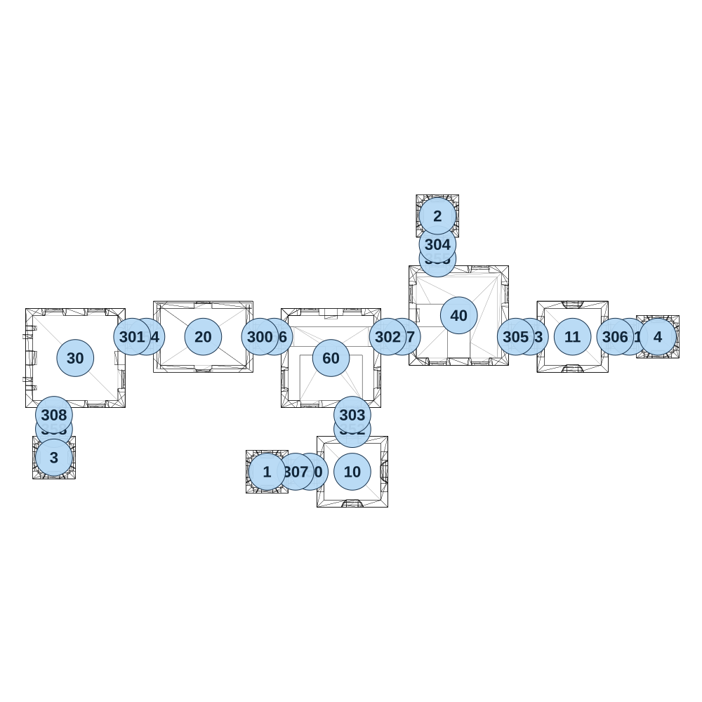

# map_ancient01_03

[All map wireframes](README.md)

[SVG](map_ancient01_03.svg) · [PNG](map_ancient01_03.png) · [Geometry JSON](map_ancient01_03.json)

## Section reference positions

These are markers, not room boundaries or safe spawn points. Positions use the file’s XYZ axes; the wireframe projects X/Z. Rotation is retained raw, not interpreted here.

| Section ID | X | Y | Z | Raw rotation |
|---:|---:|---:|---:|---:|
| 350 | 850 | 0 | 400 | 16383 |
| 351 | 1975 | 0 | -75 | 16383 |
| 352 | 1000 | 0 | 250 | 0 |
| 353 | 1625 | 0 | -75 | 16383 |
| 354 | 275 | 0 | -75 | 16383 |
| 355 | 1300 | 0 | -350 | 0 |
| 356 | 725 | 0 | -75 | 16383 |
| 357 | 1175 | 0 | -75 | 16383 |
| 358 | -50 | 0 | 250 | 0 |
| 300 | 675 | 0 | -75 | 16383 |
| 301 | 225 | 0 | -75 | 16383 |
| 302 | 1125 | 0 | -75 | 16383 |
| 303 | 1000 | 0 | 200 | 0 |
| 304 | 1300 | 0 | -400 | 0 |
| 305 | 1575 | 0 | -75 | 16383 |
| 306 | 1925 | 0 | -75 | 16383 |
| 307 | 800 | 0 | 400 | 16383 |
| 308 | -50 | 0 | 200 | 0 |
| 1 | 700 | 0 | 400 | 0 |
| 2 | 1300 | 0 | -500 | 0 |
| 3 | -50 | 0 | 350 | 0 |
| 4 | 2075 | 0 | -75 | 0 |
| 10 | 1000 | 0 | 400 | 0 |
| 11 | 1775 | 0 | -75 | 0 |
| 20 | 475 | 0 | -75 | 16383 |
| 30 | 25 | 0 | -1.5e-05 | 49152 |
| 40 | 1375 | 0 | -150 | 16383 |
| 60 | 925 | 0 | -1.5e-05 | 0 |

Collision triangles: 3182. Sentinel/unlabelled records remain in JSON. Overlapping marker positions are preserved, not moved to invent room locations.
