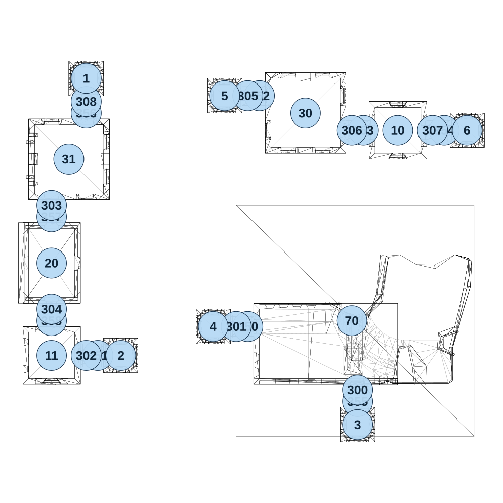

# map_ancient01_04

[All map wireframes](README.md)

[SVG](map_ancient01_04.svg) · [PNG](map_ancient01_04.png) · [Geometry JSON](map_ancient01_04.json)

## Section reference positions

These are markers, not room boundaries or safe spawn points. Positions use the file’s XYZ axes; the wireframe projects X/Z. Rotation is retained raw, not interpreted here.

| Section ID | X | Y | Z | Raw rotation |
|---:|---:|---:|---:|---:|
| 350 | 325 | 0 | 275 | 16383 |
| 351 | -325 | 0 | 400 | 16383 |
| 352 | 375 | 0 | -725 | 16383 |
| 353 | 825 | 0 | -575 | 16383 |
| 354 | 1175 | 0 | -575 | 16383 |
| 355 | 800 | 0 | 600 | 0 |
| 356 | -375 | 0 | -650 | 0 |
| 357 | -525 | 0 | -200 | 0 |
| 358 | -525 | 0 | 250 | 0 |
| 300 | 800 | 0 | 550 | 0 |
| 301 | 275 | 0 | 275 | 16383 |
| 302 | -375 | 0 | 400 | 16383 |
| 303 | -525 | 0 | -250 | 0 |
| 304 | -525 | 0 | 200 | 0 |
| 305 | 325 | 0 | -725 | 16383 |
| 306 | 775 | 0 | -575 | 16383 |
| 307 | 1125 | 0 | -575 | 16383 |
| 308 | -375 | 0 | -700 | 0 |
| 1 | -375 | 0 | -800 | 0 |
| 2 | -225 | 0 | 400 | 0 |
| 3 | 800 | 0 | 700 | 0 |
| 4 | 175 | 0 | 275 | 0 |
| 5 | 225 | 0 | -725 | 0 |
| 6 | 1275 | 0 | -575 | 0 |
| 10 | 975 | 0 | -575 | 0 |
| 11 | -525 | 0 | 400 | 49152 |
| 20 | -525 | 0 | 0 | 32768 |
| 30 | 575 | 0 | -650 | 0 |
| 31 | -450 | 0 | -450 | 49152 |
| 70 | 775 | 0 | 250 | 16383 |

Collision triangles: 3792. Sentinel/unlabelled records remain in JSON. Overlapping marker positions are preserved, not moved to invent room locations.
