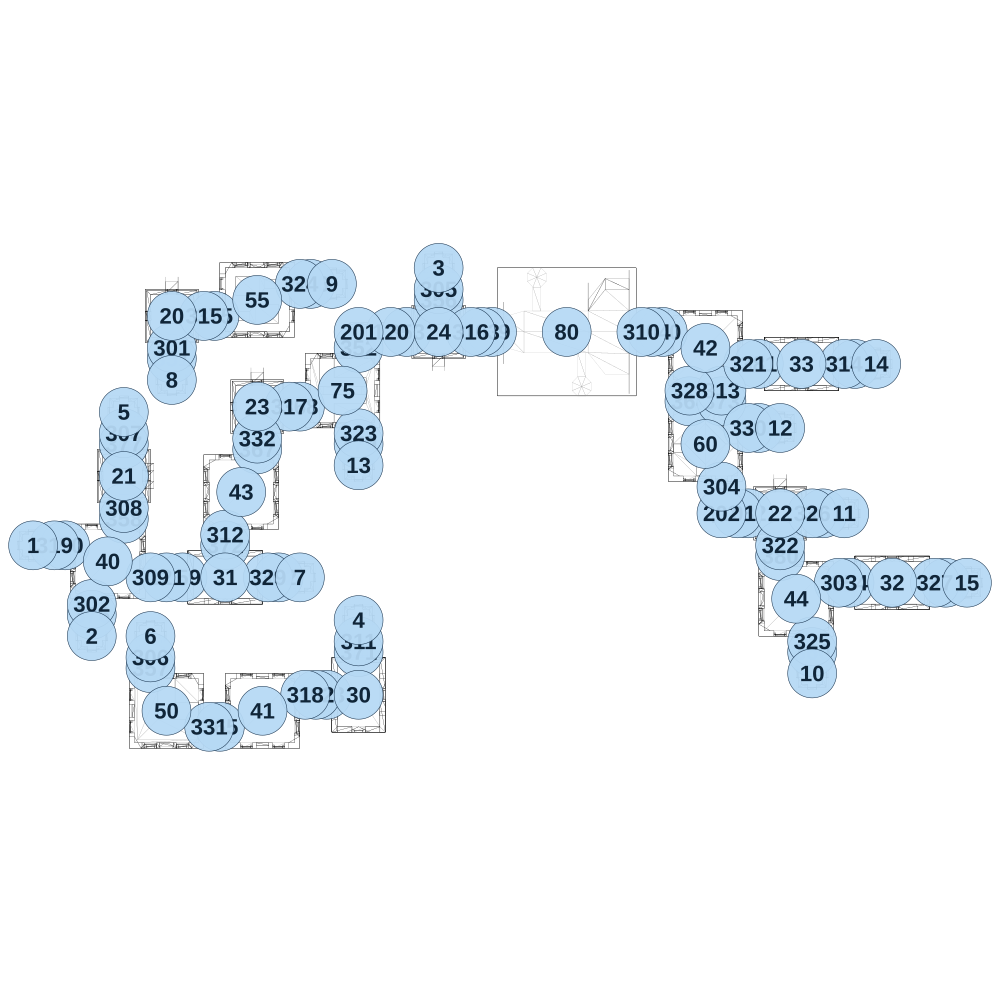

# map_ancient02_00

[All map wireframes](README.md)

[SVG](map_ancient02_00.svg) · [PNG](map_ancient02_00.png) · [Geometry JSON](map_ancient02_00.json)

## Section reference positions

These are markers, not room boundaries or safe spawn points. Positions use the file’s XYZ axes; the wireframe projects X/Z. Rotation is retained raw, not interpreted here.

| Section ID | X | Y | Z | Raw rotation |
|---:|---:|---:|---:|---:|
| 350 | 150 | 0 | -8e-06 | 16383 |
| 351 | 650 | 0 | -875 | 0 |
| 352 | 1525 | 0 | -925 | 0 |
| 353 | 1750 | 0 | -1000 | 16383 |
| 354 | 3825 | 0 | 175 | 16383 |
| 356 | 1900 | 0 | -1150 | 0 |
| 357 | 550 | 0 | 575 | 0 |
| 358 | 425 | 0 | -125 | 0 |
| 359 | 700 | 0 | 150 | 16383 |
| 360 | 3650 | 0 | 500 | 0 |
| 361 | 3700 | 0 | -150 | 16383 |
| 362 | 1150 | 0 | 150 | 16383 |
| 363 | 3400 | 0 | -550 | 16383 |
| 364 | 3075 | 0 | -675 | 0 |
| 365 | 875 | 0 | 850 | 16383 |
| 366 | 1300 | 0 | -1225 | 16383 |
| 367 | 1050 | 0 | -450 | 0 |
| 368 | 1250 | 0 | -650 | 16383 |
| 369 | 2150 | 0 | -1000 | 16383 |
| 370 | 2950 | 0 | -1000 | 16383 |
| 371 | 1525 | 0 | 500 | 0 |
| 372 | 900 | 0 | 0 | 0 |
| 373 | 3225 | 0 | -675 | 0 |
| 374 | 3850 | 0 | -850 | 16383 |
| 375 | 850 | 0 | -1075 | 16383 |
| 376 | 275 | 0 | 325 | 0 |
| 377 | 425 | 0 | -475 | 0 |
| 378 | 4275 | 0 | 175 | 16383 |
| 379 | 1525 | 0 | -475 | 0 |
| 380 | 3500 | 0 | 50 | 0 |
| 381 | 3400 | 0 | -850 | 16383 |
| 382 | 3350 | 0 | -150 | 16383 |
| 383 | 1375 | 0 | 700 | 16383 |
| 101 | 3300 | 0 | -150 | 16383 |
| 102 | 1325 | 0 | 700 | 16383 |
| 103 | 2100 | 0 | -1000 | 16383 |
| 104 | 2900 | 0 | -1000 | 16383 |
| 120 | 1675 | 0 | -1000 | 16383 |
| 121 | 625 | 0 | 150 | 16383 |
| 201 | 1525 | 0 | -1000 | 0 |
| 202 | 3225 | 0 | -150 | 16383 |
| 301 | 650 | 0 | -925 | 0 |
| 302 | 275 | 0 | 275 | 0 |
| 303 | 3775 | 0 | 175 | 16383 |
| 304 | 3225 | 0 | -275 | 0 |
| 305 | 1900 | 0 | -1200 | 0 |
| 306 | 550 | 0 | 525 | 0 |
| 307 | 425 | 0 | -525 | 0 |
| 308 | 425 | 0 | -175 | 0 |
| 309 | 550 | 0 | 150 | 16383 |
| 310 | 2850 | 0 | -1000 | 16383 |
| 311 | 1525 | 0 | 450 | 0 |
| 312 | 900 | 0 | -50 | 0 |
| 313 | 3225 | 0 | -725 | 0 |
| 314 | 3800 | 0 | -850 | 16383 |
| 315 | 800 | 0 | -1075 | 16383 |
| 316 | 2050 | 0 | -1000 | 16383 |
| 317 | 1200 | 0 | -650 | 16383 |
| 318 | 1275 | 0 | 700 | 16383 |
| 319 | 100 | 0 | 0 | 16383 |
| 321 | 3350 | 0 | -850 | 16383 |
| 322 | 3500 | 0 | 1e-06 | 0 |
| 323 | 1525 | 0 | -525 | 0 |
| 324 | 1250 | 0 | -1225 | 16383 |
| 325 | 3650 | 0 | 450 | 0 |
| 326 | 3650 | 0 | -150 | 16383 |
| 327 | 4225 | 0 | 175 | 16383 |
| 328 | 3075 | 0 | -725 | 0 |
| 329 | 1100 | 0 | 150 | 16383 |
| 330 | 3350 | 0 | -550 | 16383 |
| 331 | 825 | 0 | 850 | 16383 |
| 332 | 1050 | 0 | -500 | 0 |
| 1 | 0 | 0 | 0 | 0 |
| 2 | 275 | 0 | 425 | 0 |
| 3 | 1900 | 0 | -1300 | 0 |
| 4 | 1525 | 0 | 350 | 0 |
| 5 | 425 | 0 | -625 | 0 |
| 6 | 550 | 0 | 425 | 0 |
| 7 | 1250 | 0 | 150 | 0 |
| 8 | 650 | 0 | -775 | 0 |
| 9 | 1400 | 0 | -1225 | 0 |
| 10 | 3650 | 0 | 600 | 0 |
| 11 | 3800 | 0 | -150 | 0 |
| 12 | 3500 | 0 | -550 | 0 |
| 13 | 1525 | 0 | -375 | 0 |
| 14 | 3950 | 0 | -850 | 0 |
| 15 | 4375 | 0 | 175 | 0 |
| 20 | 650 | 0 | -1075 | 0 |
| 21 | 425 | 0 | -325 | 0 |
| 22 | 3500 | 0 | -150 | 0 |
| 23 | 1050 | 0 | -650 | 0 |
| 24 | 1900 | 0 | -1000 | 0 |
| 30 | 1525 | 0 | 700 | 0 |
| 31 | 900 | 0 | 150 | 16383 |
| 32 | 4025 | 0 | 175 | 16383 |
| 33 | 3600 | 0 | -850 | 16383 |
| 40 | 350 | 0 | 75 | 0 |
| 41 | 1075 | 0 | 775 | 0 |
| 42 | 3150 | 0 | -925 | 0 |
| 43 | 975 | 0 | -250 | 0 |
| 44 | 3575 | 0 | 250 | 0 |
| 80 | 2500 | 0 | -1000 | 16383 |
| 50 | 625 | 0 | 775 | 49152 |
| 55 | 1050 | 0 | -1150 | 16384 |
| 60 | 3150 | 0 | -475 | 0 |
| 75 | 1450 | 0 | -725 | 16384 |

Collision triangles: 9940. Sentinel/unlabelled records remain in JSON. Overlapping marker positions are preserved, not moved to invent room locations.
