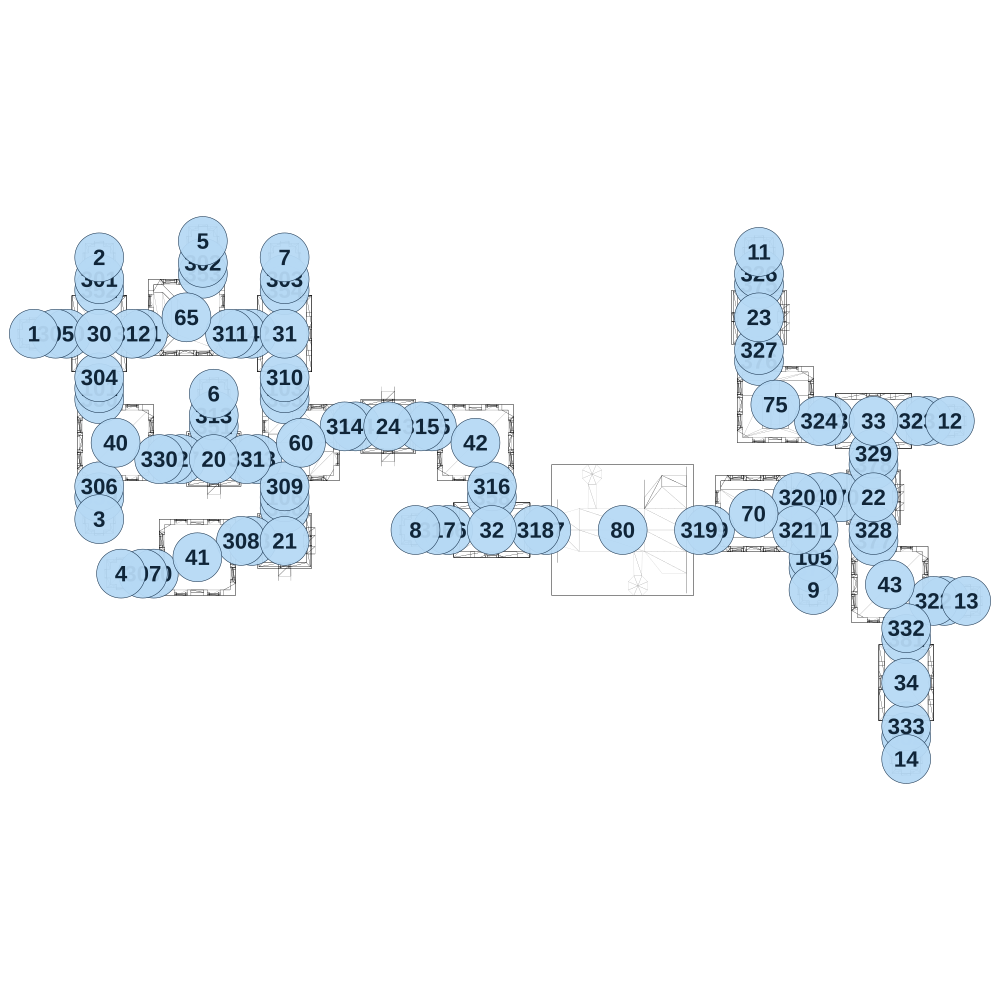

# map_ancient02_01

[All map wireframes](README.md)

[SVG](map_ancient02_01.svg) · [PNG](map_ancient02_01.png) · [Geometry JSON](map_ancient02_01.json)

## Section reference positions

These are markers, not room boundaries or safe spawn points. Positions use the file’s XYZ axes; the wireframe projects X/Z. Rotation is retained raw, not interpreted here.

| Section ID | X | Y | Z | Raw rotation |
|---:|---:|---:|---:|---:|
| 350 | 300 | 0 | 325 | 0 |
| 351 | 825 | 0 | 450 | 0 |
| 352 | 300 | 0 | -175 | 0 |
| 353 | 775 | 0 | -250 | 0 |
| 354 | 1150 | 0 | -175 | 0 |
| 355 | 1150 | 0 | 325 | 0 |
| 356 | 1150 | 0 | 825 | 0 |
| 357 | 675 | 0 | 600 | 16383 |
| 358 | 2100 | 0 | 775 | 0 |
| 359 | 300 | 0 | 775 | 0 |
| 360 | 150 | 0 | 25 | 16383 |
| 361 | 500 | 0 | 25 | 16383 |
| 362 | 1000 | 0 | 25 | 16383 |
| 363 | 1025 | 0 | 600 | 16383 |
| 364 | 1475 | 0 | 450 | 16383 |
| 365 | 1825 | 0 | 450 | 16383 |
| 366 | 1900 | 0 | 925 | 16383 |
| 367 | 2350 | 0 | 925 | 16383 |
| 368 | 1000 | 0 | 975 | 16383 |
| 369 | 3100 | 0 | 925 | 16383 |
| 370 | 3700 | 0 | 775 | 16383 |
| 371 | 4175 | 0 | 1250 | 16383 |
| 372 | 4100 | 0 | 425 | 16383 |
| 373 | 3650 | 0 | 425 | 16383 |
| 375 | 3325 | 0 | -200 | 0 |
| 376 | 3325 | 0 | 150 | 0 |
| 377 | 3850 | 0 | 975 | 0 |
| 378 | 3850 | 0 | 625 | 0 |
| 379 | 3575 | 0 | 1100 | 0 |
| 380 | 550 | 0 | 1125 | 16383 |
| 381 | 4000 | 0 | 1425 | 0 |
| 382 | 4000 | 0 | 1875 | 0 |
| 101 | 300 | 0 | 275 | 0 |
| 102 | 625 | 0 | 600 | 16383 |
| 103 | 1150 | 0 | 275 | 0 |
| 104 | 950 | 0 | 25 | 16383 |
| 105 | 3575 | 0 | 1050 | 0 |
| 106 | 1150 | 0 | 775 | 0 |
| 140 | 3600 | 0 | 775 | 16383 |
| 201 | 3575 | 0 | 925 | 49152 |
| 301 | 300 | 0 | -225 | 0 |
| 302 | 775 | 0 | -300 | 0 |
| 303 | 1150 | 0 | -225 | 0 |
| 304 | 300 | 0 | 225 | 0 |
| 305 | 100 | 0 | 25 | 16383 |
| 306 | 300 | 0 | 725 | 0 |
| 307 | 500 | 0 | 1125 | 16383 |
| 308 | 950 | 0 | 975 | 16383 |
| 309 | 1150 | 0 | 725 | 0 |
| 310 | 1150 | 0 | 225 | 0 |
| 311 | 900 | 0 | 25 | 16383 |
| 312 | 450 | 0 | 25 | 16383 |
| 313 | 825 | 0 | 400 | 0 |
| 314 | 1425 | 0 | 450 | 16383 |
| 315 | 1775 | 0 | 450 | 16383 |
| 316 | 2100 | 0 | 725 | 0 |
| 317 | 1850 | 0 | 925 | 16383 |
| 318 | 2300 | 0 | 925 | 16383 |
| 319 | 3050 | 0 | 925 | 16383 |
| 320 | 3500 | 0 | 775 | 16383 |
| 321 | 3500 | 0 | 925 | 16383 |
| 322 | 4125 | 0 | 1250 | 16383 |
| 323 | 4050 | 0 | 425 | 16383 |
| 324 | 3600 | 0 | 425 | 16383 |
| 326 | 3325 | 0 | -250 | 0 |
| 327 | 3325 | 0 | 100 | 0 |
| 328 | 3850 | 0 | 925 | 0 |
| 329 | 3850 | 0 | 575 | 0 |
| 330 | 575 | 0 | 600 | 16383 |
| 331 | 975 | 0 | 600 | 16383 |
| 332 | 4000 | 0 | 1375 | 0 |
| 333 | 4000 | 0 | 1825 | 0 |
| 1 | 0 | 0 | 25 | 0 |
| 2 | 300 | 0 | -325 | 0 |
| 3 | 300 | 0 | 875 | 0 |
| 4 | 400 | 0 | 1125 | 0 |
| 5 | 775 | 0 | -400 | 0 |
| 6 | 825 | 0 | 300 | 0 |
| 7 | 1150 | 0 | -325 | 0 |
| 8 | 1750 | 0 | 925 | 0 |
| 9 | 3575 | 0 | 1200 | 0 |
| 11 | 3325 | 0 | -350 | 0 |
| 12 | 4200 | 0 | 425 | 0 |
| 13 | 4275 | 0 | 1250 | 0 |
| 14 | 4000 | 0 | 1975 | 0 |
| 20 | 825 | 0 | 600 | 0 |
| 21 | 1150 | 0 | 975 | 0 |
| 22 | 3850 | 0 | 775 | 0 |
| 23 | 3325 | 0 | -50 | 0 |
| 24 | 1625 | 0 | 450 | 0 |
| 30 | 300 | 0 | 25 | 0 |
| 31 | 1150 | 0 | 25 | 0 |
| 32 | 2100 | 0 | 925 | 16383 |
| 33 | 3850 | 0 | 425 | 16383 |
| 34 | 4000 | 0 | 1625 | 0 |
| 40 | 375 | 0 | 525 | 0 |
| 41 | 750 | 0 | 1050 | 0 |
| 42 | 2025 | 0 | 525 | 0 |
| 43 | 3925 | 0 | 1175 | 0 |
| 80 | 2700 | 0 | 925 | 16383 |
| 60 | 1225 | 0 | 525 | 16383 |
| 65 | 700 | 0 | -50 | 16383 |
| 70 | 3300 | 0 | 850 | 49152 |
| 75 | 3400 | 0 | 350 | 0 |

Collision triangles: 9430. Sentinel/unlabelled records remain in JSON. Overlapping marker positions are preserved, not moved to invent room locations.
