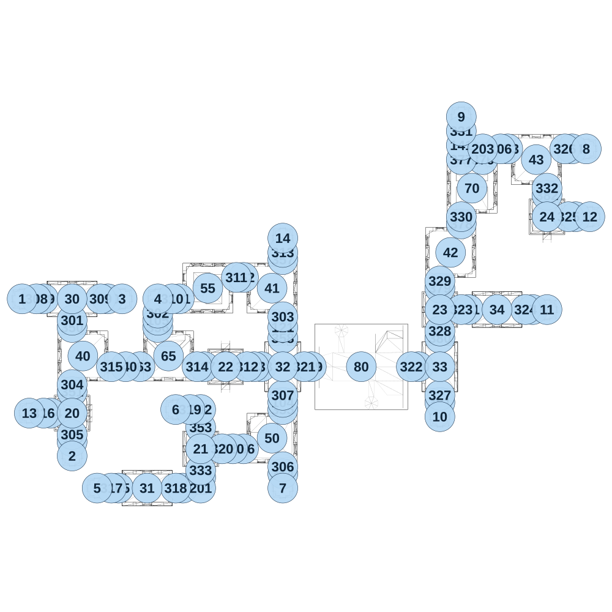

# map_ancient02_02

[All map wireframes](README.md)

[SVG](map_ancient02_02.svg) · [PNG](map_ancient02_02.png) · [Geometry JSON](map_ancient02_02.json)

## Section reference positions

These are markers, not room boundaries or safe spawn points. Positions use the file’s XYZ axes; the wireframe projects X/Z. Rotation is retained raw, not interpreted here.

| Section ID | X | Y | Z | Raw rotation |
|---:|---:|---:|---:|---:|
| 350 | 350 | 0 | 200 | 0 |
| 351 | 350 | 0 | 650 | 0 |
| 352 | 350 | 0 | 1000 | 0 |
| 353 | 1250 | 0 | 900 | 0 |
| 354 | 1825 | 0 | 1225 | 0 |
| 355 | 1825 | 0 | 775 | 0 |
| 356 | 950 | 0 | 200 | 0 |
| 357 | 1825 | 0 | -275 | 0 |
| 358 | 1825 | 0 | 275 | 0 |
| 359 | 150 | 0 | 0 | 16383 |
| 360 | 600 | 0 | 0 | 16383 |
| 361 | 1100 | 0 | 0 | 16383 |
| 362 | 1550 | 0 | -150 | 16383 |
| 363 | 825 | 0 | 475 | 16383 |
| 364 | 200 | 0 | 800 | 16383 |
| 365 | 675 | 0 | 1325 | 16383 |
| 366 | 1550 | 0 | 1050 | 16383 |
| 367 | 1275 | 0 | 475 | 16383 |
| 368 | 1675 | 0 | 475 | 16383 |
| 369 | 2025 | 0 | 475 | 16383 |
| 370 | 2775 | 0 | 475 | 16383 |
| 371 | 3125 | 0 | 75 | 16383 |
| 372 | 3575 | 0 | 75 | 16383 |
| 373 | 3400 | 0 | -1050 | 16383 |
| 374 | 3850 | 0 | -1050 | 16383 |
| 375 | 3875 | 0 | -575 | 16383 |
| 376 | 3225 | 0 | -975 | 0 |
| 377 | 3075 | 0 | -975 | 0 |
| 378 | 3075 | 0 | -525 | 0 |
| 379 | 2925 | 0 | -75 | 0 |
| 380 | 2925 | 0 | 275 | 0 |
| 381 | 2925 | 0 | 725 | 0 |
| 382 | 3675 | 0 | -725 | 0 |
| 101 | 1125 | 0 | 1325 | 16383 |
| 102 | 1250 | 0 | 1250 | 0 |
| 103 | 1625 | 0 | 475 | 16383 |
| 104 | 1825 | 0 | 725 | 0 |
| 105 | 950 | 0 | 150 | 0 |
| 106 | 3350 | 0 | -1050 | 16383 |
| 120 | 1475 | 0 | 1050 | 16383 |
| 121 | 1825 | 0 | 200 | 0 |
| 140 | 725 | 0 | 475 | 16383 |
| 141 | 3075 | 0 | -1075 | 0 |
| 201 | 1250 | 0 | 1325 | 32768 |
| 202 | 1250 | 0 | 775 | 49152 |
| 203 | 3225 | 0 | -1050 | 0 |
| 301 | 350 | 0 | 150 | 0 |
| 302 | 950 | 0 | 100 | 0 |
| 303 | 1825 | 0 | 125 | 0 |
| 304 | 350 | 0 | 600 | 0 |
| 305 | 350 | 0 | 950 | 0 |
| 306 | 1825 | 0 | 1175 | 0 |
| 307 | 1825 | 0 | 675 | 0 |
| 308 | 100 | 0 | 0 | 16383 |
| 309 | 550 | 0 | 0 | 16383 |
| 310 | 1050 | 0 | 0 | 16383 |
| 311 | 1500 | 0 | -150 | 16383 |
| 312 | 1575 | 0 | 475 | 16383 |
| 313 | 1825 | 0 | -325 | 0 |
| 314 | 1225 | 0 | 475 | 16383 |
| 315 | 625 | 0 | 475 | 16383 |
| 316 | 150 | 0 | 800 | 16383 |
| 317 | 625 | 0 | 1325 | 16383 |
| 318 | 1075 | 0 | 1325 | 16383 |
| 319 | 1175 | 0 | 775 | 16383 |
| 320 | 1400 | 0 | 1050 | 16383 |
| 321 | 1975 | 0 | 475 | 16383 |
| 322 | 2725 | 0 | 475 | 16383 |
| 323 | 3075 | 0 | 75 | 16383 |
| 324 | 3525 | 0 | 75 | 16383 |
| 325 | 3825 | 0 | -575 | 16383 |
| 326 | 3800 | 0 | -1050 | 16383 |
| 327 | 2925 | 0 | 675 | 0 |
| 328 | 2925 | 0 | 225 | 0 |
| 329 | 2925 | 0 | -125 | 0 |
| 330 | 3075 | 0 | -575 | 0 |
| 331 | 3075 | 0 | -1175 | 0 |
| 332 | 3675 | 0 | -775 | 0 |
| 333 | 1250 | 0 | 1200 | 0 |
| 1 | -5e-06 | 0 | 0 | 0 |
| 2 | 350 | 0 | 1100 | 0 |
| 3 | 700 | 0 | 0 | 0 |
| 4 | 950 | 0 | 1e-06 | 0 |
| 5 | 525 | 0 | 1325 | 0 |
| 6 | 1075 | 0 | 775 | 0 |
| 7 | 1825 | 0 | 1325 | 0 |
| 8 | 3950 | 0 | -1050 | 0 |
| 9 | 3075 | 0 | -1275 | 0 |
| 10 | 2925 | 0 | 825 | 0 |
| 11 | 3675 | 0 | 75 | 0 |
| 12 | 3975 | 0 | -575 | 0 |
| 13 | 50 | 0 | 800 | 0 |
| 14 | 1825 | 0 | -425 | 0 |
| 20 | 350 | 0 | 800 | 0 |
| 21 | 1250 | 0 | 1050 | 0 |
| 22 | 1425 | 0 | 475 | 0 |
| 23 | 2925 | 0 | 75 | 0 |
| 24 | 3675 | 0 | -575 | 0 |
| 30 | 350 | 0 | -4e-06 | 16384 |
| 31 | 875 | 0 | 1325 | 16384 |
| 32 | 1825 | 0 | 475 | 0 |
| 33 | 2925 | 0 | 475 | 0 |
| 34 | 3325 | 0 | 75 | 16384 |
| 40 | 425 | 0 | 400 | 0 |
| 41 | 1750 | 0 | -75 | 0 |
| 42 | 3000 | 0 | -325 | 0 |
| 43 | 3600 | 0 | -975 | 0 |
| 80 | 2375 | 0 | 475 | 16383 |
| 50 | 1750 | 0 | 975 | 0 |
| 55 | 1300 | 0 | -75 | 16384 |
| 65 | 1025 | 0 | 400 | 0 |
| 70 | 3150 | 0 | -775 | 0 |

Collision triangles: 9800. Sentinel/unlabelled records remain in JSON. Overlapping marker positions are preserved, not moved to invent room locations.
