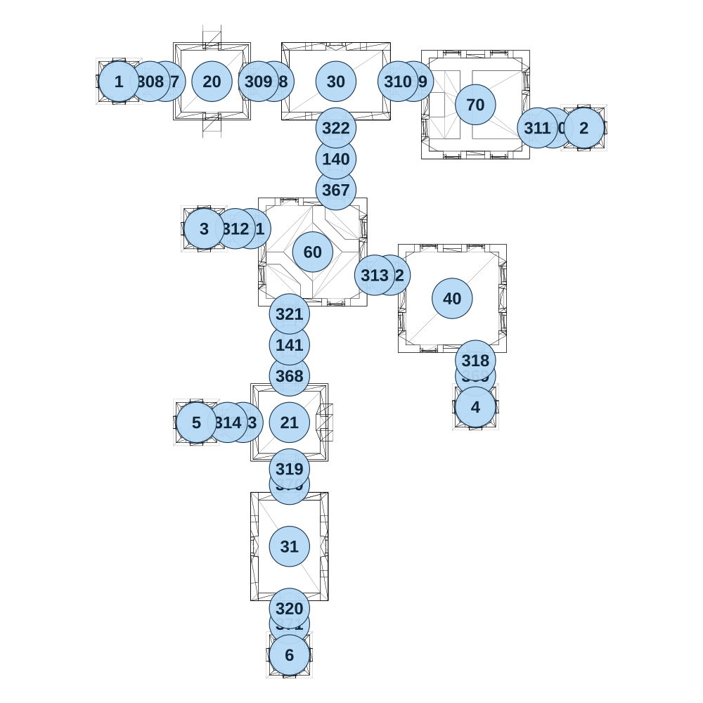

# map_ancient02_03

[All map wireframes](README.md)

[SVG](map_ancient02_03.svg) · [PNG](map_ancient02_03.png) · [Geometry JSON](map_ancient02_03.json)

## Section reference positions

These are markers, not room boundaries or safe spawn points. Positions use the file’s XYZ axes; the wireframe projects X/Z. Rotation is retained raw, not interpreted here.

| Section ID | X | Y | Z | Raw rotation |
|---:|---:|---:|---:|---:|
| 357 | -450 | 0 | -600 | 16383 |
| 358 | -100 | 0 | -600 | 16383 |
| 359 | 350 | 0 | -600 | 16383 |
| 360 | 800 | 0 | -450 | 16383 |
| 361 | -175 | 0 | -125 | 16383 |
| 362 | 275 | 0 | 25 | 16383 |
| 363 | -200 | 0 | 500 | 16383 |
| 367 | 100 | 0 | -250 | 0 |
| 368 | -50 | 0 | 350 | 0 |
| 369 | 550 | 0 | 350 | 0 |
| 370 | -50 | 0 | 700 | 0 |
| 371 | -50 | 0 | 1150 | 0 |
| 140 | 100 | 0 | -350 | 0 |
| 141 | -50 | 0 | 250 | 0 |
| 308 | -500 | 0 | -600 | 16383 |
| 309 | -150 | 0 | -600 | 16383 |
| 310 | 300 | 0 | -600 | 16383 |
| 311 | 750 | 0 | -450 | 16383 |
| 312 | -225 | 0 | -125 | 16383 |
| 313 | 225 | 0 | 25 | 16383 |
| 314 | -250 | 0 | 500 | 16383 |
| 318 | 550 | 0 | 300 | 0 |
| 319 | -50 | 0 | 650 | 0 |
| 320 | -50 | 0 | 1100 | 0 |
| 321 | -50 | 0 | 150 | 0 |
| 322 | 100 | 0 | -450 | 0 |
| 1 | -600 | 0 | -600 | 0 |
| 2 | 900 | 0 | -450 | 0 |
| 3 | -325 | 0 | -125 | 0 |
| 4 | 550 | 0 | 450 | 0 |
| 5 | -350 | 0 | 500 | 0 |
| 6 | -50 | 0 | 1250 | 0 |
| 20 | -300 | 0 | -600 | 0 |
| 21 | -50 | 0 | 500 | 0 |
| 30 | 100 | 0 | -600 | 16383 |
| 31 | -50 | 0 | 900 | 0 |
| 40 | 475 | 0 | 100 | 0 |
| 60 | 25 | 0 | -50 | 0 |
| 70 | 550 | 0 | -525 | 16383 |

Collision triangles: 3744. Sentinel/unlabelled records remain in JSON. Overlapping marker positions are preserved, not moved to invent room locations.
