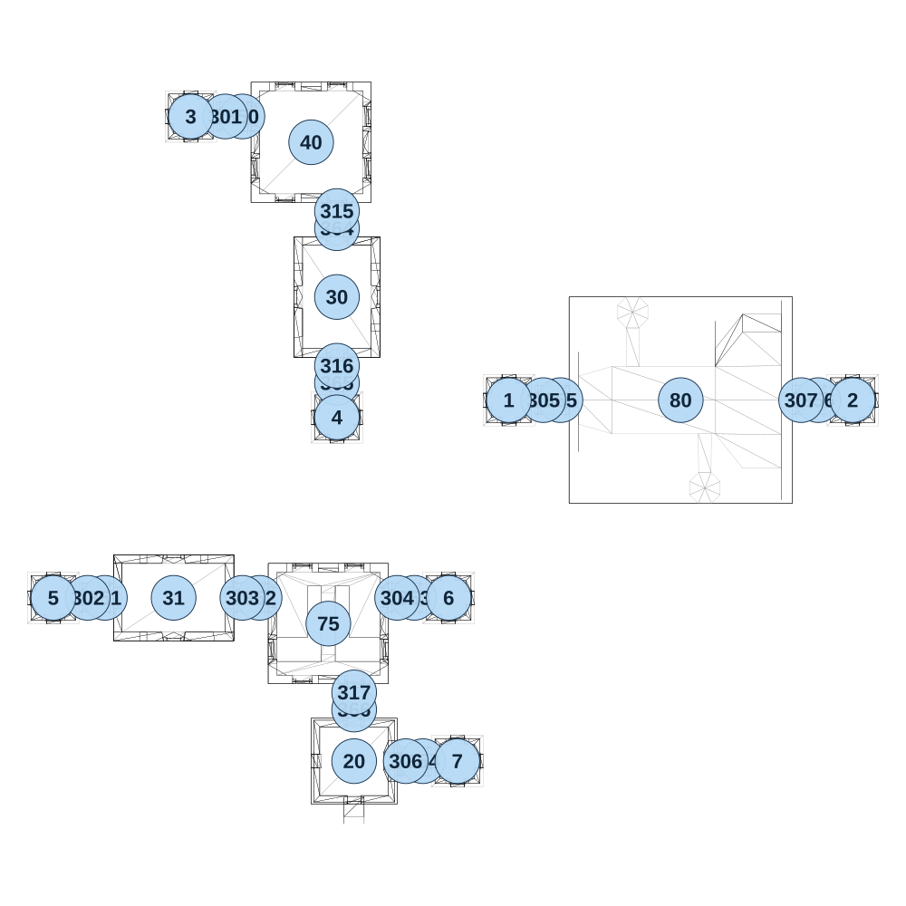

# map_ancient02_04

[All map wireframes](README.md)

[SVG](map_ancient02_04.svg) · [PNG](map_ancient02_04.png) · [Geometry JSON](map_ancient02_04.json)

## Section reference positions

These are markers, not room boundaries or safe spawn points. Positions use the file’s XYZ axes; the wireframe projects X/Z. Rotation is retained raw, not interpreted here.

| Section ID | X | Y | Z | Raw rotation |
|---:|---:|---:|---:|---:|
| 350 | -1275 | 0 | -825 | 16383 |
| 351 | -1675 | 0 | 575 | 16383 |
| 352 | -1225 | 0 | 575 | 16383 |
| 353 | -775 | 0 | 575 | 16383 |
| 354 | -750 | 0 | 1050 | 16383 |
| 355 | -350 | 0 | 0 | 16383 |
| 356 | 400 | 0 | 0 | 16383 |
| 364 | -1000 | 0 | -500 | 0 |
| 365 | -1000 | 0 | -50 | 0 |
| 366 | -950 | 0 | 900 | 0 |
| 301 | -1325 | 0 | -825 | 16383 |
| 302 | -1725 | 0 | 575 | 16383 |
| 303 | -1275 | 0 | 575 | 16383 |
| 304 | -825 | 0 | 575 | 16383 |
| 305 | -400 | 0 | -2e-06 | 16383 |
| 306 | -800 | 0 | 1050 | 16383 |
| 307 | 350 | 0 | -2e-06 | 16383 |
| 315 | -1000 | 0 | -550 | 0 |
| 316 | -1000 | 0 | -100 | 0 |
| 317 | -950 | 0 | 850 | 0 |
| 1 | -500 | 0 | 2e-06 | 0 |
| 2 | 500 | 0 | 2e-06 | 0 |
| 3 | -1425 | 0 | -825 | 0 |
| 4 | -1000 | 0 | 50 | 0 |
| 5 | -1825 | 0 | 575 | 0 |
| 6 | -675 | 0 | 575 | 0 |
| 7 | -650 | 0 | 1050 | 0 |
| 20 | -950 | 0 | 1050 | 0 |
| 30 | -1000 | 0 | -300 | 0 |
| 31 | -1475 | 0 | 575 | 16383 |
| 40 | -1075 | 0 | -750 | 0 |
| 80 | 3e-06 | 0 | 0 | 16383 |
| 75 | -1025 | 0 | 650 | 32768 |

Collision triangles: 3250. Sentinel/unlabelled records remain in JSON. Overlapping marker positions are preserved, not moved to invent room locations.
