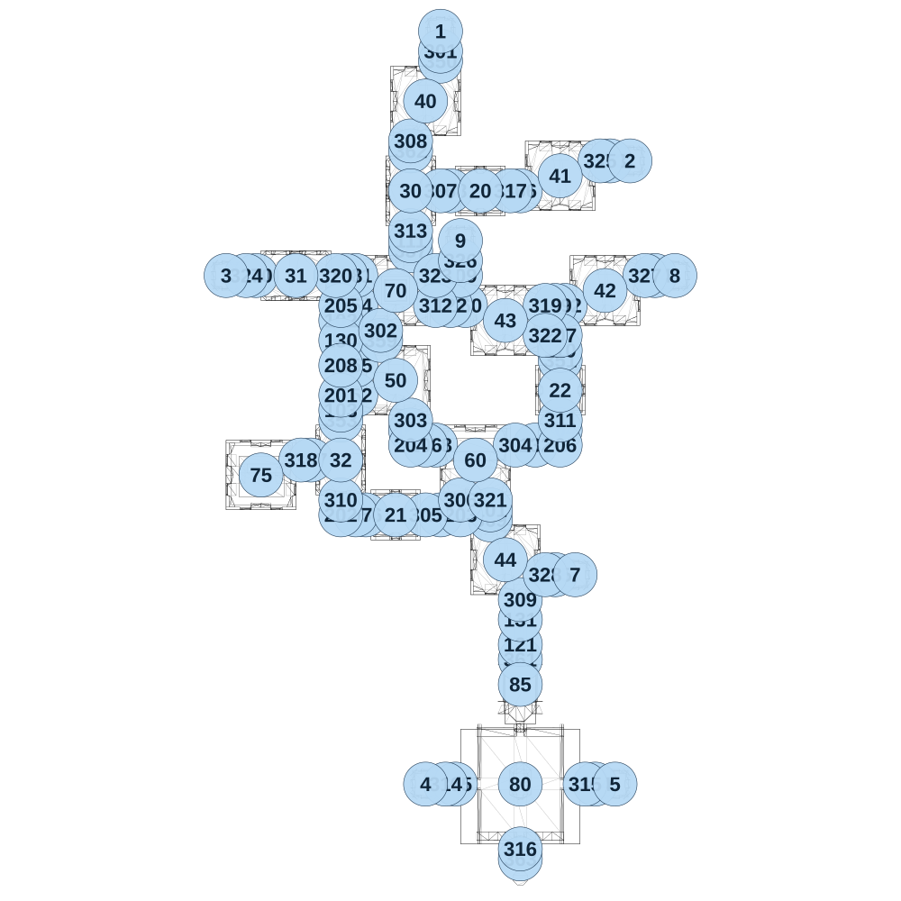

# map_ancient03_00

[All map wireframes](README.md)

[SVG](map_ancient03_00.svg) · [PNG](map_ancient03_00.png) · [Geometry JSON](map_ancient03_00.json)

## Section reference positions

These are markers, not room boundaries or safe spawn points. Positions use the file’s XYZ axes; the wireframe projects X/Z. Rotation is retained raw, not interpreted here.

| Section ID | X | Y | Z | Raw rotation |
|---:|---:|---:|---:|---:|
| 350 | 0 | 0 | 100 | 0 |
| 351 | 600 | 0 | 1600 | 0 |
| 352 | -425 | 0 | 1775 | 16383 |
| 353 | -500 | 0 | 1900 | 0 |
| 354 | -425 | 0 | 1325 | 16383 |
| 355 | -425 | 0 | 1625 | 16383 |
| 356 | -375 | 0 | 2375 | 16383 |
| 357 | -150 | 0 | 1050 | 0 |
| 358 | -25 | 0 | 2025 | 16383 |
| 359 | -300 | 0 | 1500 | 0 |
| 360 | 125 | 0 | 1325 | 16383 |
| 361 | 400 | 0 | 3100 | 0 |
| 362 | -150 | 0 | 550 | 0 |
| 363 | 400 | 0 | 4100 | 0 |
| 364 | 775 | 0 | 3725 | 16383 |
| 365 | 75 | 0 | 3725 | 16383 |
| 366 | 400 | 0 | 750 | 16383 |
| 367 | -650 | 0 | 2100 | 16383 |
| 368 | 50 | 0 | 750 | 16383 |
| 369 | 250 | 0 | 2400 | 0 |
| 370 | -925 | 0 | 1175 | 16383 |
| 371 | -425 | 0 | 1175 | 16383 |
| 372 | 625 | 0 | 1325 | 16383 |
| 373 | 850 | 0 | 600 | 16383 |
| 374 | 1075 | 0 | 1175 | 16383 |
| 375 | 575 | 0 | 2675 | 16383 |
| 101 | 250 | 0 | 2350 | 0 |
| 102 | -500 | 0 | 1400 | 0 |
| 103 | -500 | 0 | 1850 | 0 |
| 104 | 600 | 0 | 1950 | 0 |
| 105 | -150 | 0 | 1950 | 0 |
| 106 | -75 | 0 | 2025 | 16383 |
| 107 | -425 | 0 | 2375 | 16383 |
| 108 | -475 | 0 | 1175 | 16383 |
| 109 | 575 | 0 | 1325 | 16383 |
| 110 | 600 | 0 | 1550 | 0 |
| 111 | -150 | 0 | 1000 | 0 |
| 112 | 25 | 0 | 1175 | 16383 |
| 120 | -2e-06 | 0 | 2375 | 16383 |
| 121 | 400 | 0 | 3025 | 0 |
| 122 | 50 | 0 | 1325 | 16383 |
| 130 | -500 | 0 | 1500 | 0 |
| 131 | 400 | 0 | 2900 | 0 |
| 132 | 475 | 0 | 2025 | 16383 |
| 201 | -500 | 0 | 1775 | 0 |
| 202 | -500 | 0 | 2375 | 16383 |
| 203 | 100 | 0 | 2375 | 32768 |
| 204 | -150 | 0 | 2025 | 16383 |
| 205 | -500 | 0 | 1325 | 0 |
| 206 | 600 | 0 | 2025 | 32768 |
| 207 | 600 | 0 | 1475 | 49152 |
| 208 | -500 | 0 | 1625 | 16383 |
| 209 | 100 | 0 | 1175 | 32768 |
| 301 | 0 | 0 | 50 | 0 |
| 302 | -300 | 0 | 1450 | 0 |
| 303 | -150 | 0 | 1900 | 0 |
| 304 | 375 | 0 | 2025 | 16383 |
| 305 | -75 | 0 | 2375 | 16383 |
| 306 | 100 | 0 | 2300 | 0 |
| 307 | 0 | 0 | 750 | 16383 |
| 308 | -150 | 0 | 500 | 0 |
| 309 | 400 | 0 | 2800 | 0 |
| 310 | -500 | 0 | 2300 | 0 |
| 311 | 600 | 0 | 1900 | 0 |
| 312 | -25 | 0 | 1325 | 16383 |
| 313 | -150 | 0 | 950 | 0 |
| 314 | 25 | 0 | 3725 | 16383 |
| 315 | 725 | 0 | 3725 | 16383 |
| 316 | 400 | 0 | 4050 | 0 |
| 317 | 350 | 0 | 750 | 16383 |
| 318 | -700 | 0 | 2100 | 16383 |
| 319 | 525 | 0 | 1325 | 16383 |
| 320 | -525 | 0 | 1175 | 16383 |
| 321 | 250 | 0 | 2300 | 0 |
| 322 | 525 | 0 | 1475 | 16383 |
| 323 | -25 | 0 | 1175 | 16383 |
| 324 | -975 | 0 | 1175 | 16383 |
| 325 | 800 | 0 | 600 | 16383 |
| 326 | 100 | 0 | 1100 | 0 |
| 327 | 1025 | 0 | 1175 | 16383 |
| 328 | 525 | 0 | 2675 | 16383 |
| 1 | -1e-06 | 0 | -50 | 0 |
| 2 | 950 | 0 | 600 | 0 |
| 3 | -1075 | 0 | 1175 | 0 |
| 4 | -75 | 0 | 3725 | 0 |
| 5 | 875 | 0 | 3725 | 0 |
| 7 | 675 | 0 | 2675 | 0 |
| 8 | 1175 | 0 | 1175 | 0 |
| 9 | 100 | 0 | 1000 | 0 |
| 20 | 200 | 0 | 750 | 0 |
| 21 | -225 | 0 | 2375 | 0 |
| 22 | 600 | 0 | 1750 | 0 |
| 30 | -150 | 0 | 750 | 0 |
| 31 | -725 | 0 | 1175 | 16383 |
| 32 | -500 | 0 | 2100 | 0 |
| 40 | -75 | 0 | 300 | 0 |
| 41 | 600 | 0 | 675 | 0 |
| 42 | 825 | 0 | 1250 | 0 |
| 43 | 325 | 0 | 1400 | 0 |
| 44 | 325 | 0 | 2600 | 0 |
| 80 | 400 | 0 | 3725 | 32768 |
| 85 | 400 | 0 | 3225 | 32768 |
| 50 | -225 | 0 | 1700 | 0 |
| 60 | 175 | 0 | 2100 | 16383 |
| 70 | -225 | 0 | 1250 | 0 |
| 75 | -900 | 0 | 2175 | 49152 |

Collision triangles: 9407. Sentinel/unlabelled records remain in JSON. Overlapping marker positions are preserved, not moved to invent room locations.
