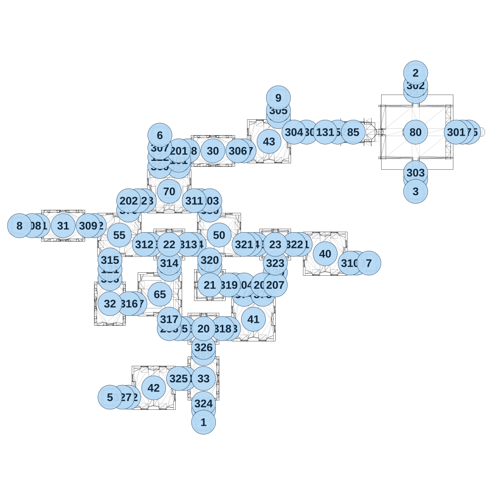

# map_ancient03_01

[All map wireframes](README.md)

[SVG](map_ancient03_01.svg) · [PNG](map_ancient03_01.png) · [Geometry JSON](map_ancient03_01.json)

## Section reference positions

These are markers, not room boundaries or safe spawn points. Positions use the file’s XYZ axes; the wireframe projects X/Z. Rotation is retained raw, not interpreted here.

| Section ID | X | Y | Z | Raw rotation |
|---:|---:|---:|---:|---:|
| 350 | 1200 | 0 | -1325 | 16383 |
| 351 | 750 | 0 | -1475 | 16383 |
| 352 | 1050 | 0 | -2375 | 16383 |
| 353 | 1675 | 0 | -2700 | 0 |
| 354 | 1675 | 0 | -2000 | 0 |
| 355 | 2100 | 0 | -2375 | 16383 |
| 356 | 575 | 0 | -2500 | 0 |
| 357 | 300 | 0 | -2225 | 16383 |
| 358 | -150 | 0 | -2225 | 16383 |
| 359 | -225 | 0 | -2100 | 0 |
| 360 | -375 | 0 | -2100 | 0 |
| 361 | -1350 | 0 | -1625 | 16383 |
| 362 | -900 | 0 | -1625 | 16383 |
| 363 | -450 | 0 | -1475 | 16383 |
| 364 | -100 | 0 | -1475 | 16383 |
| 365 | -300 | 0 | -1275 | 0 |
| 366 | -775 | 0 | -1200 | 0 |
| 367 | -575 | 0 | -1000 | 16383 |
| 368 | -175 | 0 | -800 | 16383 |
| 369 | -25 | 0 | -600 | 0 |
| 370 | -25 | 0 | -150 | 0 |
| 371 | -175 | 0 | -400 | 16383 |
| 372 | -625 | 0 | -250 | 16383 |
| 373 | 175 | 0 | -800 | 16383 |
| 374 | 300 | 0 | -1075 | 0 |
| 375 | 450 | 0 | -1075 | 0 |
| 376 | 400 | 0 | -1475 | 16383 |
| 377 | 25 | 0 | -1300 | 0 |
| 378 | -500 | 0 | -1825 | 16383 |
| 379 | -625 | 0 | -1750 | 0 |
| 380 | 25 | 0 | -1750 | 0 |
| 101 | -225 | 0 | -2150 | 0 |
| 102 | -550 | 0 | -1825 | 16383 |
| 103 | -50 | 0 | -1825 | 16383 |
| 104 | 350 | 0 | -1475 | 16383 |
| 105 | -225 | 0 | -800 | 16383 |
| 106 | 225 | 0 | -1150 | 16383 |
| 107 | 2050 | 0 | -2375 | 16383 |
| 120 | 550 | 0 | -1250 | 0 |
| 121 | -775 | 0 | -1275 | 0 |
| 122 | -375 | 0 | -2175 | 0 |
| 130 | 800 | 0 | -2375 | 16383 |
| 131 | 950 | 0 | -2375 | 16383 |
| 201 | -225 | 0 | -2225 | 0 |
| 202 | -625 | 0 | -1825 | 0 |
| 203 | 25 | 0 | -1825 | 49152 |
| 204 | 300 | 0 | -1150 | 49152 |
| 205 | 450 | 0 | -1150 | 0 |
| 206 | -300 | 0 | -800 | 16383 |
| 207 | 550 | 0 | -1150 | 32768 |
| 301 | 2000 | 0 | -2375 | 16383 |
| 302 | 1675 | 0 | -2750 | 0 |
| 303 | 1675 | 0 | -2050 | 0 |
| 304 | 700 | 0 | -2375 | 16383 |
| 305 | 575 | 0 | -2550 | 0 |
| 306 | 250 | 0 | -2225 | 16383 |
| 307 | -375 | 0 | -2250 | 0 |
| 308 | -1400 | 0 | -1625 | 16383 |
| 309 | -950 | 0 | -1625 | 16383 |
| 310 | 1150 | 0 | -1325 | 16383 |
| 311 | -100 | 0 | -1825 | 16383 |
| 312 | -500 | 0 | -1475 | 16383 |
| 313 | -150 | 0 | -1475 | 16383 |
| 314 | -300 | 0 | -1325 | 0 |
| 315 | -775 | 0 | -1350 | 0 |
| 316 | -625 | 0 | -1000 | 16383 |
| 317 | -300 | 0 | -875 | 0 |
| 318 | 125 | 0 | -800 | 16383 |
| 319 | 175 | 0 | -1150 | 16383 |
| 320 | 25 | 0 | -1350 | 0 |
| 321 | 300 | 0 | -1475 | 16383 |
| 322 | 700 | 0 | -1475 | 16383 |
| 323 | 550 | 0 | -1325 | 0 |
| 324 | -25 | 0 | -200 | 0 |
| 325 | -225 | 0 | -400 | 16383 |
| 326 | -25 | 0 | -650 | 0 |
| 327 | -675 | 0 | -250 | 16383 |
| 1 | -25 | 0 | -50 | 0 |
| 2 | 1675 | 0 | -2850 | 0 |
| 3 | 1675 | 0 | -1900 | 0 |
| 5 | -775 | 0 | -250 | 0 |
| 6 | -375 | 0 | -2350 | 0 |
| 7 | 1300 | 0 | -1325 | 0 |
| 8 | -1500 | 0 | -1625 | 0 |
| 9 | 575 | 0 | -2650 | 0 |
| 20 | -25 | 0 | -800 | 0 |
| 21 | 25 | 0 | -1150 | 0 |
| 22 | -300 | 0 | -1475 | 0 |
| 23 | 550 | 0 | -1475 | 0 |
| 30 | 50 | 0 | -2225 | 16383 |
| 31 | -1150 | 0 | -1625 | 16383 |
| 32 | -775 | 0 | -1000 | 0 |
| 33 | -25 | 0 | -400 | 0 |
| 40 | 950 | 0 | -1400 | 0 |
| 41 | 375 | 0 | -875 | 0 |
| 42 | -425 | 0 | -325 | 0 |
| 43 | 500 | 0 | -2300 | 0 |
| 80 | 1675 | 0 | -2375 | 49152 |
| 85 | 1175 | 0 | -2375 | 49152 |
| 50 | 100 | 0 | -1550 | 16383 |
| 55 | -700 | 0 | -1550 | 16383 |
| 65 | -375 | 0 | -1075 | 49152 |
| 70 | -300 | 0 | -1900 | 0 |

Collision triangles: 9563. Sentinel/unlabelled records remain in JSON. Overlapping marker positions are preserved, not moved to invent room locations.
