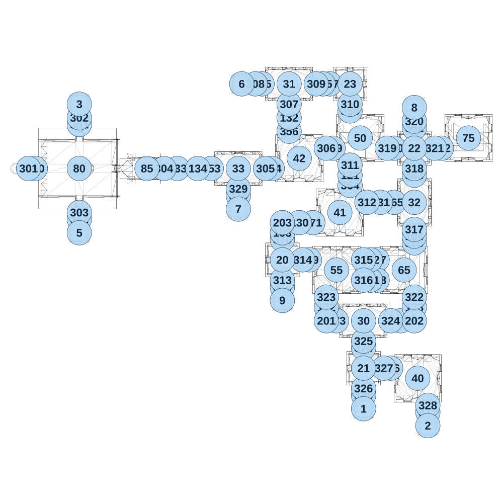

# map_ancient03_02

[All map wireframes](README.md)

[SVG](map_ancient03_02.svg) · [PNG](map_ancient03_02.png) · [Geometry JSON](map_ancient03_02.json)

## Section reference positions

These are markers, not room boundaries or safe spawn points. Positions use the file’s XYZ axes; the wireframe projects X/Z. Rotation is retained raw, not interpreted here.

| Section ID | X | Y | Z | Raw rotation |
|---:|---:|---:|---:|---:|
| 350 | -2425 | 0 | -1775 | 16383 |
| 351 | -2100 | 0 | -2100 | 0 |
| 352 | -2100 | 0 | -1400 | 0 |
| 353 | -1125 | 0 | -1775 | 16383 |
| 354 | -675 | 0 | -1775 | 16383 |
| 355 | -750 | 0 | -2400 | 16383 |
| 356 | -550 | 0 | -2050 | 0 |
| 357 | -250 | 0 | -2400 | 16383 |
| 358 | -100 | 0 | -2200 | 0 |
| 359 | -225 | 0 | -1925 | 16383 |
| 360 | 225 | 0 | -1925 | 16383 |
| 361 | 375 | 0 | -2075 | 0 |
| 362 | 575 | 0 | -1925 | 16383 |
| 363 | 375 | 0 | -1725 | 0 |
| 364 | -100 | 0 | -1650 | 0 |
| 365 | 225 | 0 | -1525 | 16383 |
| 366 | 375 | 0 | -1225 | 0 |
| 367 | 100 | 0 | -1100 | 16383 |
| 368 | 100 | 0 | -950 | 16383 |
| 369 | -400 | 0 | -1100 | 16383 |
| 370 | -600 | 0 | -1250 | 0 |
| 371 | -375 | 0 | -1375 | 16383 |
| 372 | -600 | 0 | -900 | 0 |
| 373 | -200 | 0 | -650 | 16383 |
| 374 | -8e-06 | 0 | -450 | 0 |
| 375 | -8e-06 | 0 | -100 | 0 |
| 376 | 200 | 0 | -300 | 16383 |
| 377 | 475 | 0 | 25 | 0 |
| 378 | -925 | 0 | -1575 | 0 |
| 101 | 50 | 0 | -950 | 16383 |
| 102 | 50 | 0 | -1100 | 16383 |
| 103 | -600 | 0 | -1300 | 0 |
| 104 | 375 | 0 | -1275 | 0 |
| 105 | -300 | 0 | -2400 | 16383 |
| 120 | 275 | 0 | -650 | 16383 |
| 121 | -100 | 0 | -1725 | 0 |
| 122 | -275 | 0 | -750 | 0 |
| 123 | 375 | 0 | -750 | 0 |
| 130 | -475 | 0 | -1375 | 16383 |
| 131 | 125 | 0 | -1525 | 16383 |
| 132 | -550 | 0 | -2150 | 0 |
| 133 | -1375 | 0 | -1775 | 16383 |
| 134 | -1225 | 0 | -1775 | 16383 |
| 201 | -275 | 0 | -650 | 16383 |
| 202 | 375 | 0 | -650 | 32768 |
| 203 | -600 | 0 | -1375 | 0 |
| 301 | -2475 | 0 | -1775 | 16383 |
| 302 | -2100 | 0 | -2150 | 0 |
| 303 | -2100 | 0 | -1450 | 0 |
| 304 | -1475 | 0 | -1775 | 16383 |
| 305 | -725 | 0 | -1775 | 16383 |
| 306 | -275 | 0 | -1925 | 16383 |
| 307 | -550 | 0 | -2250 | 0 |
| 308 | -800 | 0 | -2400 | 16383 |
| 309 | -350 | 0 | -2400 | 16383 |
| 310 | -100 | 0 | -2250 | 0 |
| 311 | -100 | 0 | -1800 | 0 |
| 312 | 25 | 0 | -1525 | 16383 |
| 313 | -600 | 0 | -950 | 0 |
| 314 | -450 | 0 | -1100 | 16383 |
| 315 | -2e-06 | 0 | -1100 | 16383 |
| 316 | -2e-06 | 0 | -950 | 16383 |
| 317 | 375 | 0 | -1325 | 0 |
| 318 | 375 | 0 | -1775 | 0 |
| 319 | 175 | 0 | -1925 | 16383 |
| 320 | 375 | 0 | -2125 | 0 |
| 321 | 525 | 0 | -1925 | 16383 |
| 322 | 375 | 0 | -825 | 0 |
| 323 | -275 | 0 | -825 | 0 |
| 324 | 200 | 0 | -650 | 16383 |
| 325 | 0 | 0 | -500 | 0 |
| 326 | -1e-06 | 0 | -150 | 0 |
| 327 | 150 | 0 | -300 | 16383 |
| 328 | 475 | 0 | -25 | 0 |
| 329 | -925 | 0 | -1625 | 0 |
| 1 | -8e-06 | 0 | 0 | 0 |
| 2 | 475 | 0 | 125 | 0 |
| 3 | -2100 | 0 | -2250 | 0 |
| 5 | -2100 | 0 | -1300 | 0 |
| 6 | -900 | 0 | -2400 | 0 |
| 7 | -925 | 0 | -1475 | 0 |
| 8 | 375 | 0 | -2225 | 0 |
| 9 | -600 | 0 | -800 | 0 |
| 20 | -600 | 0 | -1100 | 0 |
| 21 | 0 | 0 | -300 | 0 |
| 22 | 375 | 0 | -1925 | 0 |
| 23 | -100 | 0 | -2400 | 0 |
| 30 | 0 | 0 | -650 | 16383 |
| 31 | -550 | 0 | -2400 | 16383 |
| 32 | 375 | 0 | -1525 | 0 |
| 33 | -925 | 0 | -1775 | 16383 |
| 40 | 400 | 0 | -225 | 0 |
| 41 | -175 | 0 | -1450 | 0 |
| 42 | -475 | 0 | -1850 | 0 |
| 80 | -2100 | 0 | -1775 | 16383 |
| 85 | -1600 | 0 | -1775 | 16383 |
| 50 | -25 | 0 | -2000 | 16383 |
| 55 | -200 | 0 | -1025 | 0 |
| 65 | 300 | 0 | -1025 | 49152 |
| 75 | 775 | 0 | -2000 | 16383 |

Collision triangles: 8837. Sentinel/unlabelled records remain in JSON. Overlapping marker positions are preserved, not moved to invent room locations.
