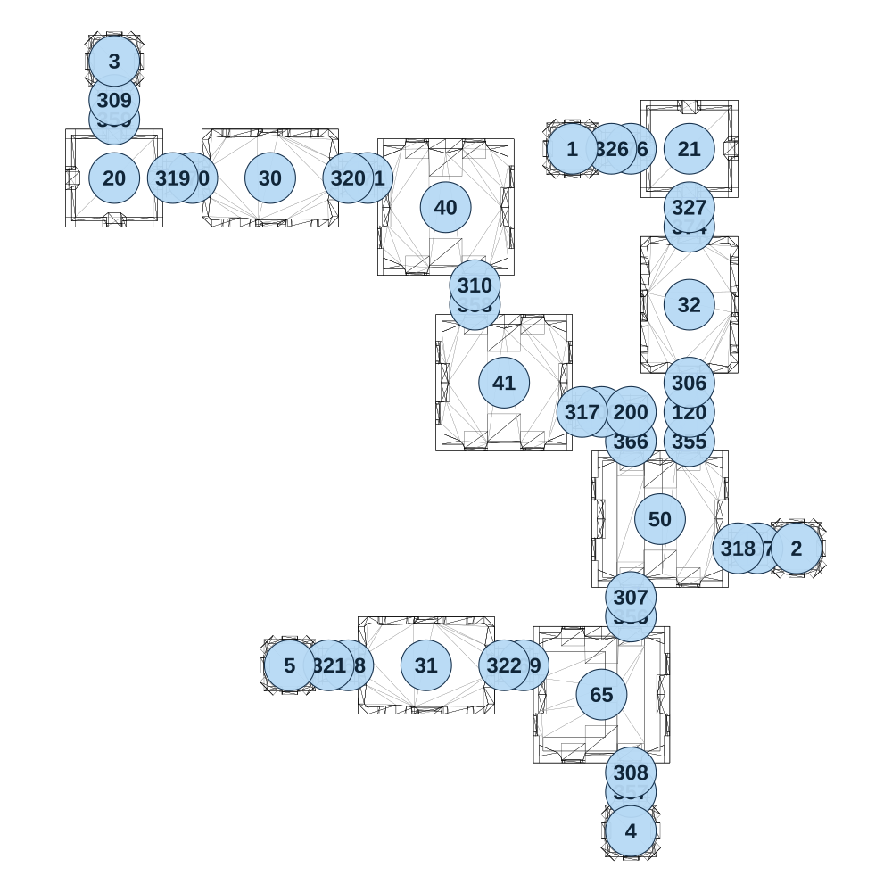

# map_ancient03_03

[All map wireframes](README.md)

[SVG](map_ancient03_03.svg) · [PNG](map_ancient03_03.png) · [Geometry JSON](map_ancient03_03.json)

## Section reference positions

These are markers, not room boundaries or safe spawn points. Positions use the file’s XYZ axes; the wireframe projects X/Z. Rotation is retained raw, not interpreted here.

| Section ID | X | Y | Z | Raw rotation |
|---:|---:|---:|---:|---:|
| 355 | 500 | 0 | 125 | 0 |
| 356 | 350 | 0 | 575 | 0 |
| 357 | 350 | 0 | 1025 | 0 |
| 358 | -50 | 0 | -225 | 0 |
| 359 | -975 | 0 | -700 | 0 |
| 366 | 350 | 0 | 125 | 0 |
| 367 | 675 | 0 | 400 | 16383 |
| 368 | -375 | 0 | 700 | 16383 |
| 369 | 75 | 0 | 700 | 16383 |
| 370 | -775 | 0 | -550 | 16383 |
| 371 | -325 | 0 | -550 | 16383 |
| 374 | 500 | 0 | -425 | 0 |
| 376 | 350 | 0 | -625 | 16383 |
| 100 | 275 | 0 | 50 | 16383 |
| 120 | 500 | 0 | 50 | 0 |
| 200 | 350 | 0 | 50 | 49152 |
| 306 | 500 | 0 | -25 | 0 |
| 307 | 350 | 0 | 525 | 0 |
| 308 | 350 | 0 | 975 | 0 |
| 309 | -975 | 0 | -750 | 0 |
| 310 | -50 | 0 | -275 | 0 |
| 317 | 225 | 0 | 50 | 16383 |
| 318 | 625 | 0 | 400 | 16383 |
| 319 | -825 | 0 | -550 | 16383 |
| 320 | -375 | 0 | -550 | 16383 |
| 321 | -425 | 0 | 700 | 16383 |
| 322 | 25 | 0 | 700 | 16383 |
| 326 | 300 | 0 | -625 | 16383 |
| 327 | 500 | 0 | -475 | 0 |
| 1 | 200 | 0 | -625 | 0 |
| 2 | 775 | 0 | 400 | 0 |
| 3 | -975 | 0 | -850 | 0 |
| 4 | 350 | 0 | 1125 | 0 |
| 5 | -525 | 0 | 700 | 0 |
| 20 | -975 | 0 | -550 | 0 |
| 21 | 500 | 0 | -625 | 0 |
| 30 | -575 | 0 | -550 | 16383 |
| 31 | -175 | 0 | 700 | 16383 |
| 32 | 500 | 0 | -225 | 0 |
| 40 | -125 | 0 | -475 | 0 |
| 41 | 25 | 0 | -25 | 0 |
| 50 | 425 | 0 | 325 | 32768 |
| 65 | 275 | 0 | 775 | 49152 |

Collision triangles: 4718. Sentinel/unlabelled records remain in JSON. Overlapping marker positions are preserved, not moved to invent room locations.
