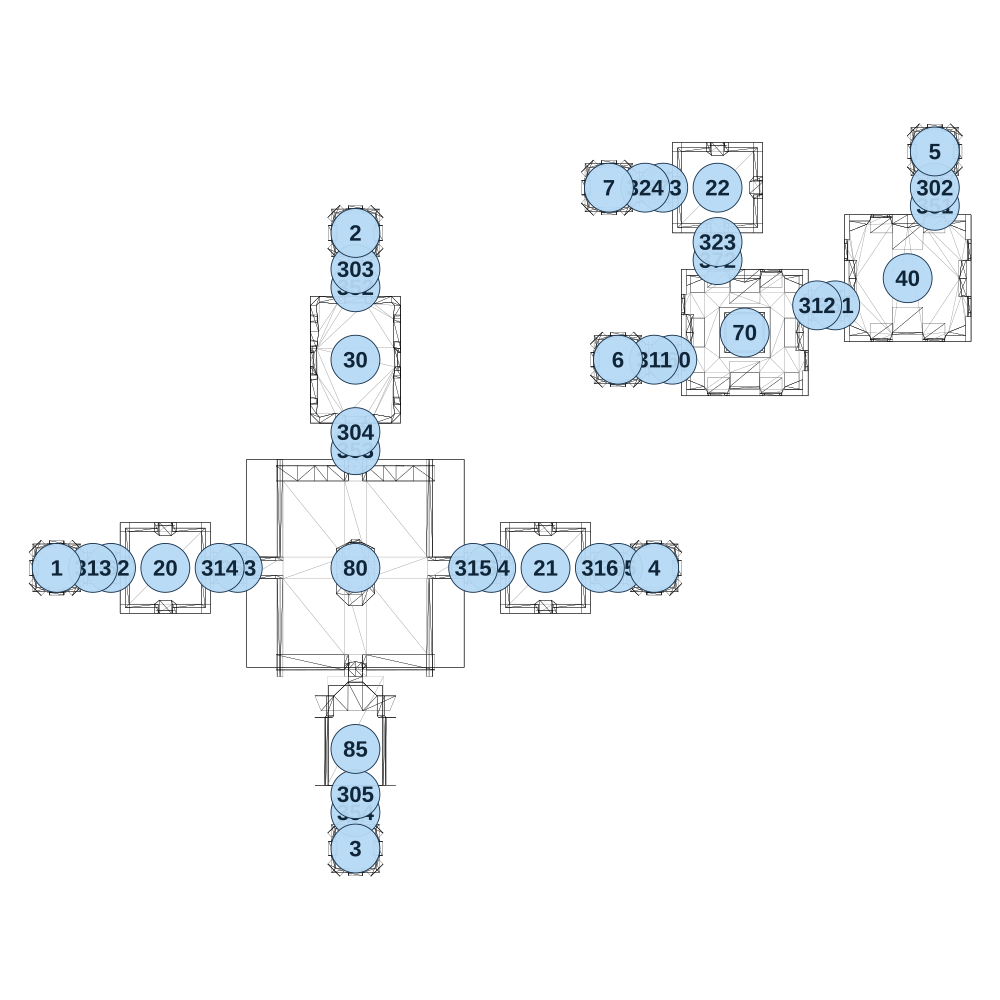

# map_ancient03_04

[All map wireframes](README.md)

[SVG](map_ancient03_04.svg) · [PNG](map_ancient03_04.png) · [Geometry JSON](map_ancient03_04.json)

## Section reference positions

These are markers, not room boundaries or safe spawn points. Positions use the file’s XYZ axes; the wireframe projects X/Z. Rotation is retained raw, not interpreted here.

| Section ID | X | Y | Z | Raw rotation |
|---:|---:|---:|---:|---:|
| 351 | 1550 | 0 | -1050 | 0 |
| 352 | -50 | 0 | -825 | 0 |
| 353 | -50 | 0 | -375 | 0 |
| 354 | -50 | 0 | 625 | 0 |
| 360 | 825 | 0 | -625 | 16383 |
| 361 | 1275 | 0 | -775 | 16383 |
| 362 | -725 | 0 | -50 | 16383 |
| 363 | -375 | 0 | -50 | 16383 |
| 364 | 325 | 0 | -50 | 16383 |
| 365 | 675 | 0 | -50 | 16383 |
| 372 | 950 | 0 | -900 | 0 |
| 373 | 800 | 0 | -1100 | 16383 |
| 302 | 1550 | 0 | -1100 | 0 |
| 303 | -50 | 0 | -875 | 0 |
| 304 | -50 | 0 | -425 | 0 |
| 305 | -50 | 0 | 575 | 0 |
| 311 | 775 | 0 | -625 | 16383 |
| 312 | 1225 | 0 | -775 | 16383 |
| 313 | -775 | 0 | -50 | 16383 |
| 314 | -425 | 0 | -50 | 16383 |
| 315 | 275 | 0 | -50 | 16383 |
| 316 | 625 | 0 | -50 | 16383 |
| 323 | 950 | 0 | -950 | 0 |
| 324 | 750 | 0 | -1100 | 16383 |
| 1 | -875 | 0 | -50 | 0 |
| 2 | -50 | 0 | -975 | 0 |
| 3 | -50 | 0 | 725 | 0 |
| 4 | 775 | 0 | -50 | 0 |
| 5 | 1550 | 0 | -1200 | 0 |
| 6 | 675 | 0 | -625 | 0 |
| 7 | 650 | 0 | -1100 | 0 |
| 20 | -575 | 0 | -50 | 0 |
| 21 | 475 | 0 | -50 | 0 |
| 22 | 950 | 0 | -1100 | 0 |
| 30 | -50 | 0 | -625 | 0 |
| 40 | 1475 | 0 | -850 | 0 |
| 80 | -50 | 0 | -50 | 0 |
| 85 | -50 | 0 | 450 | 0 |
| 70 | 1025 | 0 | -700 | 0 |

Collision triangles: 4408. Sentinel/unlabelled records remain in JSON. Overlapping marker positions are preserved, not moved to invent room locations.
