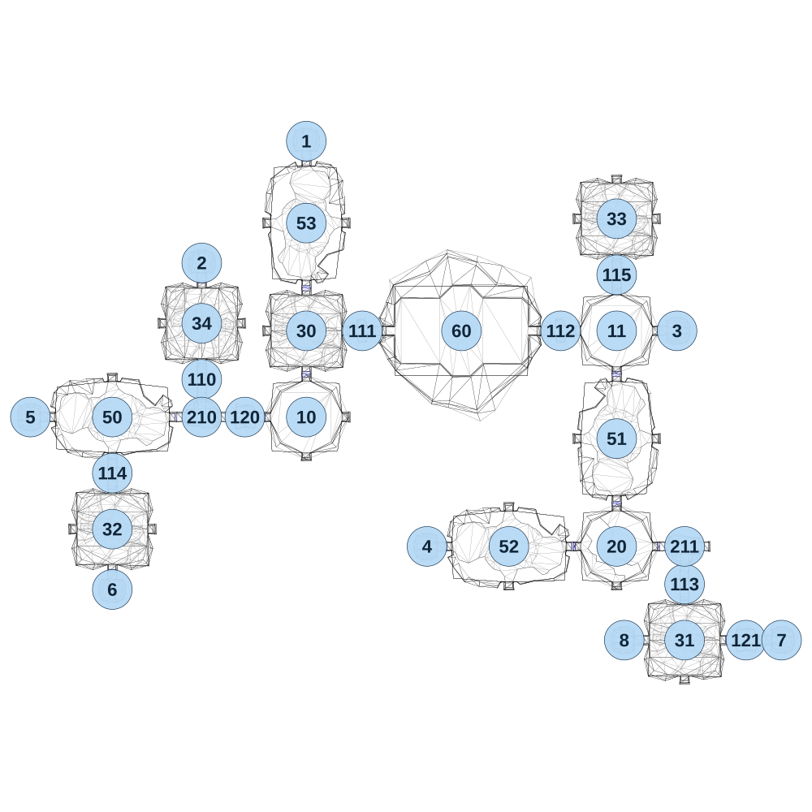

# map_cave01_00

[All map wireframes](README.md)

[SVG](map_cave01_00.svg) · [PNG](map_cave01_00.png) · [Geometry JSON](map_cave01_00.json)

## Section reference positions

These are markers, not room boundaries or safe spawn points. Positions use the file’s XYZ axes; the wireframe projects X/Z. Rotation is retained raw, not interpreted here.

| Section ID | X | Y | Z | Raw rotation |
|---:|---:|---:|---:|---:|
| 110 | 415 | 0 | -975 | 0 |
| 111 | 1160 | 0 | -1200 | 16383 |
| 112 | 2080 | 0 | -1200 | 16383 |
| 113 | 2655 | 0 | -25 | 0 |
| 114 | 0 | 0 | -540 | 0 |
| 115 | 2340 | 0 | -1460 | 0 |
| 120 | 615 | 0 | -800 | 16383 |
| 121 | 2940 | 0 | 235 | 16383 |
| 210 | 415 | 0 | -800 | 32768 |
| 211 | 2655 | 0 | -200 | 0 |
| 1 | 900 | 0 | -2080 | 32768 |
| 2 | 415 | 0 | -1515 | 32768 |
| 3 | 2620 | 0 | -1200 | 16383 |
| 4 | 1460 | 0 | -200 | 49152 |
| 5 | -380 | 0 | -800 | 49152 |
| 6 | 0 | 0 | 0 | 0 |
| 7 | 3105 | 0 | 235 | 16383 |
| 8 | 2375 | 0 | 235 | 49152 |
| 30 | 900 | 0 | -1200 | 0 |
| 31 | 2655 | 0 | 235 | 0 |
| 32 | 0 | 0 | -280 | 0 |
| 33 | 2340 | 0 | -1720 | 0 |
| 34 | 415 | 0 | -1235 | 32768 |
| 50 | 0 | 0 | -800 | 16383 |
| 51 | 2340 | 0 | -700 | 32768 |
| 52 | 1840 | 0 | -200 | 16383 |
| 53 | 900 | 0 | -1700 | 0 |
| 60 | 1620 | 0 | -1200 | 16383 |
| 10 | 900 | 0 | -800 | 0 |
| 11 | 2340 | 0 | -1200 | 0 |
| 20 | 2340 | 0 | -200 | 49152 |

Collision triangles: 7934. Sentinel/unlabelled records remain in JSON. Overlapping marker positions are preserved, not moved to invent room locations.
