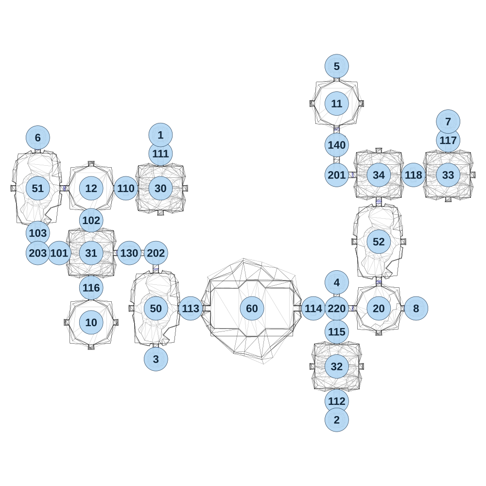

# map_cave01_01

[All map wireframes](README.md)

[SVG](map_cave01_01.svg) · [PNG](map_cave01_01.png) · [Geometry JSON](map_cave01_01.json)

## Section reference positions

These are markers, not room boundaries or safe spawn points. Positions use the file’s XYZ axes; the wireframe projects X/Z. Rotation is retained raw, not interpreted here.

| Section ID | X | Y | Z | Raw rotation |
|---:|---:|---:|---:|---:|
| 101 | -195 | 0 | -540 | 16383 |
| 102 | 45 | 0 | -785 | 0 |
| 103 | -355 | 0 | -690 | 0 |
| 110 | 305 | 0 | -1025 | 16383 |
| 111 | 565 | 0 | -1285 | 0 |
| 112 | 1885 | 0 | 570 | 0 |
| 113 | 790 | 0 | -125 | 16383 |
| 114 | 1710 | 0 | -125 | 16383 |
| 115 | 1885 | 0 | 50 | 0 |
| 116 | 45 | 0 | -280 | 0 |
| 117 | 2720 | 0 | -1385 | 0 |
| 118 | 2460 | 0 | -1125 | 16383 |
| 130 | 330 | 0 | -540 | 16383 |
| 140 | 1885 | 0 | -1350 | 0 |
| 201 | 1885 | 0 | -1125 | 32768 |
| 202 | 530 | 0 | -540 | 0 |
| 203 | -355 | 0 | -540 | 32768 |
| 220 | 1885 | 0 | -125 | 0 |
| 1 | 565 | 0 | -1425 | 32768 |
| 2 | 1885 | 0 | 710 | 0 |
| 3 | 530 | 0 | 255 | 0 |
| 4 | 1885 | 0 | -320 | 32768 |
| 5 | 1885 | 0 | -1940 | 32768 |
| 6 | -355 | 0 | -1405 | 32768 |
| 7 | 2720 | 0 | -1525 | 32768 |
| 8 | 2480 | 0 | -125 | 16383 |
| 30 | 565 | 0 | -1025 | 0 |
| 31 | 45 | 0 | -540 | 0 |
| 32 | 1885 | 0 | 310 | 0 |
| 33 | 2720 | 0 | -1125 | 0 |
| 34 | 2200 | 0 | -1125 | 0 |
| 50 | 530 | 0 | -125 | 0 |
| 51 | -355 | 0 | -1025 | 0 |
| 52 | 2200 | 0 | -625 | 0 |
| 60 | 1250 | 0 | -125 | 16383 |
| 10 | 45 | 0 | -20 | 0 |
| 11 | 1885 | 0 | -1660 | 0 |
| 12 | 45 | 0 | -1025 | 0 |
| 20 | 2200 | 0 | -125 | 0 |

Collision triangles: 8158. Sentinel/unlabelled records remain in JSON. Overlapping marker positions are preserved, not moved to invent room locations.
