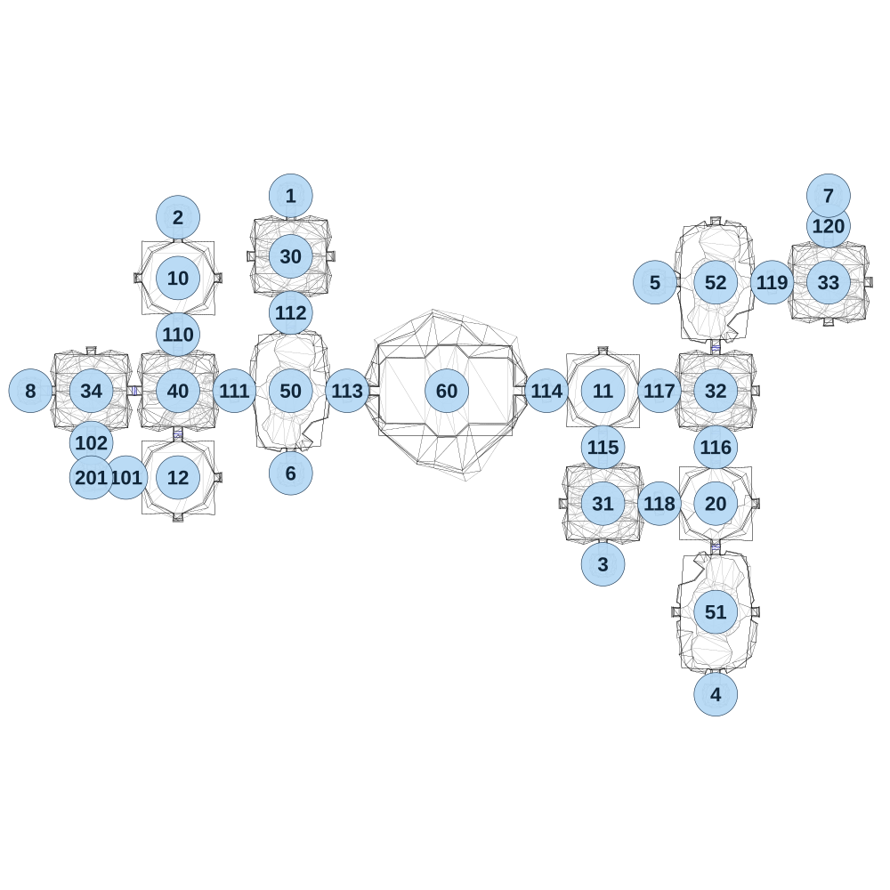

# map_cave01_02

[All map wireframes](README.md)

[SVG](map_cave01_02.svg) · [PNG](map_cave01_02.png) · [Geometry JSON](map_cave01_02.json)

## Section reference positions

These are markers, not room boundaries or safe spawn points. Positions use the file’s XYZ axes; the wireframe projects X/Z. Rotation is retained raw, not interpreted here.

| Section ID | X | Y | Z | Raw rotation |
|---:|---:|---:|---:|---:|
| 101 | -240 | 0 | 1205 | 16383 |
| 102 | -400 | 0 | 1045 | 0 |
| 110 | 0 | 0 | 545 | 0 |
| 111 | 260 | 0 | 805 | 16384 |
| 112 | 520 | 0 | 445 | 0 |
| 113 | 780 | 0 | 805 | 16384 |
| 114 | 1700 | 0 | 805 | 16384 |
| 115 | 1960 | 0 | 1065 | 0 |
| 116 | 2480 | 0 | 1065 | 0 |
| 117 | 2220 | 0 | 805 | 16384 |
| 118 | 2220 | 0 | 1325 | 16384 |
| 119 | 2740 | 0 | 305 | 16384 |
| 120 | 3000 | 0 | 45 | 0 |
| 201 | -400 | 0 | 1205 | 32768 |
| 1 | 520 | 0 | -95 | 32768 |
| 2 | 0 | 0 | 5 | 32768 |
| 3 | 1960 | 0 | 1605 | 0 |
| 4 | 2480 | 0 | 2205 | 0 |
| 5 | 2200 | 0 | 305 | 49152 |
| 6 | 520 | 0 | 1185 | 0 |
| 7 | 3000 | 0 | -95 | 32768 |
| 8 | -680 | 0 | 805 | 49152 |
| 30 | 520 | 0 | 185 | 0 |
| 31 | 1960 | 0 | 1325 | 0 |
| 32 | 2480 | 0 | 805 | 0 |
| 33 | 3000 | 0 | 305 | 0 |
| 34 | -400 | 0 | 805 | 0 |
| 40 | 0 | 0 | 805 | 0 |
| 50 | 520 | 0 | 805 | 0 |
| 51 | 2480 | 0 | 1825 | 32768 |
| 52 | 2480 | 0 | 305 | 0 |
| 60 | 1240 | 0 | 805 | 16384 |
| 10 | 0 | 0 | 285 | 0 |
| 11 | 1960 | 0 | 805 | 0 |
| 12 | 0 | 0 | 1205 | 0 |
| 20 | 2480 | 0 | 1325 | 0 |

Collision triangles: 8487. Sentinel/unlabelled records remain in JSON. Overlapping marker positions are preserved, not moved to invent room locations.
