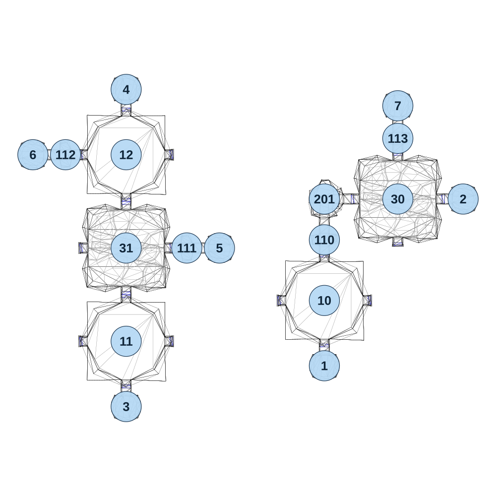

# map_cave01_03

[All map wireframes](README.md)

[SVG](map_cave01_03.svg) · [PNG](map_cave01_03.png) · [Geometry JSON](map_cave01_03.json)

## Section reference positions

These are markers, not room boundaries or safe spawn points. Positions use the file’s XYZ axes; the wireframe projects X/Z. Rotation is retained raw, not interpreted here.

| Section ID | X | Y | Z | Raw rotation |
|---:|---:|---:|---:|---:|
| 110 | -5 | 0 | 5 | 0 |
| 111 | -595 | 0 | 40 | 16383 |
| 112 | -1115 | 0 | -360 | 16383 |
| 113 | 310 | 0 | -430 | 0 |
| 201 | -5 | 0 | -170 | 16383 |
| 1 | -5 | 0 | 545 | 0 |
| 2 | 590 | 0 | -170 | 16383 |
| 3 | -855 | 0 | 720 | 0 |
| 4 | -855 | 0 | -640 | 32768 |
| 5 | -455 | 0 | 40 | 16383 |
| 6 | -1255 | 0 | -360 | 49152 |
| 7 | 310 | 0 | -570 | 32768 |
| 30 | 310 | 0 | -170 | 0 |
| 31 | -855 | 0 | 40 | 0 |
| 10 | -5 | 0 | 265 | 0 |
| 11 | -855 | 0 | 440 | 0 |
| 12 | -855 | 0 | -360 | 0 |

Collision triangles: 3012. Sentinel/unlabelled records remain in JSON. Overlapping marker positions are preserved, not moved to invent room locations.
