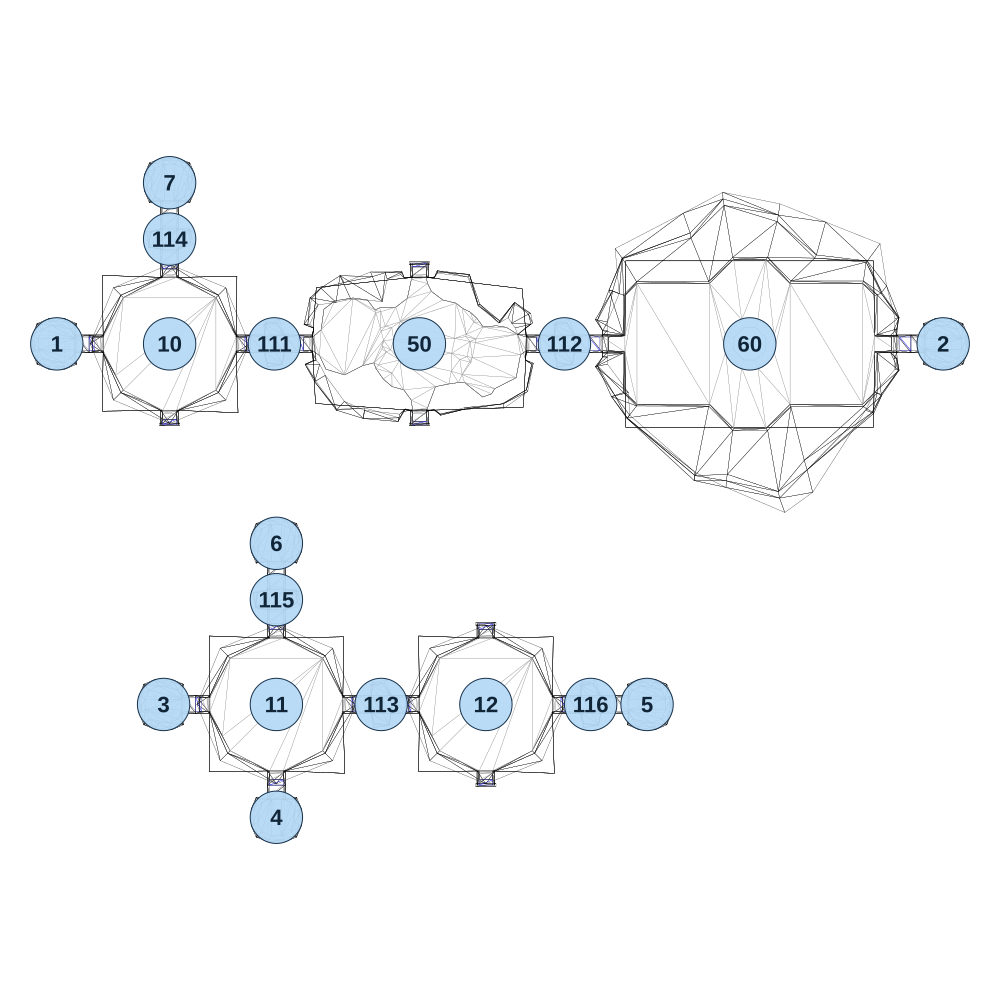

# map_cave01_04

[All map wireframes](README.md)

[SVG](map_cave01_04.svg) · [PNG](map_cave01_04.png) · [Geometry JSON](map_cave01_04.json)

## Section reference positions

These are markers, not room boundaries or safe spawn points. Positions use the file’s XYZ axes; the wireframe projects X/Z. Rotation is retained raw, not interpreted here.

| Section ID | X | Y | Z | Raw rotation |
|---:|---:|---:|---:|---:|
| 111 | -365 | 0 | 5 | 16383 |
| 112 | 355 | 0 | 5 | 16383 |
| 113 | -100 | 0 | 900 | 16383 |
| 114 | -625 | 0 | -255 | 0 |
| 115 | -360 | 0 | 640 | 0 |
| 116 | 420 | 0 | 900 | 16383 |
| 1 | -905 | 0 | 5 | 49152 |
| 2 | 1295 | 0 | 5 | 16383 |
| 3 | -640 | 0 | 900 | 49152 |
| 4 | -360 | 0 | 1180 | 0 |
| 5 | 560 | 0 | 900 | 16383 |
| 6 | -360 | 0 | 500 | 32768 |
| 7 | -625 | 0 | -395 | 32768 |
| 50 | -5 | 0 | 5 | 16383 |
| 60 | 815 | 0 | 5 | 16383 |
| 10 | -625 | 0 | 5 | 0 |
| 11 | -360 | 0 | 900 | 0 |
| 12 | 160 | 0 | 900 | 0 |

Collision triangles: 2815. Sentinel/unlabelled records remain in JSON. Overlapping marker positions are preserved, not moved to invent room locations.
