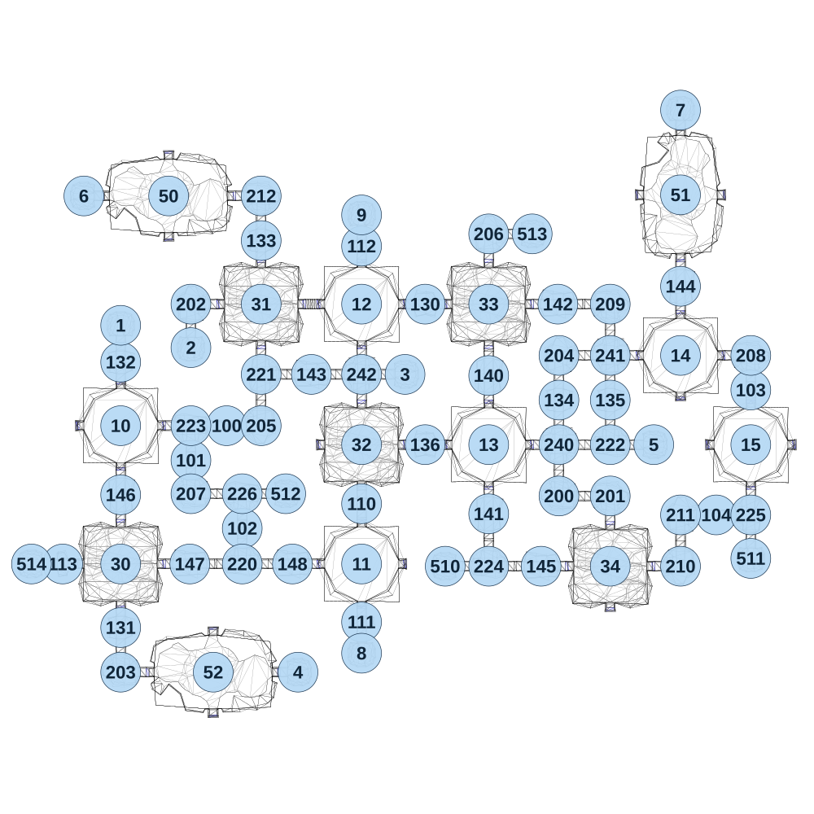

# map_cave01_05

[All map wireframes](README.md)

[SVG](map_cave01_05.svg) · [PNG](map_cave01_05.png) · [Geometry JSON](map_cave01_05.json)

## Section reference positions

These are markers, not room boundaries or safe spawn points. Positions use the file’s XYZ axes; the wireframe projects X/Z. Rotation is retained raw, not interpreted here.

| Section ID | X | Y | Z | Raw rotation |
|---:|---:|---:|---:|---:|
| 100 | -890 | 0 | -85 | 16383 |
| 101 | -1050 | 0 | 70 | 0 |
| 102 | -820 | 0 | 375 | 0 |
| 103 | 1460 | 0 | -245 | 0 |
| 104 | 1305 | 0 | 315 | 16383 |
| 110 | -285 | 0 | 265 | 0 |
| 111 | -285 | 0 | 795 | 0 |
| 112 | -285 | 0 | -890 | 0 |
| 113 | -1625 | 0 | 535 | 16383 |
| 130 | 0 | 0 | -630 | 16383 |
| 131 | -1365 | 0 | 820 | 0 |
| 132 | -1365 | 0 | -370 | 0 |
| 133 | -735 | 0 | -915 | 0 |
| 134 | 600 | 0 | -200 | 0 |
| 135 | 830 | 0 | -200 | 0 |
| 136 | 0 | 0 | 0 | 16383 |
| 140 | 285 | 0 | -310 | 0 |
| 141 | 285 | 0 | 310 | 0 |
| 142 | 595 | 0 | -630 | 16383 |
| 143 | -510 | 0 | -315 | 16383 |
| 144 | 1145 | 0 | -710 | 0 |
| 145 | 520 | 0 | 545 | 16383 |
| 146 | -1365 | 0 | 225 | 0 |
| 147 | -1055 | 0 | 535 | 16383 |
| 148 | -595 | 0 | 535 | 16383 |
| 200 | 600 | 0 | 230 | 32768 |
| 201 | 830 | 0 | 230 | 0 |
| 202 | -1050 | 0 | -630 | 16383 |
| 203 | -1365 | 0 | 1020 | 32768 |
| 204 | 600 | 0 | -400 | 16383 |
| 205 | -735 | 0 | -85 | 49152 |
| 206 | 285 | 0 | -945 | 16383 |
| 207 | -1050 | 0 | 220 | 32768 |
| 208 | 1460 | 0 | -400 | 0 |
| 209 | 830 | 0 | -630 | 0 |
| 210 | 1145 | 0 | 545 | 49152 |
| 211 | 1145 | 0 | 315 | 16383 |
| 212 | -735 | 0 | -1115 | 0 |
| 220 | -820 | 0 | 535 | 32768 |
| 221 | -735 | 0 | -315 | 16383 |
| 222 | 830 | 0 | 0 | 32768 |
| 223 | -1050 | 0 | -85 | 0 |
| 224 | 285 | 0 | 545 | 32768 |
| 225 | 1460 | 0 | 315 | 49152 |
| 226 | -820 | 0 | 220 | 0 |
| 240 | 600 | 0 | 0 | 0 |
| 241 | 830 | 0 | -400 | 0 |
| 242 | -285 | 0 | -315 | 0 |
| 1 | -1365 | 0 | -535 | 32768 |
| 2 | -1050 | 0 | -435 | 0 |
| 3 | -90 | 0 | -315 | 16383 |
| 4 | -570 | 0 | 1020 | 16383 |
| 5 | 1025 | 0 | 0 | 16383 |
| 6 | -1530 | 0 | -1115 | 49152 |
| 7 | 1145 | 0 | -1500 | 32768 |
| 8 | -285 | 0 | 935 | 0 |
| 9 | -285 | 0 | -1030 | 32768 |
| 510 | 90 | 0 | 545 | 49152 |
| 511 | 1460 | 0 | 510 | 0 |
| 512 | -625 | 0 | 220 | 16383 |
| 513 | 480 | 0 | -945 | 16383 |
| 514 | -1765 | 0 | 535 | 49152 |
| 30 | -1365 | 0 | 535 | 0 |
| 31 | -735 | 0 | -630 | 0 |
| 32 | -285 | 0 | 0 | 0 |
| 33 | 285 | 0 | -630 | 0 |
| 34 | 830 | 0 | 545 | 0 |
| 50 | -1150 | 0 | -1115 | 49152 |
| 51 | 1145 | 0 | -1120 | 32768 |
| 52 | -950 | 0 | 1020 | 49152 |
| 10 | -1365 | 0 | -85 | 0 |
| 11 | -285 | 0 | 535 | 0 |
| 12 | -285 | 0 | -630 | 0 |
| 13 | 285 | 0 | 0 | 0 |
| 14 | 1145 | 0 | -400 | 0 |
| 15 | 1460 | 0 | 0 | 0 |

Collision triangles: 12860. Sentinel/unlabelled records remain in JSON. Overlapping marker positions are preserved, not moved to invent room locations.
