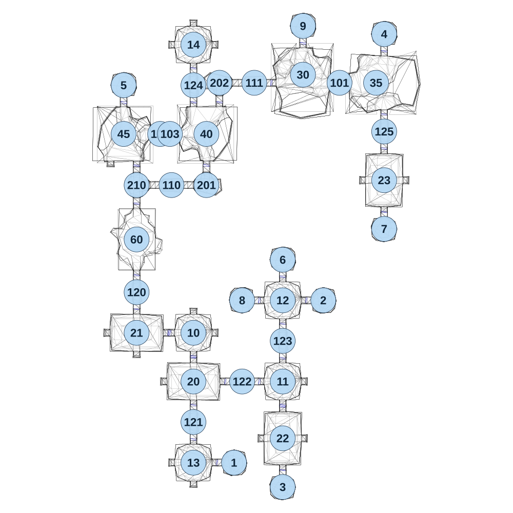

# map_cave02_01

[All map wireframes](README.md)

[SVG](map_cave02_01.svg) · [PNG](map_cave02_01.png) · [Geometry JSON](map_cave02_01.json)

## Section reference positions

These are markers, not room boundaries or safe spawn points. Positions use the file’s XYZ axes; the wireframe projects X/Z. Rotation is retained raw, not interpreted here.

| Section ID | X | Y | Z | Raw rotation |
|---:|---:|---:|---:|---:|
| 101 | 900 | 0 | -2290 | 16383 |
| 102 | -205 | 0 | -1975 | 16383 |
| 103 | -145 | 0 | -1975 | 16383 |
| 110 | -135 | 0 | -1660 | 16383 |
| 111 | 375 | 0 | -2290 | 16383 |
| 201 | 80 | 0 | -1660 | 32768 |
| 202 | 160 | 0 | -2290 | 0 |
| 210 | -350 | 0 | -1660 | 16383 |
| 1 | 250 | 0 | 50 | 49152 |
| 2 | 800 | 0 | -950 | 49152 |
| 3 | 550 | 0 | 200 | 32768 |
| 4 | 1175 | 0 | -2590 | 0 |
| 5 | -430 | 0 | -2275 | 0 |
| 6 | 550 | 0 | -1200 | 0 |
| 7 | 1175 | 0 | -1390 | 32768 |
| 8 | 300 | 0 | -950 | 16384 |
| 9 | 675 | 0 | -2640 | 0 |
| 30 | 675 | 0 | -2340 | 32768 |
| 35 | 1125 | 0 | -2290 | 49152 |
| 40 | 80 | 0 | -1975 | 0 |
| 45 | -430 | 0 | -1975 | 32768 |
| 20 | 0 | 0 | -450 | 16383 |
| 21 | -350 | 0 | -750 | 16383 |
| 22 | 550 | 0 | -100 | 0 |
| 23 | 1175 | 0 | -1690 | 0 |
| 10 | 0 | 0 | -750 | 0 |
| 11 | 550 | 0 | -450 | 0 |
| 12 | 550 | 0 | -950 | 0 |
| 13 | 0 | 0 | 50 | 0 |
| 14 | 0 | 0 | -2525 | 0 |
| 120 | -350 | 0 | -1000 | 0 |
| 121 | 0 | 0 | -200 | 0 |
| 122 | 300 | 0 | -450 | 16383 |
| 123 | 550 | 0 | -700 | 0 |
| 124 | 0 | 0 | -2275 | 0 |
| 125 | 1175 | 0 | -1990 | 0 |
| 60 | -350 | 0 | -1325 | 0 |

Collision triangles: 6805. Sentinel/unlabelled records remain in JSON. Overlapping marker positions are preserved, not moved to invent room locations.
