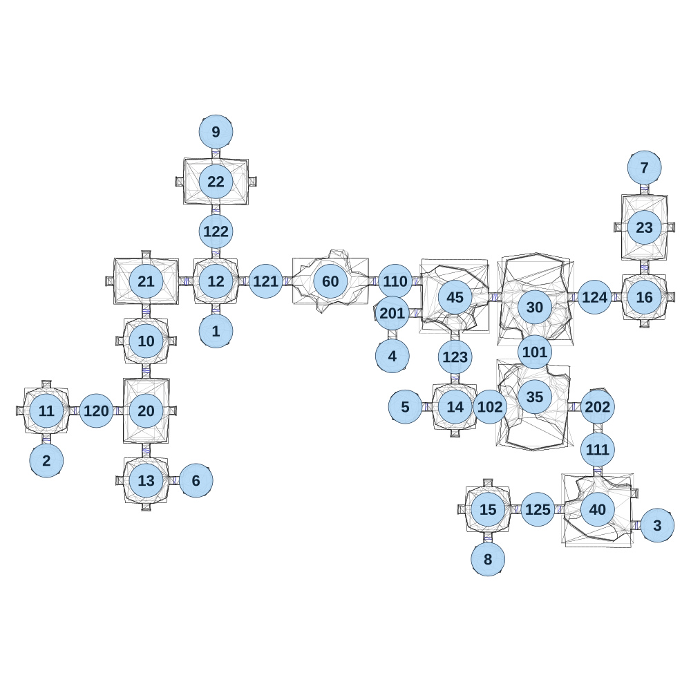

# map_cave02_02

[All map wireframes](README.md)

[SVG](map_cave02_02.svg) · [PNG](map_cave02_02.png) · [Geometry JSON](map_cave02_02.json)

## Section reference positions

These are markers, not room boundaries or safe spawn points. Positions use the file’s XYZ axes; the wireframe projects X/Z. Rotation is retained raw, not interpreted here.

| Section ID | X | Y | Z | Raw rotation |
|---:|---:|---:|---:|---:|
| 101 | 2435 | 0 | -540 | 0 |
| 102 | 2210 | 0 | -265 | 16383 |
| 110 | 1735 | 0 | -895 | 16383 |
| 111 | 2750 | 0 | -50 | 0 |
| 201 | 1720 | 0 | -735 | 0 |
| 202 | 2750 | 0 | -265 | 49152 |
| 1 | 835 | 0 | -645 | 32768 |
| 2 | -15 | 0 | 5 | 32768 |
| 3 | 3050 | 0 | 330 | 49152 |
| 4 | 1720 | 0 | -520 | 32768 |
| 5 | 1785 | 0 | -265 | 16383 |
| 6 | 735 | 0 | 105 | 49152 |
| 7 | 2985 | 0 | -1465 | 0 |
| 8 | 2200 | 0 | 500 | 32768 |
| 9 | 835 | 0 | -1645 | 0 |
| 30 | 2435 | 0 | -765 | 0 |
| 35 | 2435 | 0 | -315 | 32768 |
| 40 | 2750 | 0 | 250 | 49152 |
| 45 | 2035 | 0 | -815 | 16384 |
| 20 | 485 | 0 | -245 | 0 |
| 21 | 485 | 0 | -895 | 16383 |
| 22 | 835 | 0 | -1395 | 16383 |
| 23 | 2985 | 0 | -1165 | 0 |
| 10 | 485 | 0 | -595 | 0 |
| 11 | -15 | 0 | -245 | 0 |
| 12 | 835 | 0 | -895 | 0 |
| 13 | 485 | 0 | 105 | 0 |
| 14 | 2035 | 0 | -265 | 0 |
| 15 | 2200 | 0 | 250 | 0 |
| 16 | 2985 | 0 | -815 | 0 |
| 120 | 235 | 0 | -245 | 16383 |
| 121 | 1085 | 0 | -895 | 16383 |
| 122 | 835 | 0 | -1145 | 0 |
| 123 | 2035 | 0 | -515 | 0 |
| 124 | 2735 | 0 | -815 | 16383 |
| 125 | 2450 | 0 | 250 | 16383 |
| 60 | 1410 | 0 | -895 | 16383 |

Collision triangles: 7189. Sentinel/unlabelled records remain in JSON. Overlapping marker positions are preserved, not moved to invent room locations.
