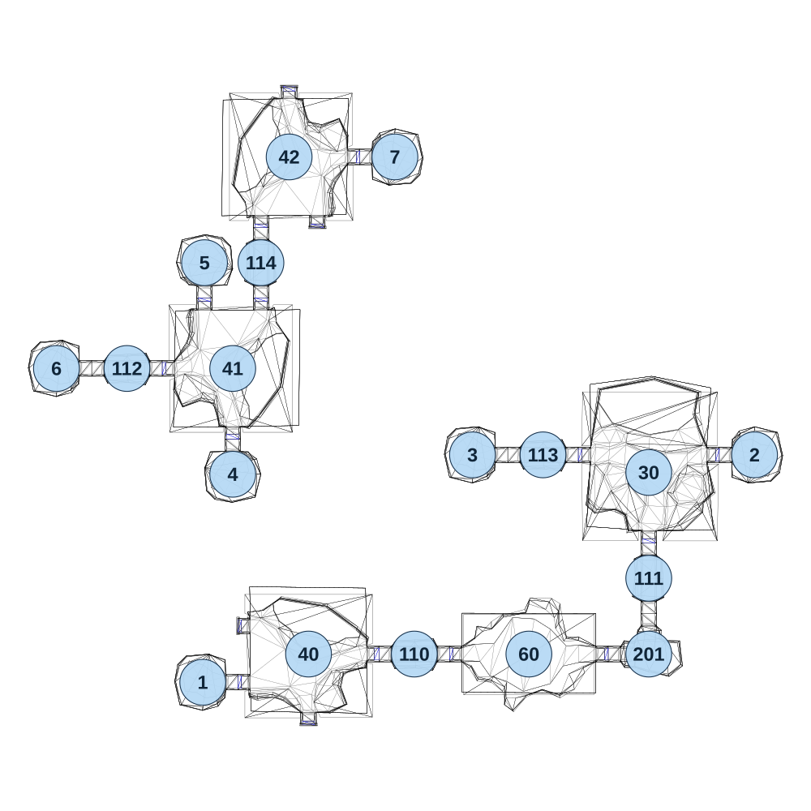

# map_cave02_03

[All map wireframes](README.md)

[SVG](map_cave02_03.svg) · [PNG](map_cave02_03.png) · [Geometry JSON](map_cave02_03.json)

## Section reference positions

These are markers, not room boundaries or safe spawn points. Positions use the file’s XYZ axes; the wireframe projects X/Z. Rotation is retained raw, not interpreted here.

| Section ID | X | Y | Z | Raw rotation |
|---:|---:|---:|---:|---:|
| 110 | -160 | 0 | 0 | 16383 |
| 111 | 505 | 0 | -215 | 0 |
| 112 | -975 | 0 | -810 | 16384 |
| 113 | 205 | 0 | -565 | 16383 |
| 114 | -595 | 0 | -1110 | 0 |
| 201 | 505 | 0 | 0 | 32768 |
| 1 | -760 | 0 | 80 | 16383 |
| 2 | 805 | 0 | -565 | 49152 |
| 3 | 5 | 0 | -565 | 16383 |
| 4 | -675 | 0 | -510 | 32768 |
| 5 | -755 | 0 | -1110 | 0 |
| 6 | -1175 | 0 | -810 | 16383 |
| 7 | -215 | 0 | -1410 | 49152 |
| 30 | 505 | 0 | -515 | 0 |
| 40 | -460 | 0 | 0 | 16383 |
| 41 | -675 | 0 | -810 | 0 |
| 42 | -515 | 0 | -1410 | 32768 |
| 60 | 165 | 0 | 0 | 16383 |

Collision triangles: 3276. Sentinel/unlabelled records remain in JSON. Overlapping marker positions are preserved, not moved to invent room locations.
