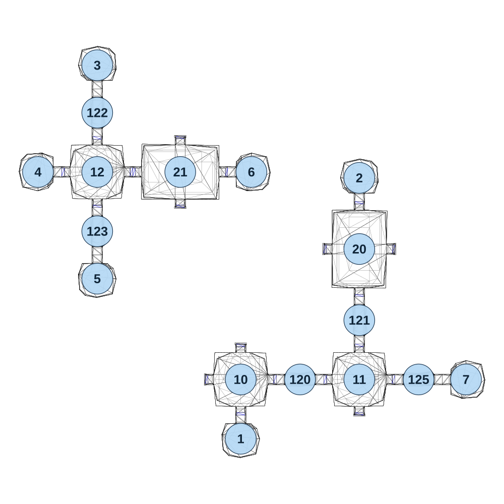

# map_cave02_04

[All map wireframes](README.md)

[SVG](map_cave02_04.svg) · [PNG](map_cave02_04.png) · [Geometry JSON](map_cave02_04.json)

## Section reference positions

These are markers, not room boundaries or safe spawn points. Positions use the file’s XYZ axes; the wireframe projects X/Z. Rotation is retained raw, not interpreted here.

| Section ID | X | Y | Z | Raw rotation |
|---:|---:|---:|---:|---:|
| 1 | -80 | 0 | 560 | 32768 |
| 2 | 420 | 0 | -540 | 0 |
| 3 | -685 | 0 | -1015 | 0 |
| 4 | -935 | 0 | -565 | 16384 |
| 5 | -685 | 0 | -115 | 32768 |
| 6 | -35 | 0 | -565 | 49152 |
| 7 | 870 | 0 | 310 | 49152 |
| 20 | 420 | 0 | -240 | 0 |
| 21 | -335 | 0 | -565 | 16384 |
| 10 | -80 | 0 | 310 | 0 |
| 11 | 420 | 0 | 310 | 0 |
| 12 | -685 | 0 | -565 | 0 |
| 120 | 170 | 0 | 310 | 16383 |
| 121 | 420 | 0 | 60 | 0 |
| 122 | -685 | 0 | -815 | 0 |
| 123 | -685 | 0 | -315 | 0 |
| 125 | 670 | 0 | 310 | 16384 |

Collision triangles: 2651. Sentinel/unlabelled records remain in JSON. Overlapping marker positions are preserved, not moved to invent room locations.
