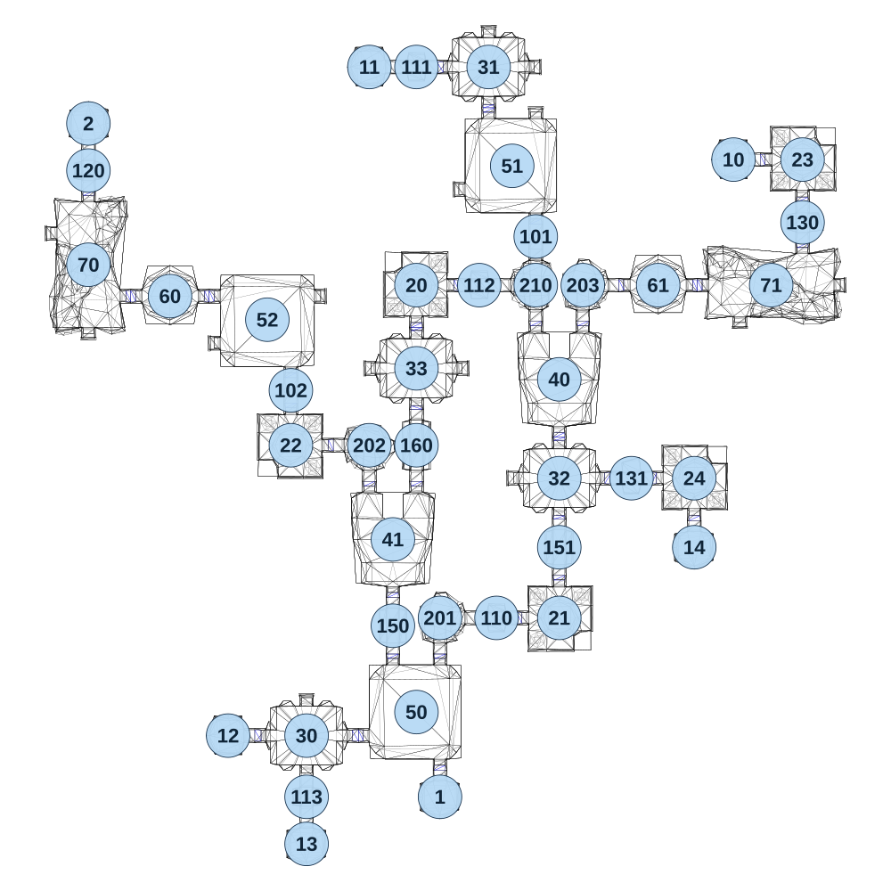

# map_cave03_00

[All map wireframes](README.md)

[SVG](map_cave03_00.svg) · [PNG](map_cave03_00.png) · [Geometry JSON](map_cave03_00.json)

## Section reference positions

These are markers, not room boundaries or safe spawn points. Positions use the file’s XYZ axes; the wireframe projects X/Z. Rotation is retained raw, not interpreted here.

| Section ID | X | Y | Z | Raw rotation |
|---:|---:|---:|---:|---:|
| 101 | 305 | 0 | -1915 | 0 |
| 102 | -475 | 0 | -1425 | 0 |
| 110 | 180 | 0 | -700 | 16383 |
| 111 | -75 | 0 | -2455 | 16383 |
| 112 | 125 | 0 | -1760 | 16383 |
| 113 | -425 | 0 | -130 | 0 |
| 160 | -75 | 0 | -1250 | 0 |
| 20 | -75 | 0 | -1760 | 16383 |
| 21 | 380 | 0 | -700 | 49152 |
| 22 | -475 | 0 | -1250 | 32768 |
| 23 | 1155 | 0 | -2160 | 0 |
| 24 | 810 | 0 | -1145 | 0 |
| 40 | 380 | 0 | -1460 | 32768 |
| 41 | -150 | 0 | -950 | 32768 |
| 120 | -1120 | 0 | -2125 | 0 |
| 1 | 0 | 0 | -130 | 0 |
| 2 | -1120 | 0 | -2275 | 32768 |
| 130 | 1155 | 0 | -1960 | 0 |
| 131 | 610 | 0 | -1145 | 16383 |
| 150 | -150 | 0 | -675 | 0 |
| 151 | 380 | 0 | -925 | 0 |
| 201 | 0 | 0 | -700 | 16383 |
| 202 | -225 | 0 | -1250 | 0 |
| 203 | 455 | 0 | -1760 | 16383 |
| 210 | 305 | 0 | -1760 | 49152 |
| 30 | -425 | 0 | -325 | 0 |
| 31 | 155 | 0 | -2455 | 0 |
| 32 | 380 | 0 | -1145 | 0 |
| 33 | -75 | 0 | -1495 | 0 |
| 10 | 935 | 0 | -2160 | 49152 |
| 11 | -225 | 0 | -2455 | 49152 |
| 12 | -675 | 0 | -325 | 49152 |
| 13 | -425 | 0 | 20 | 0 |
| 14 | 810 | 0 | -925 | 0 |
| 60 | -860 | 0 | -1725 | 0 |
| 61 | 695 | 0 | -1760 | 0 |
| 50 | -75 | 0 | -400 | 32768 |
| 51 | 230 | 0 | -2140 | 32768 |
| 52 | -550 | 0 | -1650 | 49152 |
| 70 | -1120 | 0 | -1825 | 0 |
| 71 | 1055 | 0 | -1760 | 16383 |

Collision triangles: 7709. Sentinel/unlabelled records remain in JSON. Overlapping marker positions are preserved, not moved to invent room locations.
