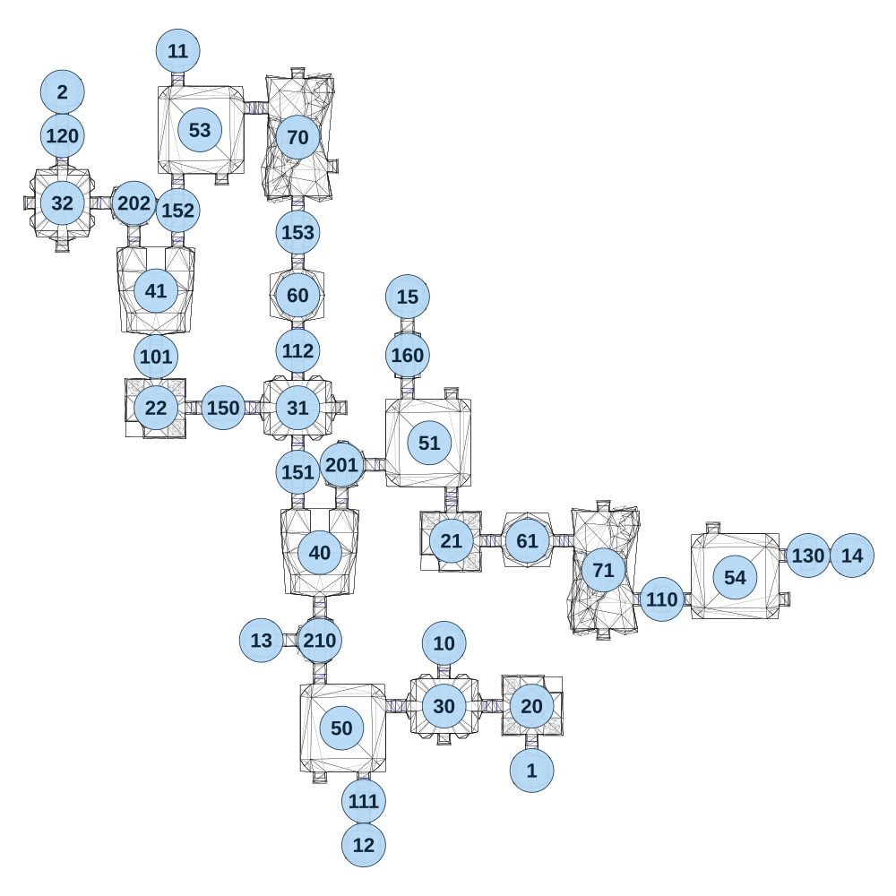

# map_cave03_01

[All map wireframes](README.md)

[SVG](map_cave03_01.svg) · [PNG](map_cave03_01.png) · [Geometry JSON](map_cave03_01.json)

## Section reference positions

These are markers, not room boundaries or safe spawn points. Positions use the file’s XYZ axes; the wireframe projects X/Z. Rotation is retained raw, not interpreted here.

| Section ID | X | Y | Z | Raw rotation |
|---:|---:|---:|---:|---:|
| 101 | -710 | 0 | -1675 | 0 |
| 110 | 1019.9 | 0 | -845.025 | 16383 |
| 111 | 0 | 0 | -155 | 0 |
| 112 | -225 | 0 | -1695 | 0 |
| 160 | 150 | 0 | -1680 | 0 |
| 20 | 575 | 0 | -480 | 0 |
| 21 | 299.9 | 0 | -1045.02 | 32768 |
| 22 | -710 | 0 | -1500 | 32768 |
| 40 | -150 | 0 | -1005 | 32768 |
| 41 | -710 | 0 | -1900 | 32768 |
| 120 | -1030 | 0 | -2430 | 0 |
| 1 | 575 | 0 | -260 | 0 |
| 2 | -1030 | 0 | -2580 | 32768 |
| 130 | 1519.9 | 0 | -995.025 | 16383 |
| 150 | -480 | 0 | -1500 | 16383 |
| 151 | -225 | 0 | -1280 | 0 |
| 152 | -635 | 0 | -2175 | 0 |
| 153 | -225 | 0 | -2100 | 0 |
| 201 | -75 | 0 | -1305 | 16383 |
| 202 | -785 | 0 | -2200 | 0 |
| 210 | -150 | 0 | -705 | 49152 |
| 30 | 275 | 0 | -480 | 0 |
| 31 | -225 | 0 | -1500 | 0 |
| 32 | -1030 | 0 | -2200 | 16383 |
| 10 | 275 | 0 | -695 | 32768 |
| 11 | -635 | 0 | -2720 | 32768 |
| 12 | 0 | 0 | -5 | 0 |
| 13 | -350 | 0 | -705 | 49152 |
| 14 | 1669.9 | 0 | -995.025 | 16383 |
| 15 | 150 | 0 | -1880 | 32768 |
| 60 | -225 | 0 | -1885 | 16383 |
| 61 | 559.9 | 0 | -1045.02 | 0 |
| 50 | -75 | 0 | -405 | 0 |
| 51 | 225 | 0 | -1380 | 32768 |
| 53 | -560 | 0 | -2450 | 0 |
| 54 | 1269.9 | 0 | -920.025 | 16383 |
| 70 | -225 | 0 | -2425 | 0 |
| 71 | 819.9 | 0 | -945.025 | 0 |

Collision triangles: 6984. Sentinel/unlabelled records remain in JSON. Overlapping marker positions are preserved, not moved to invent room locations.
