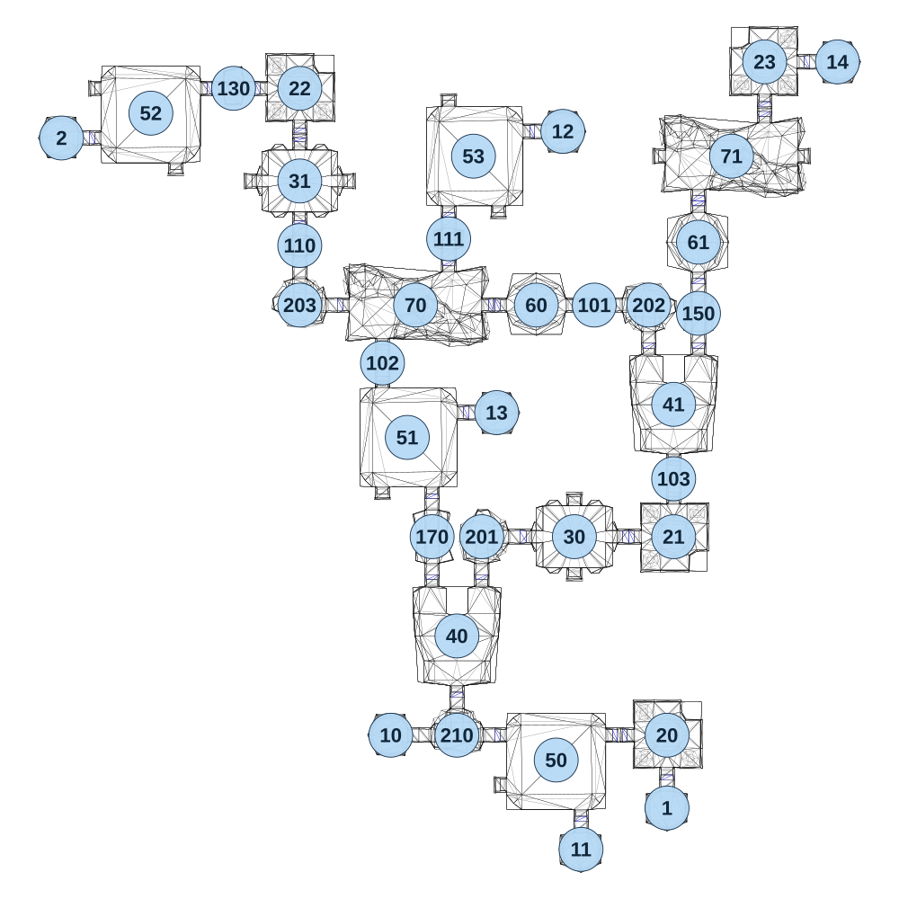

# map_cave03_02

[All map wireframes](README.md)

[SVG](map_cave03_02.svg) · [PNG](map_cave03_02.png) · [Geometry JSON](map_cave03_02.json)

## Section reference positions

These are markers, not room boundaries or safe spawn points. Positions use the file’s XYZ axes; the wireframe projects X/Z. Rotation is retained raw, not interpreted here.

| Section ID | X | Y | Z | Raw rotation |
|---:|---:|---:|---:|---:|
| 101 | 40 | 0 | -1645 | 16383 |
| 102 | -600 | 0 | -1470 | 0 |
| 103 | 280 | 0 | -1120 | 0 |
| 110 | -850 | 0 | -1825 | 0 |
| 111 | -400 | 0 | -1845 | 0 |
| 20 | 260.1 | 0 | -345 | 0 |
| 21 | 280 | 0 | -944.9 | 49152 |
| 22 | -849.9 | 0 | -2299.98 | 0 |
| 23 | 555 | 0 | -2380.1 | 16383 |
| 40 | -375 | 0 | -645 | 32768 |
| 41 | 280 | 0 | -1345 | 32768 |
| 1 | 260 | 0 | -125 | 0 |
| 2 | -1570 | 0 | -2150 | 49152 |
| 130 | -1050 | 0 | -2300 | 16383 |
| 150 | 355 | 0 | -1620 | 0 |
| 170 | -450 | 0 | -945 | 0 |
| 201 | -300 | 0 | -945 | 16383 |
| 202 | 205 | 0 | -1645 | 0 |
| 203 | -850 | 0 | -1645 | 32768 |
| 210 | -375 | 0 | -345 | 32768 |
| 30 | -20 | 0 | -945 | 0 |
| 31 | -850 | 0 | -2020 | 0 |
| 10 | -575 | 0 | -345 | 49152 |
| 11 | 0 | 0 | 0 | 0 |
| 12 | -55 | 0 | -2170 | 16383 |
| 13 | -255 | 0 | -1320 | 16383 |
| 14 | 775 | 0 | -2380 | 16383 |
| 60 | -135 | 0 | -1645 | 0 |
| 61 | 355 | 0 | -1835 | 16383 |
| 50 | -75 | 0 | -270 | 49152 |
| 51 | -525 | 0 | -1245 | 0 |
| 52 | -1300 | 0 | -2225 | 49152 |
| 53 | -325 | 0 | -2095 | 0 |
| 70 | -500 | 0 | -1645 | 16383 |
| 71 | 455 | 0 | -2095 | 16383 |

Collision triangles: 6727. Sentinel/unlabelled records remain in JSON. Overlapping marker positions are preserved, not moved to invent room locations.
