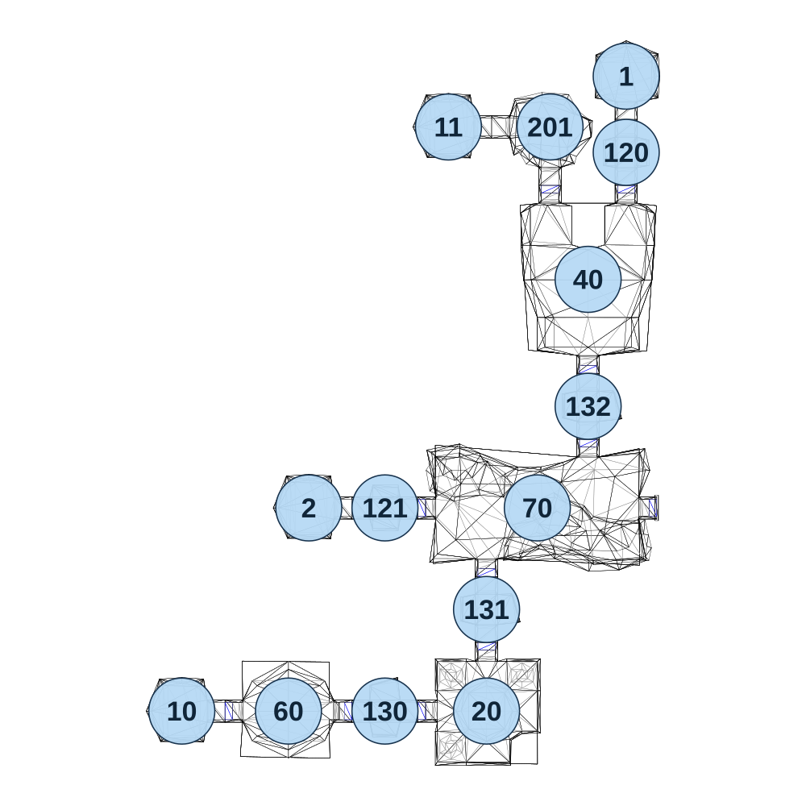

# map_cave03_03

[All map wireframes](README.md)

[SVG](map_cave03_03.svg) · [PNG](map_cave03_03.png) · [Geometry JSON](map_cave03_03.json)

## Section reference positions

These are markers, not room boundaries or safe spawn points. Positions use the file’s XYZ axes; the wireframe projects X/Z. Rotation is retained raw, not interpreted here.

| Section ID | X | Y | Z | Raw rotation |
|---:|---:|---:|---:|---:|
| 70 | 105 | 0 | 0 | 16383 |
| 20 | 5 | 0 | 400 | 49152 |
| 40 | 205 | 0 | -450 | 32768 |
| 120 | 280 | 0 | -700 | 0 |
| 121 | -195 | 0 | -0 | 16384 |
| 1 | 280 | 0 | -850 | 32768 |
| 2 | -345 | 0 | 0 | 49152 |
| 130 | -195 | 0 | 400 | 16383 |
| 131 | 5 | 0 | 200 | 0 |
| 132 | 205 | 0 | -200 | 0 |
| 201 | 130 | 0 | -750 | 0 |
| 10 | -595 | 0 | 400 | 49152 |
| 11 | -70 | 0 | -750 | 49152 |
| 60 | -385 | 0 | 400 | 0 |

Collision triangles: 2105. Sentinel/unlabelled records remain in JSON. Overlapping marker positions are preserved, not moved to invent room locations.
