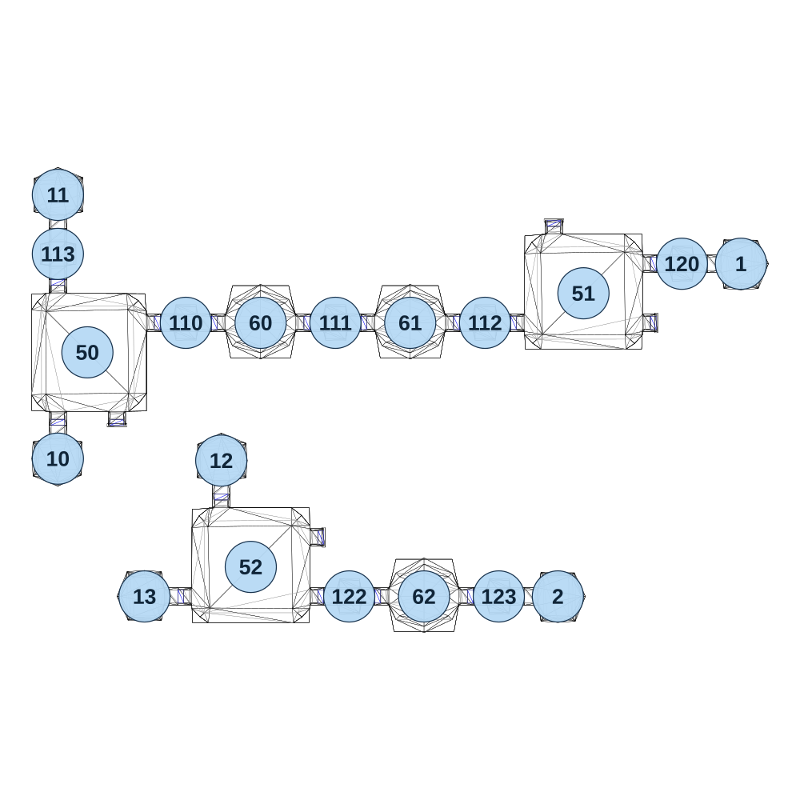

# map_cave03_04

[All map wireframes](README.md)

[SVG](map_cave03_04.svg) · [PNG](map_cave03_04.png) · [Geometry JSON](map_cave03_04.json)

## Section reference positions

These are markers, not room boundaries or safe spawn points. Positions use the file’s XYZ axes; the wireframe projects X/Z. Rotation is retained raw, not interpreted here.

| Section ID | X | Y | Z | Raw rotation |
|---:|---:|---:|---:|---:|
| 110 | -545 | 0 | -5 | 16383 |
| 111 | -165 | 0 | -5 | 16383 |
| 112 | 215 | 0 | -5 | 16383 |
| 113 | -870 | 0 | -180 | 0 |
| 120 | 715 | 0 | -155 | 16383 |
| 122 | -130 | 0 | 690 | 16383 |
| 123 | 250 | 0 | 690 | 16383 |
| 1 | 865 | 0 | -155 | 16383 |
| 2 | 400 | 0 | 690 | 16383 |
| 10 | -870 | 0 | 340 | 0 |
| 11 | -870 | 0 | -330 | 32768 |
| 12 | -455 | 0 | 345 | 32768 |
| 13 | -650 | 0 | 690 | 49152 |
| 60 | -355 | 0 | -5 | 0 |
| 61 | 25 | 0 | -5 | 0 |
| 62 | 60 | 0 | 690 | 0 |
| 50 | -795 | 0 | 70 | 0 |
| 51 | 465 | 0 | -80 | 16383 |
| 52 | -380 | 0 | 615 | 16383 |

Collision triangles: 2426. Sentinel/unlabelled records remain in JSON. Overlapping marker positions are preserved, not moved to invent room locations.
