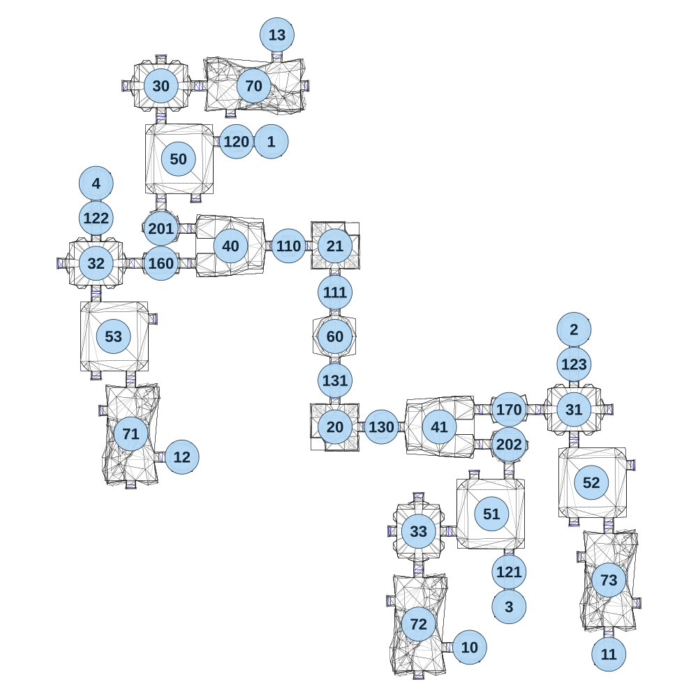

# map_cave03_05

[All map wireframes](README.md)

[SVG](map_cave03_05.svg) · [PNG](map_cave03_05.png) · [Geometry JSON](map_cave03_05.json)

## Section reference positions

These are markers, not room boundaries or safe spawn points. Positions use the file’s XYZ axes; the wireframe projects X/Z. Rotation is retained raw, not interpreted here.

| Section ID | X | Y | Z | Raw rotation |
|---:|---:|---:|---:|---:|
| 110 | -200 | 0 | -390 | 16383 |
| 111 | 0 | 0 | -190 | 0 |
| 160 | -750 | 0 | -315 | 16383 |
| 20 | 0.100006 | 0 | 390 | 32768 |
| 21 | 0.100007 | 0 | -390 | 0 |
| 40 | -450 | 0 | -390 | 49152 |
| 41 | 450 | 0 | 390 | 16383 |
| 120 | -425 | 0 | -840 | 16383 |
| 121 | 750 | 0 | 1015 | 0 |
| 122 | -1030 | 0 | -510 | 0 |
| 123 | 1030 | 0 | 120 | 0 |
| 1 | -275 | 0 | -840 | 16383 |
| 2 | 1030 | 0 | -30 | 32768 |
| 3 | 750 | 0 | 1165 | 0 |
| 4 | -1030 | 0 | -660 | 32768 |
| 130 | 200 | 0 | 390 | 16383 |
| 131 | 0 | 0 | 190 | 0 |
| 170 | 750 | 0 | 315 | 16383 |
| 201 | -750 | 0 | -465 | 32768 |
| 202 | 750 | 0 | 465 | 0 |
| 30 | -750 | 0 | -1080 | 0 |
| 31 | 1030 | 0 | 315 | 0 |
| 32 | -1030 | 0 | -315 | 0 |
| 33 | 360 | 0 | 840 | 16383 |
| 10 | 580 | 0 | 1340 | 16383 |
| 11 | 1180 | 0 | 1370 | 0 |
| 12 | -660 | 0 | 520 | 16383 |
| 13 | -250 | 0 | -1300 | 32768 |
| 60 | 0 | 0 | 0 | 16383 |
| 50 | -675 | 0 | -765 | 0 |
| 51 | 675 | 0 | 765 | 32768 |
| 52 | 1105 | 0 | 630 | 0 |
| 53 | -955 | 0 | 0 | 0 |
| 70 | -350 | 0 | -1080 | 16383 |
| 71 | -880 | 0 | 420 | 0 |
| 72 | 360 | 0 | 1240 | 0 |
| 73 | 1180 | 0 | 1050 | 0 |

Collision triangles: 7652. Sentinel/unlabelled records remain in JSON. Overlapping marker positions are preserved, not moved to invent room locations.
