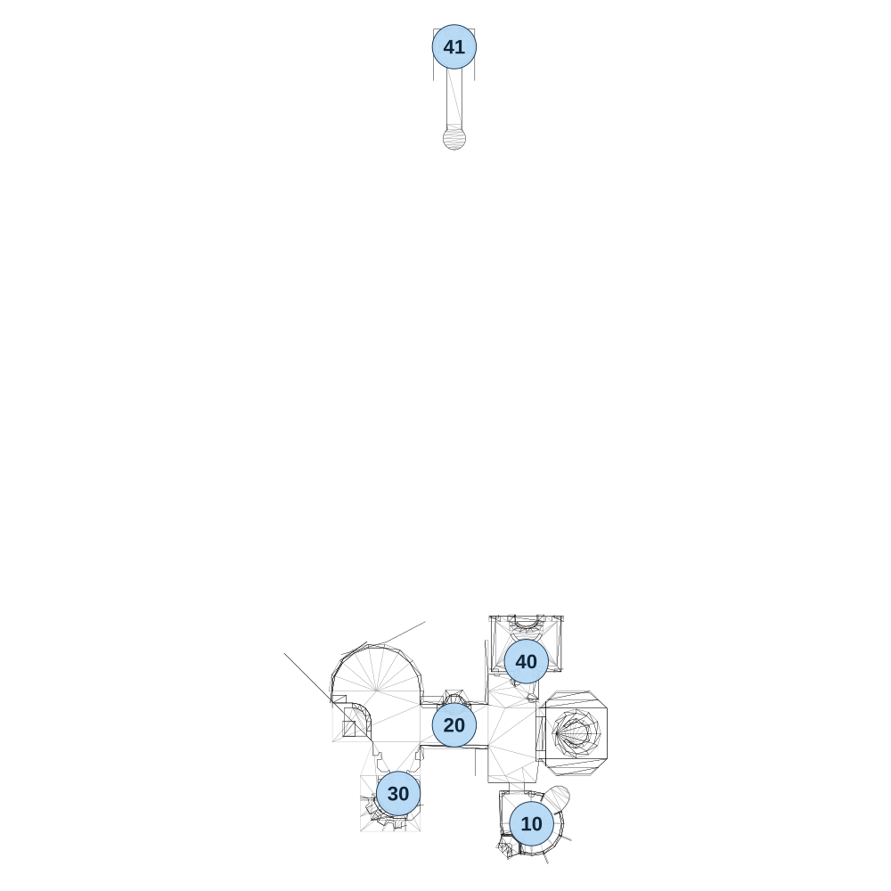

# map_city02_00

[All map wireframes](README.md)

[SVG](map_city02_00.svg) · [PNG](map_city02_00.png) · [Geometry JSON](map_city02_00.json)

## Section reference positions

These are markers, not room boundaries or safe spawn points. Positions use the file’s XYZ axes; the wireframe projects X/Z. Rotation is retained raw, not interpreted here.

| Section ID | X | Y | Z | Raw rotation |
|---:|---:|---:|---:|---:|
| 10 | 228 | 0 | 291 | 0 |
| 20 | 0 | 0 | 0 | 0 |
| 30 | -165 | 0 | 202 | 32768 |
| 40 | 212.5 | 0 | -187.5 | 0 |
| 41 | 0 | 0 | -2000 | 0 |

Collision triangles: 1497. Sentinel/unlabelled records remain in JSON. Overlapping marker positions are preserved, not moved to invent room locations.
