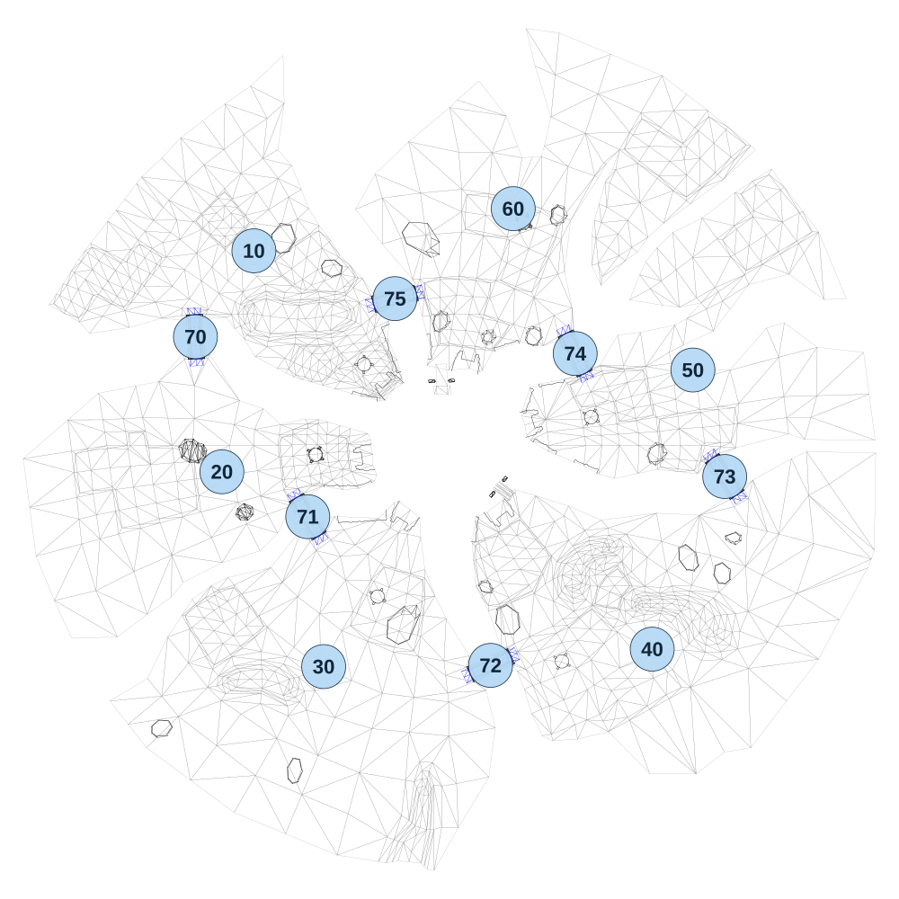

# map_crater01_00

[All map wireframes](README.md)

[SVG](map_crater01_00.svg) · [PNG](map_crater01_00.png) · [Geometry JSON](map_crater01_00.json)

## Section reference positions

These are markers, not room boundaries or safe spawn points. Positions use the file’s XYZ axes; the wireframe projects X/Z. Rotation is retained raw, not interpreted here.

| Section ID | X | Y | Z | Raw rotation |
|---:|---:|---:|---:|---:|
| 10 | -670 | -400 | -670 | 0 |
| 20 | -780 | -400 | 90 | 0 |
| 30 | -430 | -400 | 760 | 0 |
| 40 | 700 | -400 | 700 | 0 |
| 50 | 840 | -400 | -260 | 0 |
| 60 | 222 | -400 | -815 | 0 |
| 70 | -870.967 | -424.558 | -374.395 | 483 |
| 71 | -484.696 | -443.335 | 244.372 | 5645 |
| 72 | 143.972 | -430.551 | 755.855 | 20778 |
| 73 | 949.443 | -421.954 | 106.247 | 4294940759 |
| 74 | 435.071 | -444.777 | -316.651 | 4294939172 |
| 75 | -184.774 | -444.67 | -505.524 | 4294953582 |

Collision triangles: 5543. Sentinel/unlabelled records remain in JSON. Overlapping marker positions are preserved, not moved to invent room locations.
