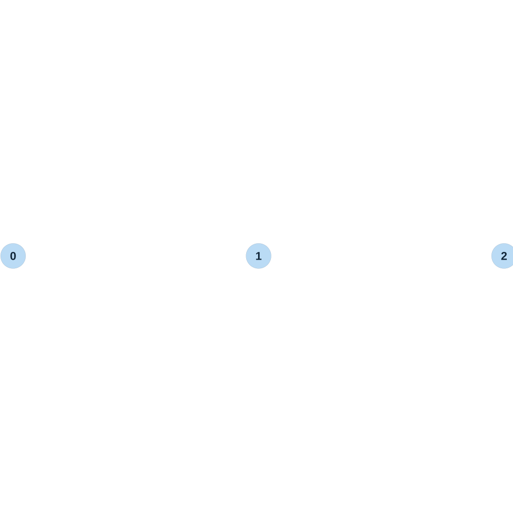

# map_darkfalz00

[All map wireframes](README.md)

[SVG](map_darkfalz00.svg) · [PNG](map_darkfalz00.png) · [Geometry JSON](map_darkfalz00.json)

## Section reference positions

These are markers, not room boundaries or safe spawn points. Positions use the file’s XYZ axes; the wireframe projects X/Z. Rotation is retained raw, not interpreted here.

| Section ID | X | Y | Z | Raw rotation |
|---:|---:|---:|---:|---:|
| 0 | -10000 | 0 | 0 | 0 |
| 1 | 0 | 0 | 0 | 0 |
| 2 | 10000 | 0 | 0 | 0 |

Collision triangles: 1041. Sentinel/unlabelled records remain in JSON. Overlapping marker positions are preserved, not moved to invent room locations.
