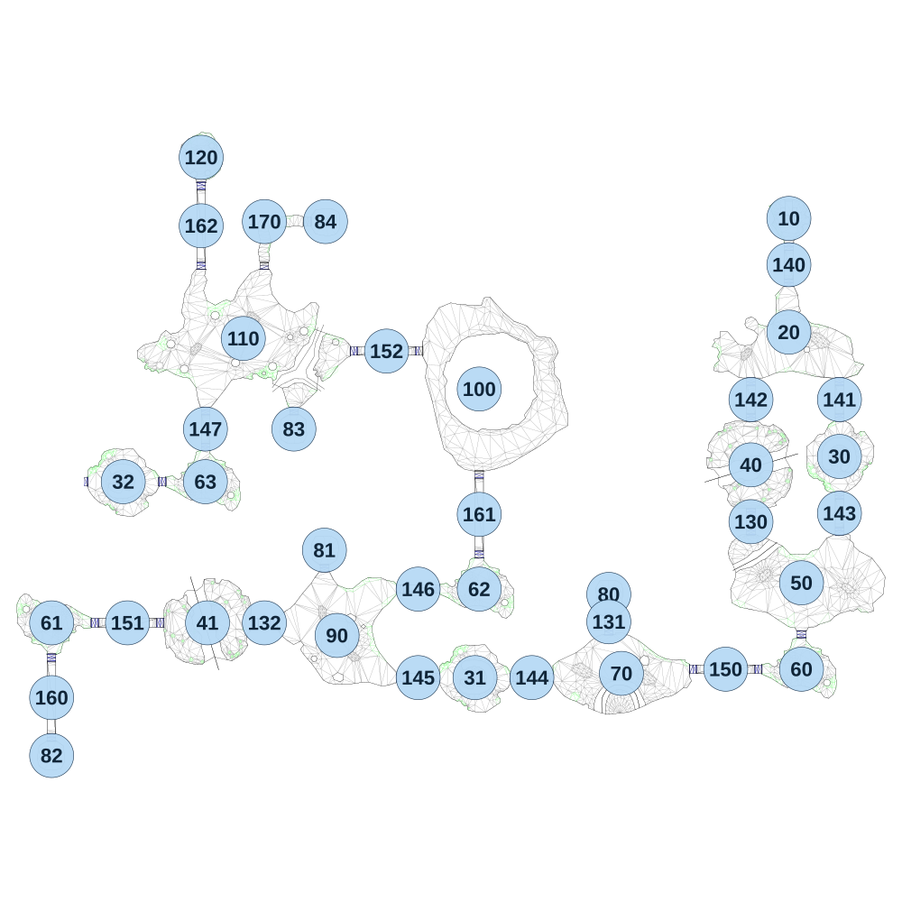

# map_desert01_00

[All map wireframes](README.md)

[SVG](map_desert01_00.svg) · [PNG](map_desert01_00.png) · [Geometry JSON](map_desert01_00.json)

## Section reference positions

These are markers, not room boundaries or safe spawn points. Positions use the file’s XYZ axes; the wireframe projects X/Z. Rotation is retained raw, not interpreted here.

| Section ID | X | Y | Z | Raw rotation |
|---:|---:|---:|---:|---:|
| 10 | 0 | 0 | 0 | 0 |
| 20 | -0 | 0 | 540 | 0 |
| 30 | 240 | 0 | 1130 | 0 |
| 31 | -1490 | 0 | 2180 | 4294950912 |
| 32 | -3160 | 0 | 1250 | 4294950912 |
| 40 | -180 | 0 | 1170 | 0 |
| 41 | -2760 | 0 | 1920 | 4294950912 |
| 50 | 60 | 0 | 1730 | 0 |
| 60 | 60 | 0 | 2140 | 0 |
| 61 | -3500 | 0 | 1920 | 32768 |
| 62 | -1470 | 0 | 1760 | 0 |
| 63 | -2770 | 0 | 1250 | 0 |
| 70 | -795 | 0 | 2160 | 0 |
| 80 | -855 | 0 | 1785 | 0 |
| 81 | -2205 | 0 | 1575 | 0 |
| 82 | -3500 | 0 | 2550 | 32768 |
| 83 | -2350 | 0 | 1000 | 32768 |
| 84 | -2200 | 0 | 15 | 4294950912 |
| 90 | -2145 | 0 | 1980 | 0 |
| 100 | -1470 | 0 | 810 | 0 |
| 110 | -2590 | 0 | 570 | 0 |
| 120 | -2790 | 0 | -290 | 0 |
| 130 | -180 | 0 | 1440 | 0 |
| 131 | -855 | 0 | 1915 | 0 |
| 132 | -2490 | 0 | 1920 | 16384 |
| 140 | 0 | 0 | 220 | 0 |
| 141 | 240 | 0 | 860 | 0 |
| 142 | -180 | 0 | 860 | 0 |
| 143 | 240 | 0 | 1400 | 0 |
| 144 | -1220 | 0 | 2180 | 16384 |
| 145 | -1760 | 0 | 2180 | 16384 |
| 146 | -1760 | 0 | 1760 | 16384 |
| 147 | -2770 | 0 | 1000 | 0 |
| 150 | -300 | 0 | 2140 | 16384 |
| 151 | -3140 | 0 | 1920 | 16384 |
| 152 | -1910 | 0 | 630 | 16384 |
| 160 | -3500 | 0 | 2275 | 0 |
| 161 | -1470 | 0 | 1405 | 0 |
| 162 | -2790 | 0 | 35 | 0 |
| 170 | -2490 | 0 | 15 | 4294950912 |

Collision triangles: 11566. Sentinel/unlabelled records remain in JSON. Overlapping marker positions are preserved, not moved to invent room locations.
