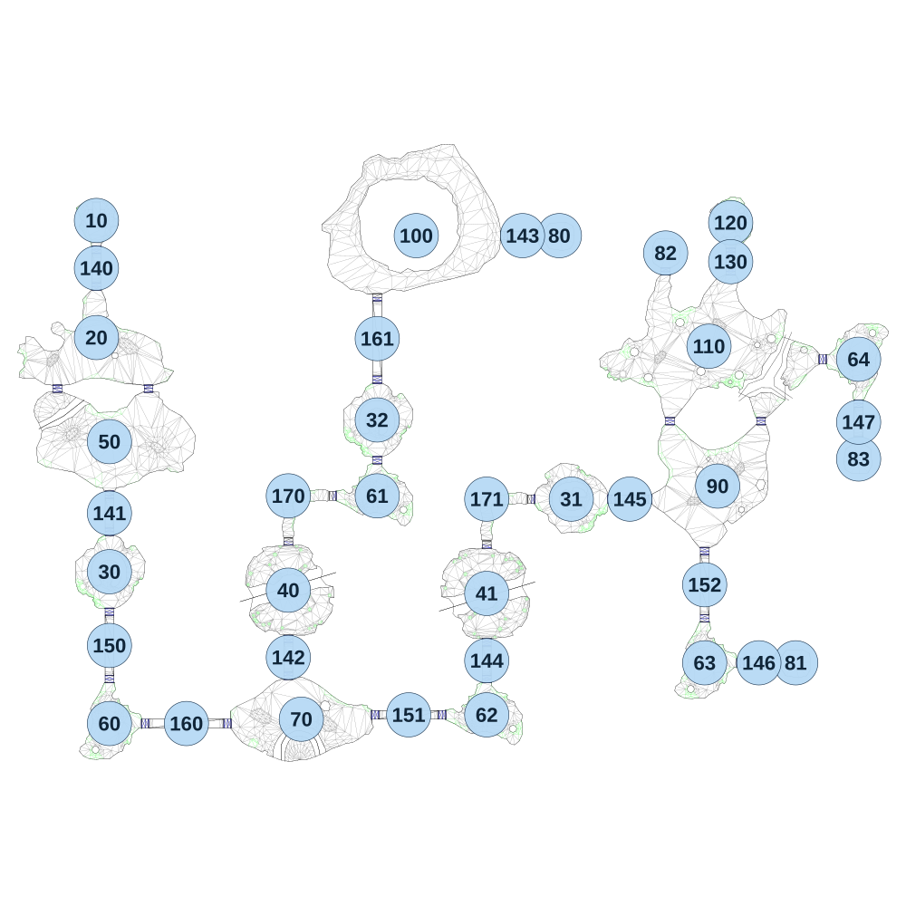

# map_desert01_02

[All map wireframes](README.md)

[SVG](map_desert01_02.svg) · [PNG](map_desert01_02.png) · [Geometry JSON](map_desert01_02.json)

## Section reference positions

These are markers, not room boundaries or safe spawn points. Positions use the file’s XYZ axes; the wireframe projects X/Z. Rotation is retained raw, not interpreted here.

| Section ID | X | Y | Z | Raw rotation |
|---:|---:|---:|---:|---:|
| 10 | 0 | 0 | 0 | 0 |
| 20 | 0 | 0 | 540 | 0 |
| 30 | 60 | 0 | 1620 | 0 |
| 31 | 2190 | 0 | 1285 | 16384 |
| 32 | 1295 | 0 | 920 | 0 |
| 40 | 885 | 0 | 1705 | 32768 |
| 41 | 1800 | 0 | 1720 | 0 |
| 50 | 60 | 0 | 1020 | 0 |
| 60 | 60 | 0 | 2320 | 4294950912 |
| 61 | 1295 | 0 | 1270 | 0 |
| 62 | 1800 | 0 | 2280 | 0 |
| 63 | 2805 | 0 | 2040 | 4294950912 |
| 64 | 3515 | 0 | 640 | 16384 |
| 70 | 945 | 0 | 2300 | 0 |
| 80 | 2135 | 0 | 70 | 4294950912 |
| 81 | 3225 | 0 | 2040 | 4294950912 |
| 82 | 2625 | 0 | 150 | 0 |
| 83 | 3515 | 0 | 1100 | 32768 |
| 90 | 2865 | 0 | 1225 | 16384 |
| 100 | 1475 | 0 | 70 | 16384 |
| 110 | 2825 | 0 | 580 | 0 |
| 120 | 2925 | 0 | 10 | 0 |
| 130 | 2925 | 0 | 190 | 0 |
| 140 | 0 | 0 | 220 | 0 |
| 141 | 60 | 0 | 1350 | 0 |
| 142 | 885 | 0 | 2015 | 0 |
| 143 | 1965 | 0 | 70 | 16384 |
| 144 | 1800 | 0 | 2030 | 0 |
| 145 | 2460 | 0 | 1285 | 16384 |
| 146 | 3055 | 0 | 2040 | 16384 |
| 147 | 3515 | 0 | 930 | 0 |
| 150 | 60 | 0 | 1960 | 0 |
| 151 | 1440 | 0 | 2280 | 16384 |
| 152 | 2805 | 0 | 1680 | 0 |
| 160 | 415 | 0 | 2320 | 16384 |
| 161 | 1295 | 0 | 545 | 0 |
| 170 | 885 | 0 | 1270 | 4294950912 |
| 171 | 1800 | 0 | 1285 | 4294950912 |

Collision triangles: 11953. Sentinel/unlabelled records remain in JSON. Overlapping marker positions are preserved, not moved to invent room locations.
