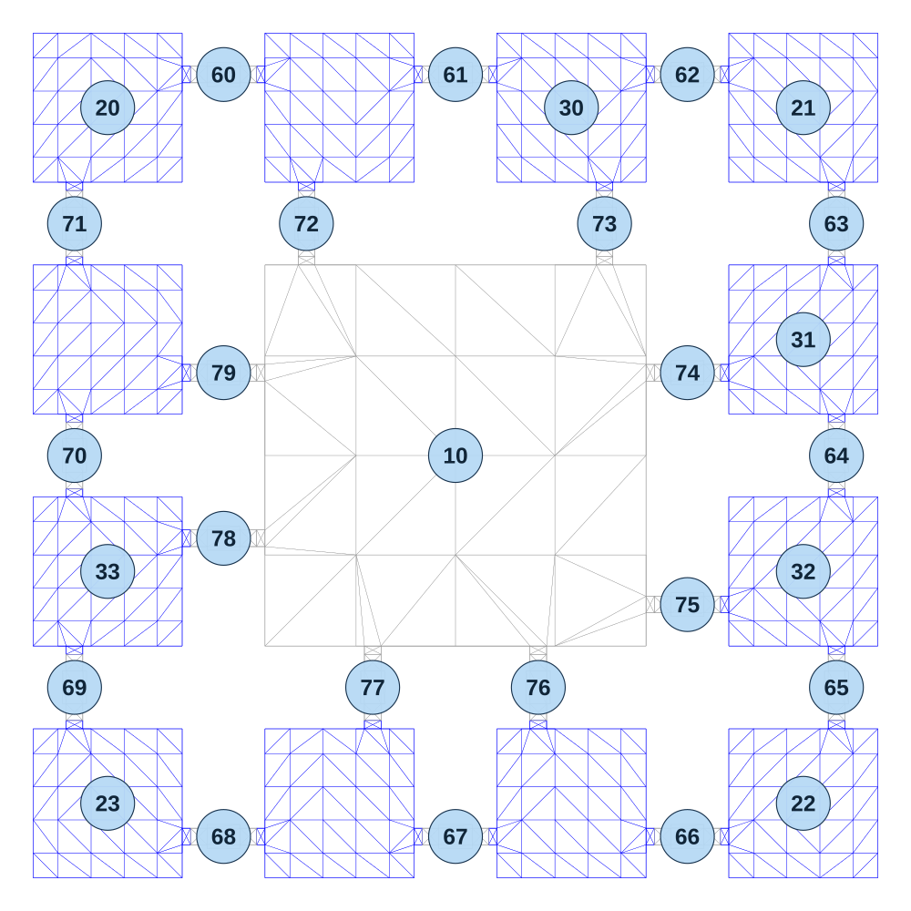

# map_desert02_01

[All map wireframes](README.md)

[SVG](map_desert02_01.svg) · [PNG](map_desert02_01.png) · [Geometry JSON](map_desert02_01.json)

## Section reference positions

These are markers, not room boundaries or safe spawn points. Positions use the file’s XYZ axes; the wireframe projects X/Z. Rotation is retained raw, not interpreted here.

| Section ID | X | Y | Z | Raw rotation |
|---:|---:|---:|---:|---:|
| 10 | 0 | 0 | 0 | 0 |
| 20 | -840 | 0 | -840 | 0 |
| 21 | 840 | 0 | -840 | 4294950912 |
| 22 | 840 | 0 | 840 | 32768 |
| 23 | -840 | 0 | 840 | 16384 |
| 30 | 280 | 0 | -840 | 0 |
| 31 | 840 | 0 | -280 | 4294950912 |
| 32 | 840 | 0 | 280 | 4294950912 |
| 33 | -840 | 0 | 280 | 16384 |
| 60 | -560 | 0 | -920 | 16384 |
| 61 | 0 | 0 | -920 | 16384 |
| 62 | 560 | 0 | -920 | 16384 |
| 63 | 920 | 0 | -560 | 0 |
| 64 | 920 | 0 | 0 | 0 |
| 65 | 920 | 0 | 560 | 0 |
| 66 | 560 | 0 | 920 | 16384 |
| 67 | 0 | 0 | 920 | 16384 |
| 68 | -560 | 0 | 920 | 16384 |
| 69 | -920 | 0 | 560 | 0 |
| 70 | -920 | 0 | 0 | 0 |
| 71 | -920 | 0 | -560 | 0 |
| 72 | -360 | 0 | -560 | 0 |
| 73 | 360 | 0 | -560 | 0 |
| 74 | 560 | 0 | -200 | 16384 |
| 75 | 560 | 0 | 360 | 16384 |
| 76 | 200 | 0 | 560 | 0 |
| 77 | -200 | 0 | 560 | 0 |
| 78 | -560 | 0 | 200 | 16384 |
| 79 | -560 | 0 | -200 | 16384 |

Collision triangles: 2464. Sentinel/unlabelled records remain in JSON. Overlapping marker positions are preserved, not moved to invent room locations.
