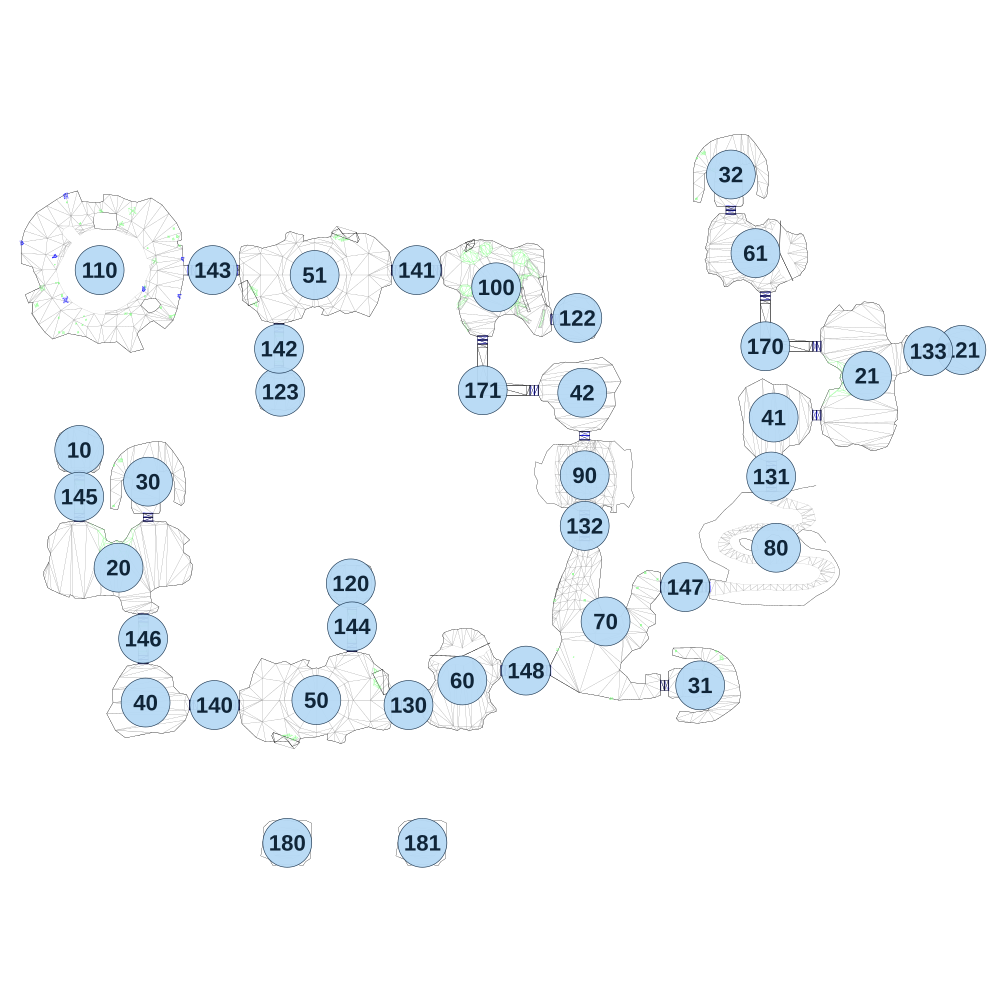

# map_desert03_00

[All map wireframes](README.md)

[SVG](map_desert03_00.svg) · [PNG](map_desert03_00.png) · [Geometry JSON](map_desert03_00.json)

## Section reference positions

These are markers, not room boundaries or safe spawn points. Positions use the file’s XYZ axes; the wireframe projects X/Z. Rotation is retained raw, not interpreted here.

| Section ID | X | Y | Z | Raw rotation |
|---:|---:|---:|---:|---:|
| 10 | 0 | 0 | -3.37 | 0 |
| 20 | 160 | 0 | 475.63 | 0 |
| 21 | 3206.04 | 0 | -305.315 | 16384 |
| 30 | 279.99 | 0 | 125.631 | 0 |
| 31 | 2527 | 0 | 954.622 | 4294950912 |
| 32 | 2652.04 | 0 | -1124.31 | 0 |
| 40 | 270 | 0 | 1024.63 | 0 |
| 41 | 2826.04 | 0 | -135.315 | 4294950912 |
| 42 | 2047 | 0 | -236.369 | 4294934529 |
| 50 | 965 | 0 | 1014.63 | 0 |
| 51 | 957.998 | 0 | -715.37 | 4294934529 |
| 60 | 1559 | 0 | 934.63 | 0 |
| 61 | 2752.04 | 0 | -804.315 | 4294950912 |
| 70 | 2142 | 0 | 694.63 | 0 |
| 80 | 2836 | 0 | 394.584 | 0 |
| 90 | 2057 | 0 | 99.63 | 0 |
| 100 | 1697 | 0 | -665.369 | 0 |
| 110 | 82.9985 | 0 | -735.37 | 0 |
| 120 | 1105 | 0 | 539.63 | 0 |
| 121 | 3590.04 | 0 | -410.315 | 4294950912 |
| 122 | 2027 | 0 | -540.369 | 4294950912 |
| 123 | 817.998 | 0 | -240.369 | 4294934529 |
| 130 | 1340 | 0 | 1034.63 | 16384 |
| 131 | 2816.04 | 0 | 104.684 | 0 |
| 132 | 2057 | 0 | 305.63 | 0 |
| 133 | 3455.04 | 0 | -405.315 | 16384 |
| 140 | 550 | 0 | 1034.63 | 16384 |
| 141 | 1373 | 0 | -735.369 | 16384 |
| 142 | 812.998 | 0 | -415.369 | 0 |
| 143 | 542.998 | 0 | -735.37 | 16384 |
| 144 | 1110 | 0 | 714.63 | 0 |
| 145 | 0 | 0 | 186.63 | 0 |
| 146 | 260 | 0 | 764.63 | 0 |
| 147 | 2466 | 0 | 554.63 | 16384 |
| 148 | 1818 | 0 | 894.63 | 16384 |
| 170 | 2792.04 | 0 | -425.315 | 0 |
| 171 | 1642 | 0 | -246.369 | 0 |
| 180 | 846.7 | 0 | 1595.45 | 0 |
| 181 | 1396.62 | 0 | 1595.45 | 0 |

Collision triangles: 7009. Sentinel/unlabelled records remain in JSON. Overlapping marker positions are preserved, not moved to invent room locations.
