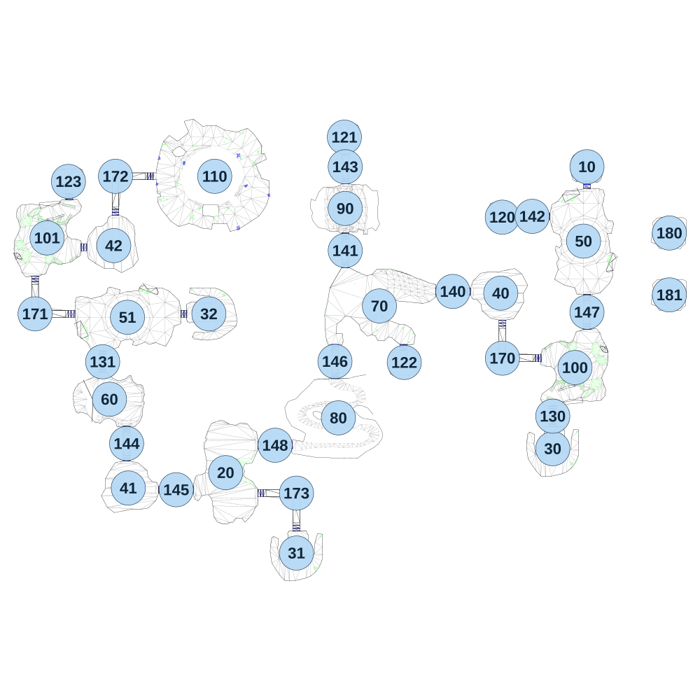

# map_desert03_01

[All map wireframes](README.md)

[SVG](map_desert03_01.svg) · [PNG](map_desert03_01.png) · [Geometry JSON](map_desert03_01.json)

## Section reference positions

These are markers, not room boundaries or safe spawn points. Positions use the file’s XYZ axes; the wireframe projects X/Z. Rotation is retained raw, not interpreted here.

| Section ID | X | Y | Z | Raw rotation |
|---:|---:|---:|---:|---:|
| 10 | 1.0094 | 0 | -0.2471 | 0 |
| 20 | -2110.91 | 0 | 1787.8 | 4294950912 |
| 30 | -198.99 | 0 | 1647.75 | 4294934529 |
| 31 | -1696.93 | 0 | 2257.8 | 4294934529 |
| 32 | -2208.89 | 0 | 859.791 | 4294950912 |
| 40 | -502.989 | 0 | 738.753 | 4294934529 |
| 41 | -2679.92 | 0 | 1877.8 | 0 |
| 42 | -2764.92 | 0 | 460.799 | 16384 |
| 50 | -18.9907 | 0 | 434.753 | 16384 |
| 51 | -2684.91 | 0 | 879.8 | 4294934529 |
| 60 | -2789.91 | 0 | 1358.8 | 16384 |
| 70 | -1211.99 | 0 | 813.753 | 4294950912 |
| 80 | -1451.93 | 0 | 1467.75 | 0 |
| 90 | -1411.99 | 0 | 243.753 | 0 |
| 100 | -68.9906 | 0 | 1173.75 | 4294950912 |
| 101 | -3154.9 | 0 | 415.799 | 16384 |
| 110 | -2174.9 | 0 | 55.8 | 4294934529 |
| 120 | -493.99 | 0 | 294.752 | 16384 |
| 121 | -1416.99 | 0 | -173 | 0 |
| 122 | -1066.99 | 0 | 1143.75 | 32768 |
| 123 | -3029.92 | 0 | 85.7995 | 0 |
| 130 | -198.989 | 0 | 1457.75 | 0 |
| 131 | -2829.91 | 0 | 1139.8 | 0 |
| 140 | -782.99 | 0 | 728.753 | 16384 |
| 141 | -1411.99 | 0 | 489.753 | 0 |
| 142 | -318.99 | 0 | 289.753 | 16384 |
| 143 | -1411.99 | 0 | 0 | 0 |
| 144 | -2689.91 | 0 | 1617.8 | 0 |
| 145 | -2399.91 | 0 | 1887.8 | 16384 |
| 146 | -1471.99 | 0 | 1137.75 | 0 |
| 147 | 1.0093 | 0 | 849.753 | 0 |
| 148 | -1821.93 | 0 | 1627.8 | 16384 |
| 170 | -492.99 | 0 | 1118.75 | 0 |
| 171 | -3224.91 | 0 | 859.799 | 0 |
| 172 | -2754.91 | 0 | 55.7995 | 4294950912 |
| 173 | -1696.93 | 0 | 1907.8 | 4294934529 |
| 180 | 482.699 | 0 | 387.099 | 0 |
| 181 | 482.699 | 0 | 748.799 | 0 |

Collision triangles: 7024. Sentinel/unlabelled records remain in JSON. Overlapping marker positions are preserved, not moved to invent room locations.
