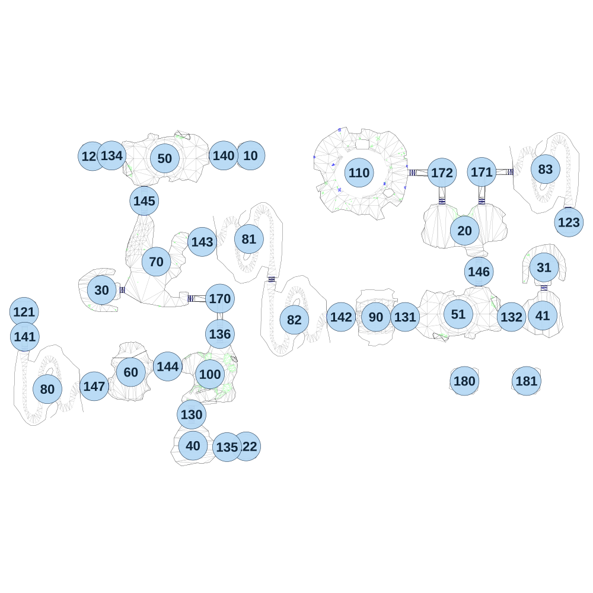

# map_desert03_02

[All map wireframes](README.md)

[SVG](map_desert03_02.svg) · [PNG](map_desert03_02.png) · [Geometry JSON](map_desert03_02.json)

## Section reference positions

These are markers, not room boundaries or safe spawn points. Positions use the file’s XYZ axes; the wireframe projects X/Z. Rotation is retained raw, not interpreted here.

| Section ID | X | Y | Z | Raw rotation |
|---:|---:|---:|---:|---:|
| 10 | 0 | 0 | 0 | 4294950912 |
| 20 | 1511 | 0 | 530 | 0 |
| 30 | -1050 | 0 | 949 | 16384 |
| 31 | 2070.99 | 0 | 788.999 | 0 |
| 40 | -406 | 0 | 2047 | 0 |
| 41 | 2061 | 0 | 1129 | 16384 |
| 50 | -604.999 | 0 | 20 | 4294934529 |
| 51 | 1466 | 0 | 1119 | 0 |
| 60 | -844 | 0 | 1528 | 0 |
| 70 | -664.999 | 0 | 749 | 0 |
| 80 | -1433 | 0 | 1647.95 | 4294950912 |
| 81 | -11.0001 | 0 | 588.953 | 16384 |
| 82 | 309 | 0 | 1158.95 | 4294950912 |
| 83 | 2081 | 0 | 95.9531 | 16384 |
| 90 | 885 | 0 | 1139 | 16384 |
| 100 | -286 | 0 | 1543 | 4294950912 |
| 110 | 766 | 0 | 121 | 0 |
| 120 | -1115 | 0 | 5.0003 | 16384 |
| 121 | -1597.95 | 0 | 1102.95 | 0 |
| 122 | -31 | 0 | 2052 | 4294950912 |
| 123 | 2246.05 | 0 | 470.952 | 4294934529 |
| 130 | -416 | 0 | 1827 | 0 |
| 131 | 1091 | 0 | 1139 | 16384 |
| 132 | 1841 | 0 | 1139 | 16384 |
| 134 | -979.999 | 0 | 0 | 16384 |
| 135 | -165.999 | 0 | 2057 | 16384 |
| 136 | -216 | 0 | 1259 | 0 |
| 140 | -190 | 0 | 0 | 16384 |
| 141 | -1592.95 | 0 | 1277.95 | 0 |
| 142 | 639 | 0 | 1139 | 16384 |
| 143 | -340.999 | 0 | 609 | 16384 |
| 144 | -585 | 0 | 1488 | 16384 |
| 145 | -749.999 | 0 | 320 | 0 |
| 146 | 1611 | 0 | 819 | 0 |
| 147 | -1103 | 0 | 1628 | 16384 |
| 170 | -215.999 | 0 | 1009 | 4294934529 |
| 171 | 1631 | 0 | 116 | 4294950912 |
| 172 | 1351 | 0 | 121 | 4294934529 |
| 180 | 1509.58 | 0 | 1590.62 | 0 |
| 181 | 1947.1 | 0 | 1590.62 | 0 |

Collision triangles: 7243. Sentinel/unlabelled records remain in JSON. Overlapping marker positions are preserved, not moved to invent room locations.
