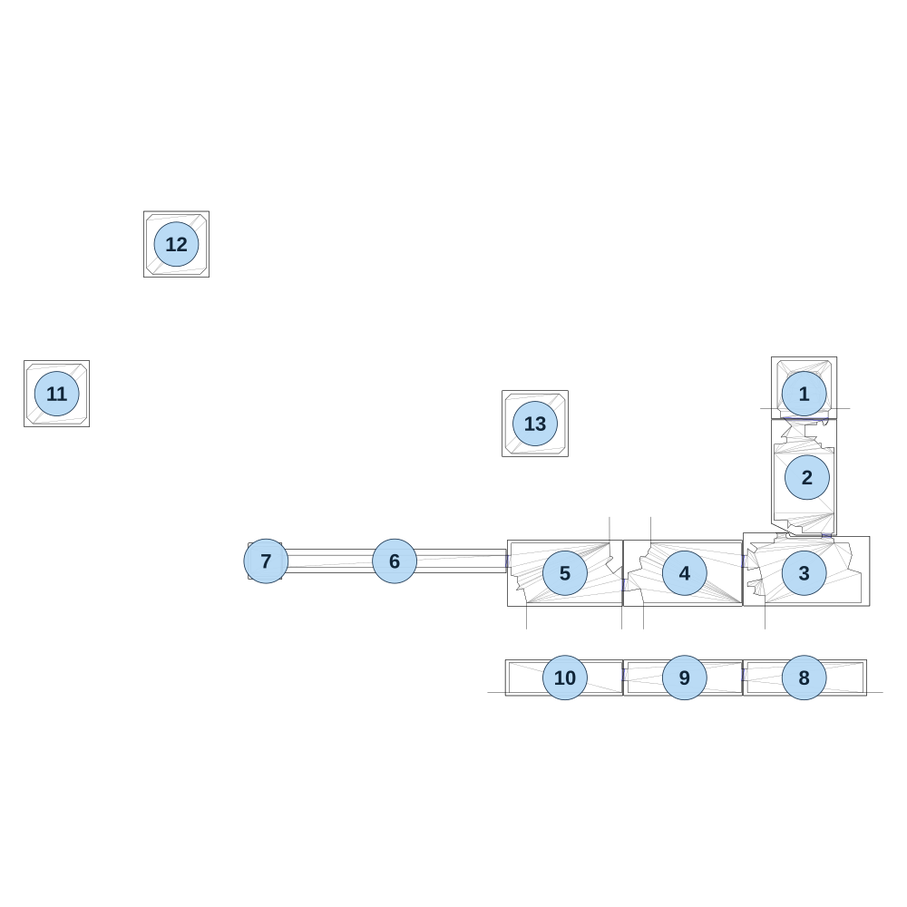

# map_jungle01_00

[All map wireframes](README.md)

[SVG](map_jungle01_00.svg) · [PNG](map_jungle01_00.png) · [Geometry JSON](map_jungle01_00.json)

## Section reference positions

These are markers, not room boundaries or safe spawn points. Positions use the file’s XYZ axes; the wireframe projects X/Z. Rotation is retained raw, not interpreted here.

| Section ID | X | Y | Z | Raw rotation |
|---:|---:|---:|---:|---:|
| 1 | 0 | 0 | 0 | 0 |
| 2 | 10 | 0 | 280 | 0 |
| 3 | 0 | 0 | 600 | 0 |
| 4 | -400 | 0 | 600 | 0 |
| 5 | -800 | 0 | 600 | 0 |
| 6 | -1370 | 0 | 560 | 0 |
| 7 | -1800 | 0 | 560 | 0 |
| 8 | 0 | -150 | 950 | 0 |
| 9 | -400 | -150 | 950 | 0 |
| 10 | -800 | -150 | 950 | 0 |
| 11 | -2500 | 20 | -0 | 0 |
| 12 | -2100 | 20 | -500 | 0 |
| 13 | -900 | 20 | 100 | 0 |

Collision triangles: 899. Sentinel/unlabelled records remain in JSON. Overlapping marker positions are preserved, not moved to invent room locations.
