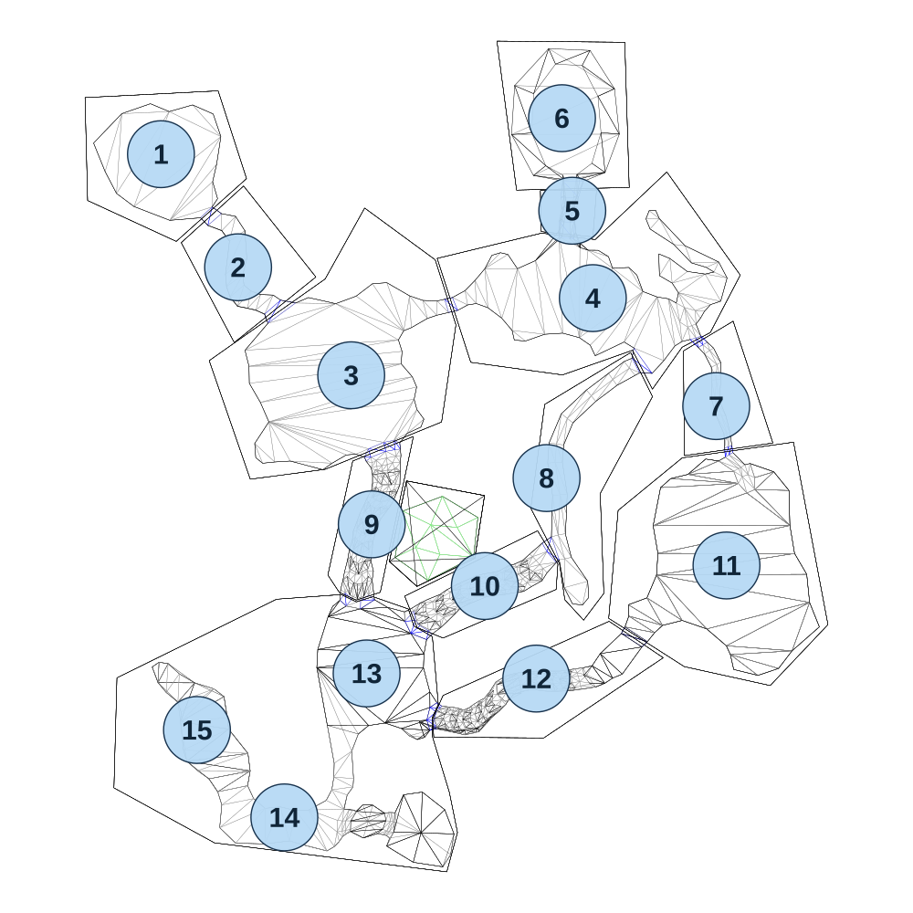

# map_jungle02_00

[All map wireframes](README.md)

[SVG](map_jungle02_00.svg) · [PNG](map_jungle02_00.png) · [Geometry JSON](map_jungle02_00.json)

## Section reference positions

These are markers, not room boundaries or safe spawn points. Positions use the file’s XYZ axes; the wireframe projects X/Z. Rotation is retained raw, not interpreted here.

| Section ID | X | Y | Z | Raw rotation |
|---:|---:|---:|---:|---:|
| 1 | -700 | 0 | -800 | 0 |
| 2 | -550 | 0 | -580 | 0 |
| 3 | -330 | 0 | -370 | 0 |
| 4 | 140 | 0 | -520 | 0 |
| 5 | 100 | 0 | -690 | 0 |
| 6 | 80 | 0 | -870 | 0 |
| 7 | 380 | 0 | -310 | 0 |
| 8 | 50 | 0 | -170 | 0 |
| 9 | -290 | 0 | -80 | 0 |
| 10 | -70 | 0 | 40 | 0 |
| 11 | 400 | 0 | 0 | 0 |
| 12 | 30 | 0 | 220 | 0 |
| 13 | -300 | 0 | 210 | 0 |
| 14 | -460 | 0 | 490 | 0 |
| 15 | -630 | 0 | 320 | 0 |

Collision triangles: 2642. Sentinel/unlabelled records remain in JSON. Overlapping marker positions are preserved, not moved to invent room locations.
