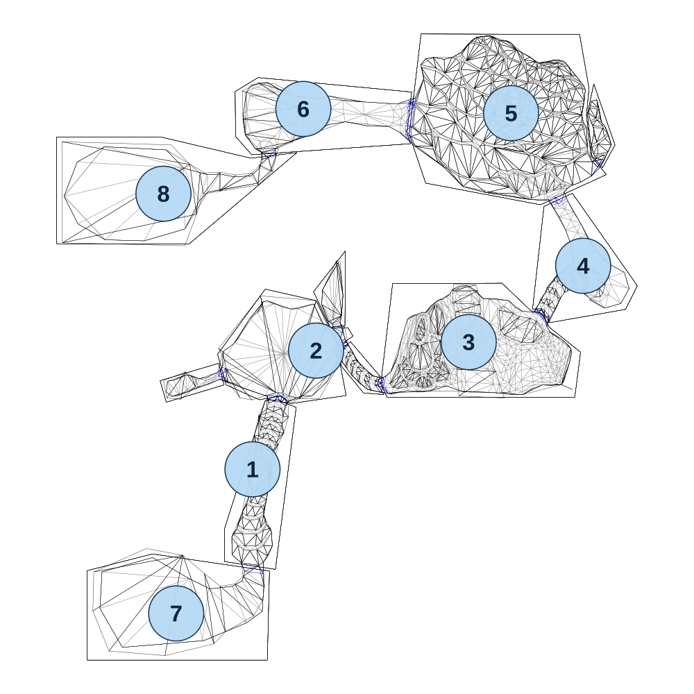

# map_jungle03_00

[All map wireframes](README.md)

[SVG](map_jungle03_00.svg) · [PNG](map_jungle03_00.png) · [Geometry JSON](map_jungle03_00.json)

## Section reference positions

These are markers, not room boundaries or safe spawn points. Positions use the file’s XYZ axes; the wireframe projects X/Z. Rotation is retained raw, not interpreted here.

| Section ID | X | Y | Z | Raw rotation |
|---:|---:|---:|---:|---:|
| 1 | 0 | 0 | -160 | 0 |
| 2 | 150 | 0 | -440 | 0 |
| 3 | 510 | 0 | -460 | 0 |
| 4 | 780 | 0 | -640 | 0 |
| 5 | 610 | 0 | -1000 | 0 |
| 6 | 120 | 0 | -1010 | 0 |
| 7 | -180 | 0 | 180 | 0 |
| 8 | -210 | 0 | -810 | 0 |

Collision triangles: 4383. Sentinel/unlabelled records remain in JSON. Overlapping marker positions are preserved, not moved to invent room locations.
