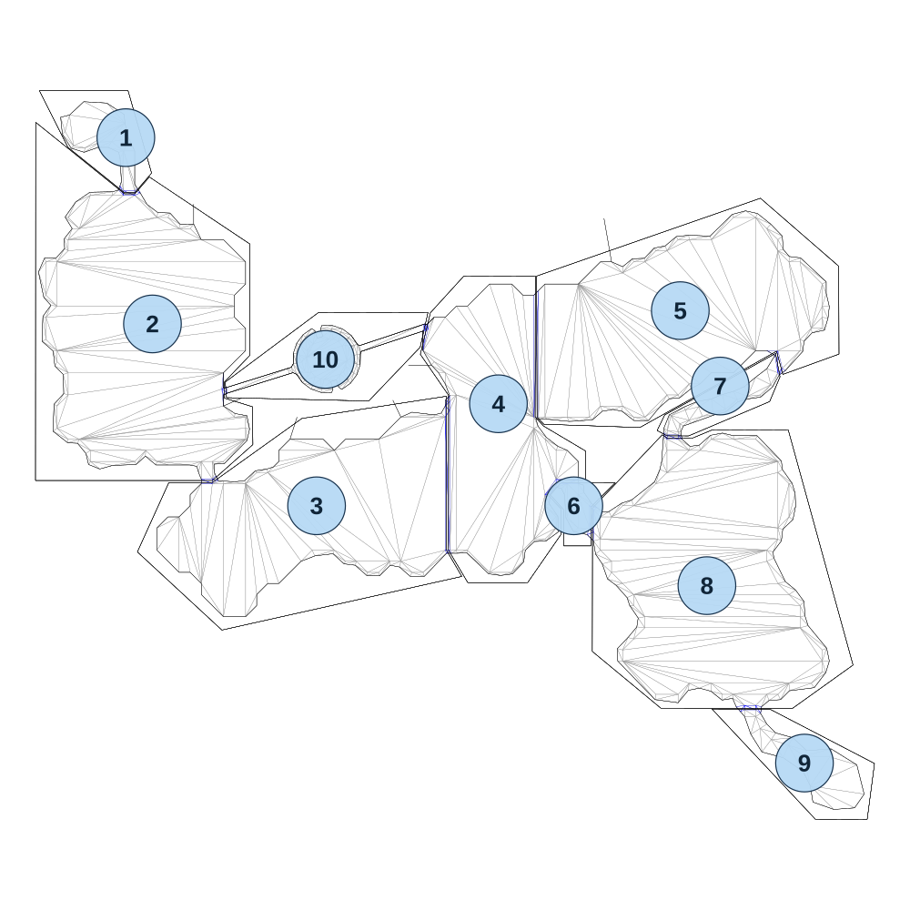

# map_jungle04_02

[All map wireframes](README.md)

[SVG](map_jungle04_02.svg) · [PNG](map_jungle04_02.png) · [Geometry JSON](map_jungle04_02.json)

## Section reference positions

These are markers, not room boundaries or safe spawn points. Positions use the file’s XYZ axes; the wireframe projects X/Z. Rotation is retained raw, not interpreted here.

| Section ID | X | Y | Z | Raw rotation |
|---:|---:|---:|---:|---:|
| 1 | -370 | 0 | 70 | 0 |
| 2 | -310 | 0 | 490 | 0 |
| 3 | 60 | 0 | 900 | 0 |
| 4 | 470 | 0 | 670 | 0 |
| 5 | 880 | 0 | 460 | 0 |
| 6 | 640 | 0 | 900 | 0 |
| 7 | 970 | 0 | 630 | 0 |
| 8 | 940 | 0 | 1080 | 0 |
| 9 | 1160 | 0 | 1480 | 0 |
| 10 | 80 | 0 | 570 | 0 |

Collision triangles: 2003. Sentinel/unlabelled records remain in JSON. Overlapping marker positions are preserved, not moved to invent room locations.
